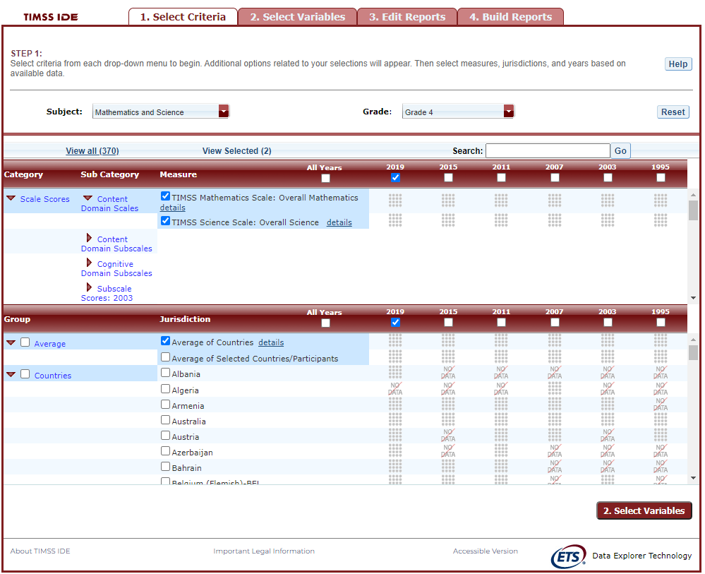
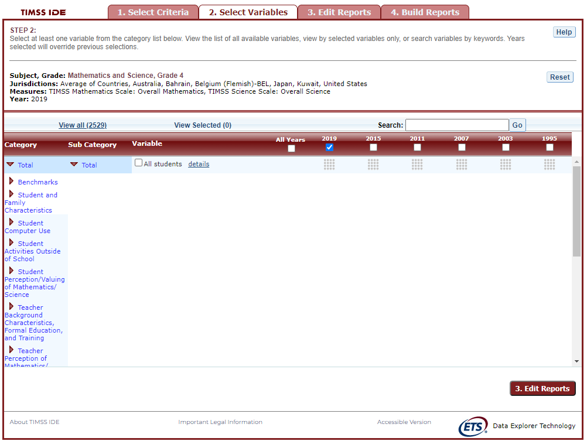
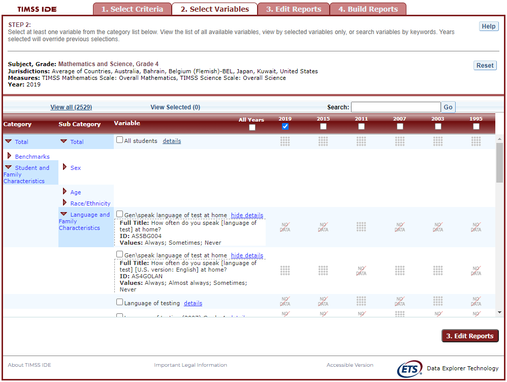
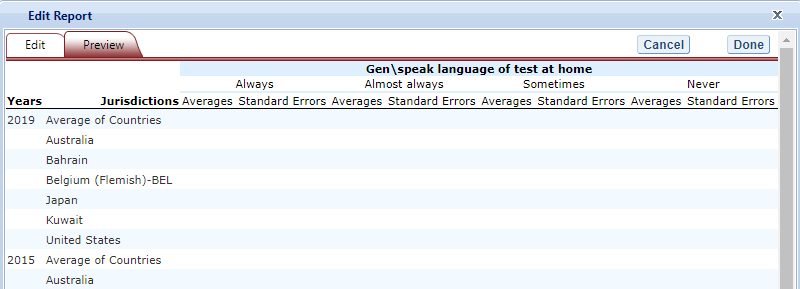
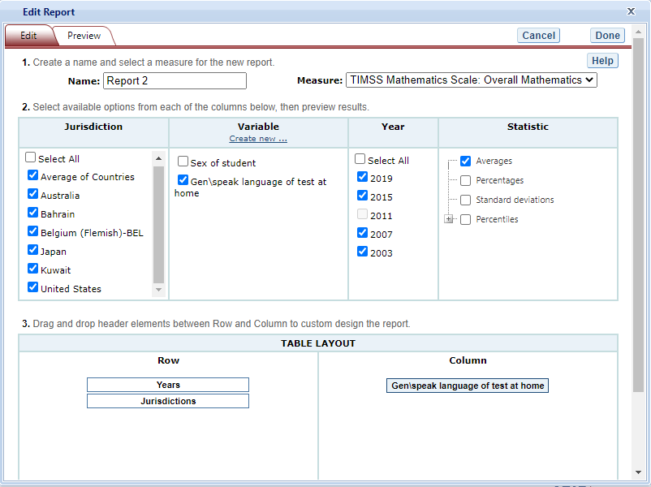
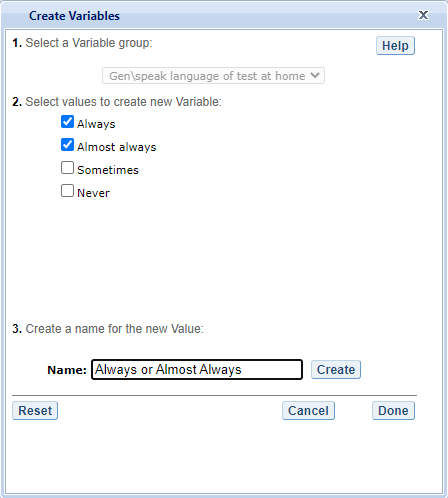
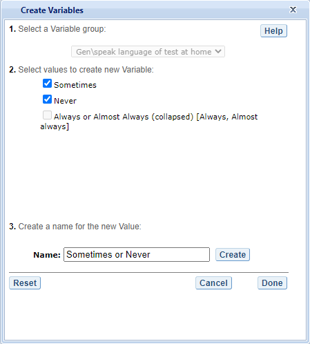
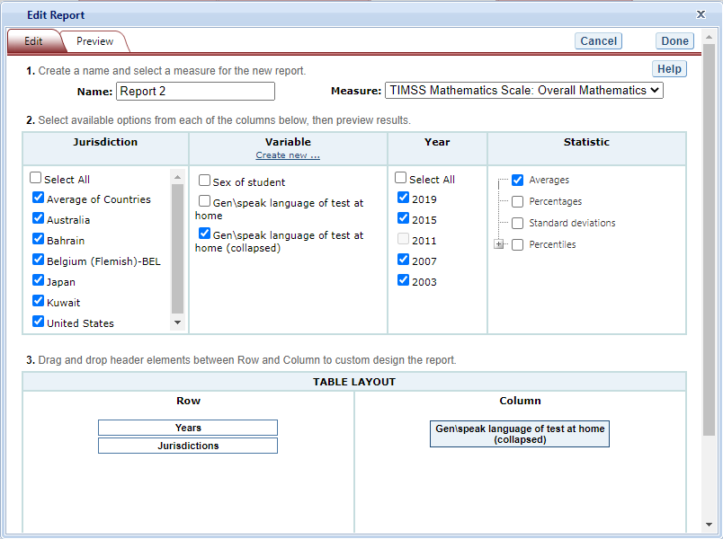
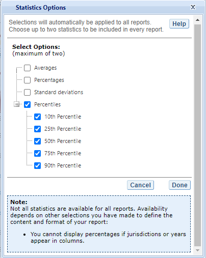
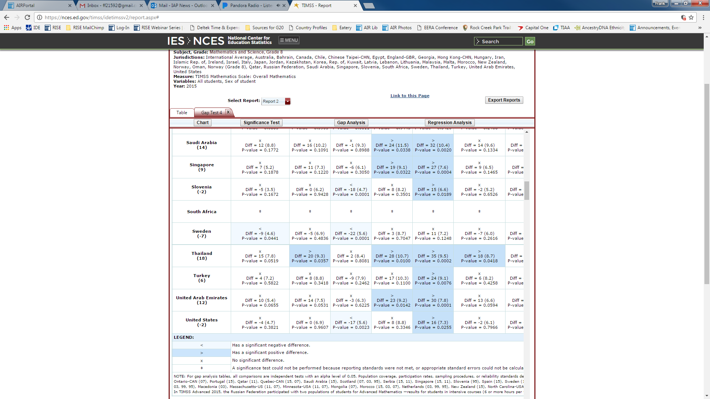

# TIMSS IDE Walkthrough {#timsswalkthrough}

There are four general steps for exploring each IDE page (see exhibit 3). Each step is described in more detail in the following sub-sections. 

Exhibit 3. What you will see in the IDE environment and what each step entails
```{r chapter4-1, echo=FALSE, fig.align='center', out.width="50%"}
knitr::include_graphics('images/chapter4/four-steps.png')
```


## *1. Select Criteria* {#select-criteria .unnumbered}

### 1.A. Overview  {#a.-overview .unnumbered}

Your data query in the IDE (International Data Explorer) begins on the
**Select Criteria** screen (see exhibit 2).

Choose one **Subject**, one **Grade**, and one or more **Measures**,
**Years,** and **Jurisdictions** for the data you wish to view or
compare.

Use the **Reset** button, located in the upper-right portion of the
screen (just below the **Help** button), to cancel your selections and
begin again.

Click on a red sideways-facing arrow (►) to open up a category and click
on a red downward-facing arrow (▼) to close a category.**\
**

**Exhibit 2. Selecting criteria**

{width="6.5in"
height="5.774305555555555in"}

### 1.B. Choose Subject {#b.-choose-subject .unnumbered}

Under **Subject**, you have the choice of **Mathematics and Science**,
**TIMSS Advanced: Advanced Mathematics**, or **TIMSS Advanced:
Physics**.

### 1.C. Choose Grade {#c.-choose-grade .unnumbered}

Under **Grade**, choose **Grade 4**, **Grade 8**, or **End of High
School**. Once a grade is chosen, the screen resets and you can select
**Year**(s), **Measure**(s), and **Jurisdiction**(s).

### 1.D. Choose Year {#d.-choose-year .unnumbered}

At the top of the **Measure** and **Jurisdiction** sections, you have
the choice of selecting 2019, 2015, 2011, 2007, 2003, 1999, and/or 1995
by checking the appropriate box. To include data from all years, check
the "All Years" box to the left of the individual years. Mathematics and
science data are available for 2019, 2015, 2011, 2007, 2003, 1999, and
1995. In 1999, no data for grade 4 were collected in mathematics or
science. Advanced mathematics and physics data are available for 2015
only.

### 1.E. Choose Measure {#e.-choose-measure .unnumbered}

After choosing a subject, you can choose between the overall scale
and/or any of the subject's subscales. The overall scale and subscales
can be used for trend analyses across years where applicable.

In addition, there are a number of continuous variables other than scale
scores that you may choose as a measure of analysis. These variables
fall under different categories, such as "Student and Family
Characteristics" and "Teacher Background Characteristics, Formal
Education, and Training" and include variables such as age, teaching
experience, and class size.

### 1.F. Choose Jurisdiction {#f.-choose-jurisdiction .unnumbered}

With your **Measure**(s) and **Year**(s) selected, next choose at least
one **Jurisdiction**.

Jurisdictions are found under the following groups: **Countries**,
**U.S. Jurisdictions**, and **Benchmarking Participants.** There is also
a group category called **Average,** with options to display the
**Average of Countries** and the **Average of Selected
Countries/Participants. Average of Countries** displays the average
statistic for all available jurisdictions under the "**Countries**"
group, except when "**All students**" is selected at step 2, in which
case **Average of Countries** displays the TIMSS scale centerpoint of
500.

The general procedures for selecting one or more jurisdictions are as
follows:

1.  To open or close jurisdictions, click on the arrow. Jurisdictions in
    the group are open and can be selected when the red arrow points
    down (see exhibit 3).  

2.  Click the checkboxes next to the specific jurisdictions that you are
    interested in, or uncheck those jurisdictions that you wish to
    deselect. If you click the checkbox next to the group name (e.g.,
    "Countries"), you will select all the jurisdictions within that
    group. If desired, uncheck the group name to deselect all.

3.  If you want to close a group (e.g., close the list of countries in
    order to readily see the benchmarking participants), click the red
    arrow next to the group name. The closed group's arrow points to the
    right. Be advised that closing the group will not deselect your
    choices.

**Exhibit 3. Choosing jurisdictions**
{width="6.5in" height="5.289788932633421in"}

To continue in the IDE, click the **Select Variables** button at the
bottom right of the page or the tab at the top of the page to go to the
next screen (see exhibit 3).

## *2. Select Variables* {#select-variables .unnumbered}

### 2.A. Overview  {#a.-overview-1 .unnumbered}

Step 2, **Select Variables,** can only be accessed after choosing
criteria at step 1, **Select Criteria**.

To continue your data query and edit a report, you must choose at least
one variable on this screen*.* You can browse for variables using the
**Category** and **Sub Category** lists or by using the **Search**
function (see exhibit 4). You can return to this screen to change
variable selections at any time.

**Exhibit 4. Selecting variables
overview**{width="6.5in"
height="4.88472987751531in"}

###  2.B. Search Using Category and Sub Category Lists  {#b.-search-using-category-and-sub-category-lists .unnumbered}

On the **Select Variables** screen, choose at least one variable for
your report. One way to do this is to search for variables using the
**Category** and **Sub Category** lists. If you don't wish to choose
from any of the specified categories and subcategories, select **All
students** in the **Total** category.

The variables shown are tied to the criteria you selected at step 1
(**Subject, Grade,** **Jurisdiction, Measure,** and **Year**), which are
indicated at the top of the screen. To change any of these criteria,
return to step 1, **Select Criteria**.

To browse for variables, get details about them, select them, and view
them:

1.  Click the red arrows to open and close categories and subcategories
    of variables (see exhibit 5).

2.  Click **details** or **hide details** to show or hide the full title
    of a given variable, the TIMSS ID, and the values (i.e., value
    labels). Note that some variables have the same or similar short
    titles, but comparing details will show you how they differ. See the
    example in exhibit 5 below, which shows two variables titled
    **Gen\\speak language of test at home**. "Gen" refers to variables
    that are general cross-subject variables. The differences between
    these two variables are described in the details.

3.  Click the checkbox next to a variable to select it for your
    analysis/report. You will see the count increase next to **View
    Selected**.

4.  Click the **View Selected** tab to see the variables you have
    chosen. To return to the full list of variables by category, click
    the **View all** tab.

5.  Remember to select the year for which you wish to build a report and
    make sure that data are available for your chosen year and
    variables.

6.  Searching variables is an option from the **Search** box. See
    Section 2.C Search Function for more details about this function.

**Exhibit 5. Select variables using category and sub category lists**

{width="6.326388888888889in"
height="4.760638670166229in"}

When you have selected the variable(s) you want to include, continue by
clicking the **Edit Reports** button at the bottom of the page or the
tab at the top of the page to go to the next screen.

### 2.C. Search Function {#c.-search-function .unnumbered}

The second way to search for variables is to use the **Search** function
on the **Select Variables** screen.

Type a term in the **Search** box and click **Go** (or hit "Enter" on
your keyboard) to find variables by keywords in the question and/or
details for the variable (see exhibit 6). If you use multiple keywords,
"and" is assumed. You can narrow your search by using "or," "not," or
"and not." The search function operates on an exact phrase if it is
contained in quotes. The variable(s) that include the search term(s) in
the question or its details will be listed.

**Exhibit 6. Select variables using the search function**{width="6.5in"
height="4.979166666666667in"}

When you have selected the variable(s) you want to include, continue by
clicking the **Edit Reports** button at the bottom of the page or the
tab at the top of the page to go to the next screen.

## *3. Edit Reports* {#edit-reports .unnumbered}

### 3.A. Overview  {#a.-overview-2 .unnumbered}

You can access step 3, **Edit Reports,** after choosing criteria at step
1, **Select Criteria**, and choosing variables at step 2, **Select
Variables**. The IDE will automatically build reports based on your
selections from steps 1 and 2. However, at step 3, the **Edit Reports**
phase, you may modify your selections for each report.

At this step, you can

-   preview and edit the layout of your reports;

-   copy reports or create new reports based on the variables selected;

-   change formatting options, such as number of decimal places to
    display, for all reports (these may also be changed in individual
    reports, but format options can overwrite previous edits);

-   change statistics options, such as averages, for all reports (these
    may also be changed in individual reports, but statistics options
    can overwrite previous edits);

-   select reports to be built into tables and charts at step 4, **Build
    Reports**; and  

-   delete reports.

Using your chosen criteria, the IDE will return a separate data report
for each variable you have chosen. If you have selected two or three
variables (not counting **All students**), you will also see a
cross-tabulated report for these variables. If you have chosen four or
more variables, you will get tables for each variable, but you will not
get the cross-tabulation. If your selected criteria include more than
one measure (e.g., overall science scale and one or more science
subscales or continuous variables), a separate set of data reports will
be generated for each measure (see exhibit 7).

**Exhibit 7. Edit reports overview**

{width="6.5in"
height="4.101388888888889in"}

The **Edit Reports** step shows detailed information on the layout of
your reports. The **Report** column indicates the report, or
cross-tabulation report, number based on the variable(s) chosen during
the criteria selection. Under the **All** tab, reports may be chosen for
the report-building phase, either by selecting **All** or selecting
individual reports. The **Action** column gives you the option to
**Preview**, **Edit**, **Delete**, or **Copy** the report. The
**Measure** column shows which measure the report will portray. The
**Variable** column indicates the variable(s) included in the report.
The **Year** column shows which years you have selected for comparison.
The **Jurisdiction** column shows the countries and subnational
education systems selected for comparison, and the **Statistic** column
provides the type of statistic output that will be generated in the
report-building phase.

### 3.B. Preview Report {#b.-preview-report .unnumbered}

Select **Preview,** in the **Action** column (see exhibit 7), to see how
your report will be laid out. The preview will not provide actual data,
but will show how the data will be arranged in rows and columns (see
exhibit 8). You can select **Preview** at any time to see how your
changes will affect the report's final layout.

**Exhibit 8. Using preview report**

{width="6.391298118985127in"
height="2.3266601049868765in"}

### 3.C. Edit Report {#c.-edit-report .unnumbered}

To edit the report, select the **Edit** command, in the **Action**
column (see exhibit 7). (Another way to edit a report is to select the
**Edit** tab when you are previewing a report.) The following can be
done using the edit function (see exhibit 9):

1.  Name your report. You have the option of giving each report a
    distinctive name, up to a limit of 50 characters, using only
    letters, numbers, spaces, underscores, and hyphens. (Otherwise, by
    default, the report is named Report 1, Report 2, etc., or
    Cross-Tabulated Report 1, Cross-Tabulated Report 2, etc.)

```{=html}
<!-- -->
```
1.  Select a measure. You can choose a measure if more than one was
    slected at step 1.

2.  Select which jurisdictions, variables, years (if applicable), and
    statistics to include (out of the selections previously made at
    steps 1 and 2). You can select up to two statistics options from the
    following: averages, percentages, standard deviations, and
    percentiles. (For further information, see Section 3.G. Statistics
    Options.)

3.  To create a new variable while editing a report, click on **Create
    New...** under the **Variable** heading. Section 3.D below explains
    the process for creating a new variable.

4.  Change the table layout by dragging elements to determine which
    items will appear in rows and which will appear in columns. Some of
    the arrangements will not be permissible, but a pop-up alert will
    explain this.

**Exhibit 9. Editing reports**

{width="6.40948053368329in"
height="4.835444006999125in"}

To save changes, make sure to select **Done** in the upper-right portion
of the screen before closing the **Edit Report** window.

### 3.D. Create New Variables {#d.-create-new-variables .unnumbered}

To create a new variable, select **Edit,** in the **Action** column, and
select **Create new...** under **Variable** (see exhibit 9 above). The
new variable is created by collapsing values for an existing variable.
The steps are as follows:

1.  Click **Create new\...** under the **Variable** heading.

2.  Select the variable for which you wish to collapse values.

3.  Select the values you want to collapse by checking the boxes to the
    left of the values. In the example below (see exhibit 10a), "Always"
    and "Almost always" are checked

4.  Create a name for the new value, and press **Create**. The collapsed
    values will appear in gray to indicate that they have already been
    used.

5.  Repeat steps 3 and 4 to collapse other values if applicable. In the
    example below (see exhibit 10b), "Sometimes" and "Never" will be
    collapsed into "Sometimes or Never". Note that it is also possible
    to leave "Sometimes" and "Never" uncollapsed, thus skipping step 5.

6.  Press **Done** when the screen has refreshed.

7.  The new variable will appear in the **Variable** list in the **Edit
    Report** window, designated as "collapsed."

8.  Check the box next to the new variable to view it in the report. You
    can click **Preview** to see how the table will be laid out before
    retrieving data.

**Exhibit 10a. Creating new variables**

{width="2.809640201224847in"
height="3.123216316710411in"}

**\
**

**Exhibit 10b. Creating new variables**

{width="2.8188024934383202in"
height="3.126421697287839in"}

A new variable that you create is applicable only to a specific report;
it does not apply to the other reports listed on the **Edit Reports**
screen. For example, if you selected multiple measures of science
literacy for analysis, then you would need to create the new variable
for each measure, or create a copy of the report and edit it
accordingly. To do the latter, click on **Copy** report on the **Edit
Reports** screen (copied reports appear at the end of the list of
reports) and then, for the new copy, click on **Edit** (using the above
example, you can change the measure and give the report a new name).

You can repeat the process and combine different values of a variable to
create additional new variables. Using the **Create New Report**
function, you can create a new report for each new variable that you
create. (For further information, see section 3.E. Create New Report.)

If you selected two or three variables from which to create new
variables, you can repeat the process for each of them. Using the
**Create New Report** or **Edit Report** function, these collapsed
variables will be listed and available for cross-tabulation (see exhibit
11). If you have chosen four or more variables (not counting **All
Students**), you won't get the cross-tabulation. You can click
**Preview** to see how the table will be laid out before retrieving
data.

**\
**

**Exhibit 11. Edit reports with collapsed variables**

{width="6.399992344706912in"
height="4.870833333333334in"}

### 3.E. Create New Report {#e.-create-new-report .unnumbered}

From the main **Edit Reports** screen, clicking on **Create New Report**
brings up the same options as **Edit** **Report**, but with no
checkboxes marked and without any new variables you may have created.
Thus, **Create New Report** provides a clean slate for your selections
from the first two steps, **Select Criteria** and **Select Variables**
(see exhibit 12). Each new report you create will appear at the end of
the list of reports. If you do not give the report a specific name, it
will be called "New Report."

**\
**

**Exhibit 12. Creating new reports**

{width="6.5in"
height="4.834722222222222in"}

### 3.F. Format Options {#f.-format-options .unnumbered}

From the main **Edit Reports** screen, clicking on **Format Options**
will allow you to make formatting changes applicable to all the reports
listed. The following formatting options are available using this
function (see exhibit 13):

1.  **Variable Labels** gives you the option to display a more detailed
    description of the variables selected in a query (**Long**) than the
    default label (**Short**). For variables from questionnaires, the
    full text of the question is displayed when **Long** is selected. Be
    advised that the length of the extra detail may sometimes interfere
    with table formatting.

2.  **Show data for values categorized as Missing** will include the
    percentage of students in the total sample or in a reporting group
    for whom membership in a particular response category is unknown
    because no response was given by the students, their teacher, or
    their school. The percentage of "missing" will be shown in the
    right-most table column. Missing data are available only for queries
    that involve percentages as the statistic type. Unless you check
    this option, the default is for missing responses not to be included
    in the percentage distribution shown.

3.  **Decimal Places** allows you to specify the level of precision for
    a particular statistic. Depending on the value range of the
    dependent variable (for example, the dependent variable "TIMSS
    Mathematics Scale: Overall Mathematics" ranges from 0 to 1000; the
    dependent variable "Students like learning mathematics scale
    \[AS5BG071\]" ranges from 4 to 13), the default decimal places for a
    report could be from zero to three. Also, standard errors will be
    shown to one more decimal place than is shown for a particular
    statistic. For example, if you request that average scores be
    displayed to one decimal place (by default, the average scores are
    displayed as whole numbers), the corresponding standard errors will
    be displayed to two decimal places. If you export to Excel, you will
    be able to increase the number of decimal places in most cases. Note
    that only integer-level precision is allowed for percentages; that
    is, the number of decimal places is fixed at "none" for percentages
    and the corresponding standard errors are shown to one decimal
    place.

4.  **Include** gives you the option of showing standard errors. By
    default, standard errors are shown inside parentheses, but you have
    the option of choosing to show them without parentheses*.* You can
    preview the effects of your selection in the **Sample Display** area
    (see the blue-shaded box at the bottom of exhibit 13).

**Exhibit 13. Format options**

{width="2.523839676290464in"
height="3.755792869641295in"}

Be advised that the choices you make in the **Format Options** window
will apply to all reports and cannot be changed for individual reports.
Use the **Reset** button, located in the upper-right portion of the main
**Edit Reports** screen (just below the **Help** button), to restore the
**Format Options** to the default settings (although caution is advised,
as this will also delete any new reports that you have created).

### 3.G. Statistics Options {#g.-statistics-options .unnumbered}

Available only from the main **Edit Reports** screen, clicking on
**Statistics Options** allows you to designate up to two statistics. The
selections you make are applicable to all the reports listed, although
you can also change the statistics for an individual report when you
edit it. (For further information, see Section 3.C. Edit Report.)

The following statistics options are available (see exhibit 14):

1.  **Averages.** This statistic provides the average value for a
    selected continuous variable or score (i.e., overall score or
    subscale score). For the TIMSS assessment, student performance is
    reported on scales that range from 0 to 1,000. By default, the
    standard errors of the scores are shown in parentheses.

2.  **Percentages.** This statistic shows the percentage of students as
    a row percentage. For example, if the first column lists countries,
    then each country will display its own percentage distribution
    across its row. By default, percentage distributions do not include
    missing data. For information on how to show data for values
    categorized as missing, see Section 3.F. Format Options.

3.  **Standard deviations.** The standard deviation is a measure of how
    widely or narrowly dispersed scores are for a particular variable.
    Under general normality assumptions, 95 percent of the scores are
    within two standard deviations of the mean. For example, if the
    average score of a variable is 500 and the standard deviation is
    100, it means that 95 percent of the scores in this variable fall
    between 300 and 700. The standard deviation is the square root of
    the variance.

4.  **Percentiles.** This statistic shows the threshold (or cutpoint)
    score for the following:

    -   10^th^ percentile---the bottom 10 percent of students

    -   25^th^ percentile---the bottom quarter of students

    -   50^th^ percentile---the median (half the students scored below
        the cutpoint and half scored above it)

    -   75^th^ percentile---the top quarter of students

    -   90^th^ percentile*---*the top 10 percent of students

**\
**

**Exhibit 14. Statistics options**

{width="3.100948162729659in"
height="3.891535433070866in"}

As previously noted, the selections you make in **Statistics Options**
will be applied automatically to all reports, although you can change
the statistics for an individual report when you edit it. Be advised
that if you use **Statistics Options** after editing the statistics in
one or more of your individual reports, the statistics options selected
will overwrite your previously edited selections. If you wish to use the
same criteria and variables in a report with a different selection of
statistics, consider using the **Create New Report** function to
generate a new report with different statistics. (For further
information, see Section 3.E. Create New Report.) You can also make a
copy of an individual report.

You can use the **Reset** button, located in the upper-right portion of
the main **Edit Reports** screen (just below the **Help** button), to
restore the **Statistics Options** to the default setting, which is
averages for all reports (this will also delete any new reports that you
created).

Not all statistics are available for all reports. Their availability
depends on other selections you have made to define the content and
format of your report:

-   Percentages will not display if jurisdictions or years appear in
    columns.

-   If benchmarks are selected in the variable section, only average
    scores and percentages will be displayed.

Please note that results obtained from the IDE might not always match
those published by the International Association for the Evaluation of
Educational Achievement (IEA). This is due to the use of different
reporting standards, such as suppression rules related to sample size,
and suppression due to response rates. In addition, results published by
the IEA using teacher data make use of all available teacher data for
any one student, whereas results obtained from the IDE make use of only
one teacher per student. In other words, in IEA published data, when a
student has more than one teacher, the individual student weight is
distributed evenly across all responding teachers of that student. In
the IDE, under the same circumstances, the response of a single teacher
is selected at random and assigned to the student. While the results are
expected to be the same, there is some small variation due to the random
selection of the teacher response. This affects results for teacher
data, calculated for 4th and 8th graders, and is only noticeable in
cases where students have multiple teachers.

### 3.H. Select Reports to Build {#h.-select-reports-to-build .unnumbered}

As you edit your reports, you can give them distinct names (up to 50
characters) to differentiate them, as well as make changes to the
jurisdictions and variables previously selected, the statistics, and the
layout of the rows and columns. (For further information, see section
3.C. Edit Report.) You may make copies of reports with these changes. In
order to proceed to step 4, **Build Reports**, each report for which you
want to retrieve data should be previewed using the **Preview**
function. To decrease processing time as you move to step 4, you can
uncheck any reports for which you do not wish to retrieve data. By
default, all reports are checked. To uncheck one or more reports, you
can either uncheck the reports individually or click on the **All** box.
(Doing the latter will uncheck all of the reports and allow you to check
only those for which you wish to retrieve data.) In the example that
follows (see exhibit 15), data will be retrieved for all reports.

**Exhibit 15. Selecting reports to build**

{width="6.5in"
height="4.1097222222222225in"}

If you wish to delete a report from the list of reports, click
**Delete** (see 1 above) in the **Action** column. Use the **Reset**
button (see 2 above), located in the upper-right portion of the screen
(just below the **Help** button), to restore the deleted reports
(although caution is advised, as this will also delete any new reports
that you created and restore the **Format Options** and **Statistics
Options** to the default settings).

To continue to the last step in the IDE, click the **Build Reports**
button at the bottom of the page (see 3 above) or the tab at the top of
the page to go to the next screen.

## *4. Build Reports* {#build-reports .unnumbered}

### 4.A. Overview {#a.-overview-3 .unnumbered}

You can access step 4, **Build Reports**, after choosing criteria at
step 1, **Select Criteria**, in which case the default report built will
provide data for just averages and for the **All Students** variable.
After step 1, you may also go on to steps 2 and 3, where you can select
additional variables and edit reports, before moving on to **Build
Reports**. In **Build Reports**, you can do the following:

1.  Generate a data table for each report, as shown in the **Select
    Report** drop-down feature (see 1 in exhibit 16). By default, all
    reports are checked, although you can uncheck any reports for which
    you do not wish to retrieve data. (For further information, see
    section 3.H. Select Reports to Build.)

2.  Export and save data tables into various formats using the **Export
    Reports** button (see 2 in exhibit 16). The output formats include
    HTML (print-friendly), Microsoft Excel, Microsoft Word, and Adobe
    PDF.

3.  Select the **Chart** tab (see 3 in exhibit 16) to create and
    customize charts for each report and save them for export in the
    above formats.

4.  Select the **Significance Test** tab (see 4 in exhibit 16) to run a
    significance test on your results, customize it, and export it.

**Exhibit 16. Building reports overview**

{width="6.5in"
height="4.346527777777778in"}

### 4.B. View Reports as Data Tables {#b.-view-reports-as-data-tables .unnumbered}

Some reports will take longer than others to process, so please do not
hit the "Back" button on your browser once you click on **Build
Reports** (see exhibit 17). Your table will appear once the processing
is complete. To select a different table to view, go to the **Select
Report** drop-down menu (see 1 in exhibit 16) and choose the table of
interest. To change the formatting or statistics options of a table or
to generate a table from a report not included in your selection, return
to step 3, **Edit Reports**.

**Exhibit 17. Processing data**{width="6.5in"
height="3.0833333333333335in"}

###  **4.C. Charts** {#c.-charts .unnumbered}

To create a chart, go to **Select Report** on the **Build Reports**
screen to choose the report of interest from the drop-down menu, and
then click the **Chart** link (see exhibit 18).

You will be able to create many types of charts and customize them.
Section 4.E. Create Charts---Chart Options provides a summary of the
available features and how they can be customized.

**Exhibit 18. Viewing reports as charts**{width="6.5in" height="2.0125in"}

### 4.D. Create Charts---Chart Options {#d.-create-chartschart-options .unnumbered}

When you click **Chart,** your screen will present data options
pertaining to **Jurisdiction, Year,** and **Statistic­** (see exhibit
19). Only the statistics option(s) used to report data in the previous
step will be presented, and only one statistics option can be selected
at a time. For example, **Percentiles** will appear as the only data
option to build the chart if the table created in the previous step is
reporting data with only percentiles selected as the statistics option.

Below, you can select **Bar Chart, Column Chart,** or **Line Chart**
(see exhibit 20). If all of the percentiles are chosen as the statistics
option, you also have the option of selecting a **Percentile Chart**.

After selecting a chart type, change any data dimensions from the
drop-down menus for **Bar**, **Column**, or **Line Values** and **Values
Grouped by**. Any new variables that you created at step 3, **Edit
Reports**, will be available for selection, but only if you selected the
variables (by clicking the checkbox next to them) and pressed **Done**
after you edited the report.

Once you are finished with the Chart Options, click the **Create Chart**
button in the lower-right corner of the screen.

**Exhibit 19. Data options for charts**

{width="5.34113845144357in"
height="5.495779746281714in"}

**Exhibit 20. Chart options**

{width="4.418926071741033in"
height="4.546865704286964in"}

Clicking **Create Chart** takes you to the exportable version of the
chart (see exhibit 21). You can subsequently click **"Back to Chart
Options"** (located in the upper-left corner, below **Chart**) to make
more changes.

**Exhibit 21. Completed chart**

{width="6.5in" height="5.125in"}

To make an additional chart from the same report or table, click the
**Chart** link on the **Build Reports** screen. If you don't start the
chart process again by clicking the **Chart** link, the new chart will
overwrite the previous one.

If you wish to make charts from other reports, select another report in
the **Select Report** drop-down list. (If other reports were not checked
in step 3, **Edit Reports**, go back to step 3 and check the ones you
want. Then, when you advance to step 4, **Build Reports**, the reports
will appear in the **Select Report** drop-down list.) If you need to
create new reports, go back to step 1, **Select Criteria**, and/or step
2, **Select Variables**. Remember to export any completed charts you
want to save by using the **Export Reports** function before leaving the
**Build Reports** screen. (For further information, see Section 4.H.
Export Reports.)

### 4.E. Significance Tests {#e.-significance-tests .unnumbered}

Tests for statistical significance indicate whether observed differences
between estimates are likely to have occurred because of sampling error
or chance. "Significance" here does not imply any judgment about
absolute magnitude or educational relevance. It refers only to the
statistical nature of the difference and whether that difference likely
reflects a true difference in the population.

With your report of interest selected, click the **Significance Test**
link, which is located to the right of the **Chart** link (see exhibit
16 and 21). You first need to decide which variable you want to test and
the criterion by which you want to test it (i.e., between jurisdictions,
within variables, or across years). You will compare or look across the
variable's range of values, so it must have more than one value. You can
look across jurisdictions for a variable (that is, compare between two
or more jurisdictions) or you can look across the values within a
variable for a single jurisdiction. For example, with the variable shown
in exhibit 22, you could choose to compare scores of female students
between countries and subnational education systems, or you could choose
to compare scores of female students and male students.

The general steps for running significance tests are as follows (see
exhibit 22):

1.  In the **Significance Test** window, select either **Between
    Jurisdictions**, **Within Variables**, or **Across Years**. Then,
    select the appropriate jurisdiction(s), variable(s), year(s), and
    statistic(s). For **Between Jurisdictions**, select at least two
    jurisdictions. For **Within Variables**, select at least two
    variable values. For **Across Years**, more than one year needs to
    be selected.

2.  You can enter a **Name** limited to 25 characters, using only
    letters, numbers, spaces, underscores, and hyphens (otherwise, by
    default, the test is named "Sig Test 1").

3.  Select the output type as either **Table** or **Map**. The table
    option will show the significance test results as a matrix. The map
    option will show the significance test results on a world map,
    highlighting countries and subnational education systems that have
    been selected. The map output is only available when **Between
    Jurisdictions** is selected in the first step.

4.  Additional options allow you to select **Show table details** to
    display the estimates and standard errors for the table cells. If
    you selected a map, this option is not applicable, as the map will
    automatically show score details.

5.  Click the **Preview** tab located in the upper-left corner, or the
    **Preview** button located in the bottom-left corner.

6.  Click the **Edit** tab in the upper-left corner of the screen if you
    wish to go back and make changes to the selections you made for
    running the significance tests.

7.  Click the **Done** button in the upper- or lower-right corner of the
    screen to run the significance tests.

**Exhibit 22. Significance test options**

{width="6.5in"
height="5.032638888888889in"}

When the table option is selected, you will get a significance test
matrix in which you will see the differences and *p* values. Using the
symbols shown in the legend of the matrix, an indication is also
provided of whether one estimate is significantly lower or higher than
another estimate or whether there is no significant difference (see
exhibit 23).

The alpha level to establish significance for all comparisons is .05.
All comparisons within a jurisdiction, within the same year, are made
using dependent samples *t*-tests. Comparisons between jurisdictions,
and comparisons between years, even for the same jurisdiction, are made
using independent samples *t*-tests. The TIMSS IDE also uses independent
samples *t*-tests, between a country and a subnational entity that is
participating as a benchmarking entity (for instance, in order to
compare scores between the United States and Massachusetts or Minnesota,
since they each are an independent sample).

**Exhibit 23. Significance test table output**

{width="6.5in" height="5.75625in"}

When the **map option** is selected, a global map is shown with the
countries and subnational education systems that were previously
selected shaded (see exhibit 24). The focal jurisdiction is shaded in
green, with all other countries compared to it. The other countries are
shaded in colors that indicate whether they are higher, lower, or not
significantly different from the focal jurisdiction on whatever measure
has been selected. (Note that grey is the default color for countries
not selected for comparison.) When you hover over a country, a text
bubble pops up indicating the point estimates for that country and the
focal jurisdiction. At any point, you may choose a different focal
jurisdiction by clicking on another country.

**Exhibit 24. Significance test map output**

{width="6.5in"
height="7.135416666666667in"}

### 4.F. Gap Analysis {#f.-gap-analysis .unnumbered}

Gap Analysis is included in the IDE to compare differences in gaps shown
in a map, table, or chart. These gap differences can be compared between
jurisdictions and/or across years.

**Exhibit 25. Gap analysis link selection**

{width="6.5in"
height="3.436111111111111in"}

With your report of interest selected, click on the **Gap Analysis**
link, which is located to the right of the **Significance Test** link
(see exhibit 25). You will need to decide which variable you would like
to test (e.g., gender) and the criterion by which you want to test it
(i.e., between jurisdictions or across years). The difference measure,
or gap, can be viewed between groups, between years, between groups and
years, or between percentiles within the selected variable. For example,
if you compute average mathematics scores for two countries at two time
points for males and females, you can:

-   at one time point, compare the male-female gap in one country to the
    male-female gap in another country;

-   compare the male-female gap at two time points within a country;

-   compare the difference between the male-female gap at two time
    points in one country to the difference between the male-female gap
    at two time points in another country; or

-   compare the gap for females at two time points in one country to the
    gap for females at two time points in another country.

**\
**

**Exhibit 26. Gap analysis options**

{width="6.5in"
height="5.030555555555556in"}

The steps for running a gap analysis are similar to those for conducting
a statistical significance test (see exhibit 26). Thus, to run a gap
analysis, follow the instructions under section **4.E. Significance
Tests**, noting the following differences:

1.  The **Gap Analysis** link should be selected, not the **Significance
    Test** link.

2.  The gap analysis does not have a **Within Variables** option for
    analysis; the options are **Between Jurisdictions** and **Across
    Years.**

3.  The difference measure (gap) of analysis must be selected from the
    following: **Between Groups, Between Years, Between Groups and
    Years,** and **Between Percentiles** (if variables are selected for
    which a difference measure is not feasible, the difference measure
    option will not appear as available in the Gap Analysis menu).

The gap analysis output is presented in a format similar to that of the
significance test output, with one difference: the difference estimate
shown in the output is the difference between the gaps selected for
analysis. Note that you will still see the significance of these
differences just like in a significance test. For example, exhibit 27
shows cross-national differences between male-female score gaps among
8^th^ grade students.

The gap analysis function computes and statistically tests differences
between score, percentage, or percentile gaps. All gap comparisons are
made using independent samples *t*-tests with an alpha level of 0.05.
Note that the reference group for the gaps is kept constant during the
analysis, as opposed to taking the absolute value of the gaps.
Therefore, the gap analysis tests whether the magnitude of the gaps
differ from each other only when the gaps go in the same direction
(e.g., comparing a 5-point gender gap favoring females in one country
with a 15-point gender gap favoring females in another country).

**Exhibit 27. Gap analysis output**

{width="6.46875in"
height="1.187399387576553in"}{width="6.5in"
height="5.184722222222222in"}

Note that a gap analysis across years cannot be combined with the
Between Years or Between Groups and Years difference measures, so you
will select the difference measure Between Groups, or, if you have
selected percentiles as one of your statistics, you may choose Between
Percentiles.

### 4.G. Regression Analysis {#g.-regression-analysis .unnumbered}

Regression Analysis is included in the IDE to test for the relationship
between one or more independent variables with a dependent variable,
with the independent variables controlling for each other. The type of
analysis performed in this feature of the IDE is referred to as linear
regression, with the dependent variable being a continuous variable
selected at step 1.

**Exhibit 28. Regression analysis link selection**

{width="6.5in"
height="1.9041666666666666in"}

A regression analysis can be performed based on the selections that were
made to build your table in the IDE by selecting the **Regression
Analysis** button above the table (see Exhibit 28). The **Measure**, or
continuous variable, that you selected in Step 1 and that is displayed
in your table will automatically become your dependent variable for the
regression analysis (in Exhibit 28 this is "TIMSS Mathematics Scale:
Overall Mathematics"). Please note that continuous variables cannot be
used as independent variables. The variables that you selected in Step 2
and that are displayed in your table will become your independent
variable options for the regression analysis (in Exhibit 28 this is "Sex
of student").

The general steps for running a regression analysis are as follows (see
exhibit 29):

1.  In the **Regression Analysis** pop-up window, you can enter a
    **Name** limited to 25 characters, using only letters, numbers,
    spaces, underscores, and hyphens (otherwise, by default, the test
    will be named "Regression 1").

2.  Select the appropriate jurisdiction, year, and variable(s) for
    analysis. Please note that you may only choose one jurisdiction and
    year at a time, but you may choose up to 3 independent variables to
    be in your report. In order to use up to 3 variables, you must have
    already created and selected a cross-tabulated report (by selecting
    3 variables in Step 2, **Select Variables**).

3.  Click the **Preview** tab located in the upper-left corner to view
    the table format into which your output will be populated. In the
    Preview tab, an "X" denotes where the output will display.

4.  Click the **Edit** tab in the upper-left corner of the screen if you
    wish to go back and make changes to the selections you made for
    running the analysis.

5.  Click the **Done** button in the upper- or lower-right corner of the
    screen to run the regression analysis.

**Exhibit 29. Regression analysis options**

{width="6.5in"
height="3.4444444444444446in"}

After you have clicked **Done**, your regression analysis output will
load onto the screen (see exhibit 30). A 0-1 contrast coding is used to
code the independent variable, where the first subgroup of the
independent variable is the reference group. Using dummy-coded variables
in a linear regression is useful for comparing each subgroup against a
reference group. For example, in exhibit 30, if the subgroup "Female" is
the reference group for the independent variable **Sex of student
\[ITSEX\]**, the IDE creates a "Male" dummy variable (1 for respondents
who answered "Male", 0 otherwise). Reference group "Female" is excluded
from the regression analysis.

**Exhibit 30. Regression analysis output**

{width="6.5in"
height="3.484722222222222in"}

Using the output from exhibit 30 you can compare the average mathematics
achievement of 8^th^ grade students who are female to the average
mathematics achievement of 8^th^ grade students who are female. When a
single dummy-coded variable is used in a regression, the *intercept* is
the mean of the reference group (e.g., 529.0473), and the *regression
coefficient* is the difference between the mean of the reference group
and the group identified (coded 1) with the dummy-coded variable (e.g.,
11.1312 for students who are Male). Since the regression coefficients
are presented with a standard error and a *t* value, these can be used
to test whether a difference between means is statistically significant.
Under the Significance column in the output you will see 3 possible
signs: 1) \< signifies a significant negative difference, 2) \>
signifies a significant positive difference, and 3) x signifies the
difference is not statistically significant.

### 4.H. Export Reports {#h.-export-reports .unnumbered}

Click on the **Export Reports** button located on the right side of the
**Build Reports** screen to save or print your tables, charts, and
significance tests. The report names that appear in the **Export
Reports** window are those that were checked off at step 3, **Edit
Reports**.

Check the files you want to export, and select one of the file formats:
**HTML** (print-friendly), **Excel, Word,** or **PDF** (see exhibit 31).
All reports that you select at the same time will be exported in one
file. In the Excel format, you will be able to increase the visible
decimal places visible wherever more precision is available. Because
there are many different operating systems in use, you may get an error
message with Excel or one of the other formats. Usually, this will not
affect your ability to export, so please wait for the software "errors"
to resolve.

Charts or maps for each report will only be available on the **Export
Reports** menu if you saved them by clicking **Done** when you finished
each one. If a chart or map that you wish to save or print is grayed out
(not available for selection), cancel the **Export Reports** tool, go
back to your chart or map, and be sure to click **Done** on the last
screen. After that, it will be available for export.

**Exhibit 31. Export report options**

{width="4.010976596675415in"
height="5.1361329833770775in"}


