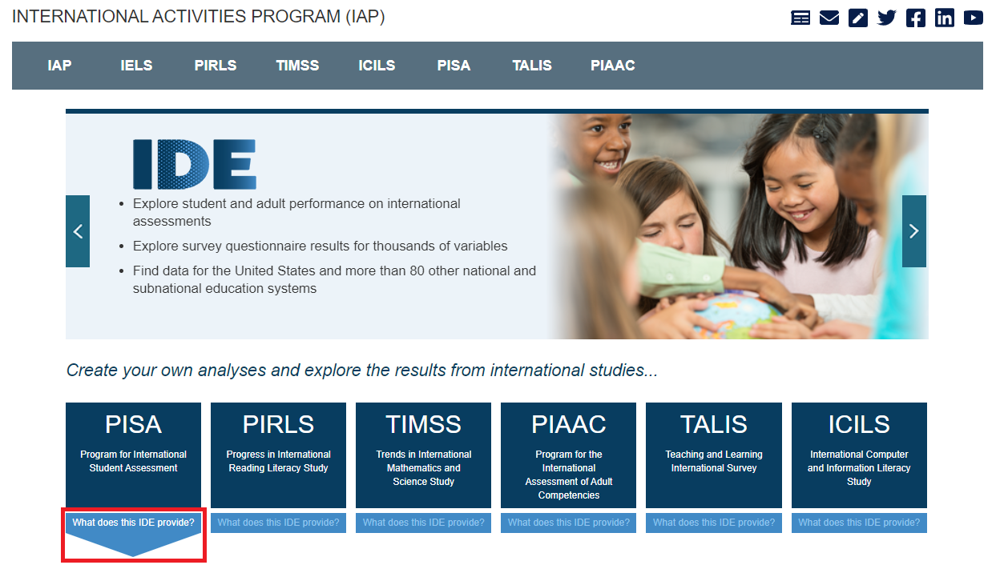
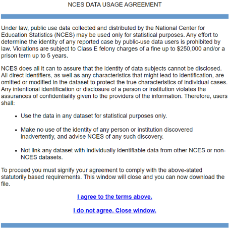

# Overview of the International Data Explorer (IDE) {#overview}

## What is the IDE? 

The National Center for Education Statistics (NCES) has made it easy to explore and analyze large-scale international education study data via various tools, including the international Data Explorer (IDE). The IDE is an interactive online tool with data from the following studies: 

-	[Program for International Student Assessment (PISA)](https://nces.ed.gov/surveys/pisa/){target="_blank"}
-	[Progress in International Reading Literacy Study (PIRLS)](https://nces.ed.gov/surveys/pirls/index.asp){target="_blank"}
-	[Trends in International Mathematics and Science Study (TIMSS)](https://nces.ed.gov/timss/){target="_blank"}
-	[Program for the International Assessment of Adult Competencies (PIAAC)](https://nces.ed.gov/surveys/piaac/index.asp){target="_blank"}
-	[Teaching and Learning International Survey (TALIS)](https://nces.ed.gov/surveys/talis/){target="_blank"}
-	[International Computer and Information Literacy Study (ICILS)](https://nces.ed.gov/surveys/icils/){target="_blank"}

The IDE provides a wide set of functions, including:

-	Explore student and adult performance on international assessments
-	Explore survey questionnaire data for thousands of variables
-	Find data for the United States and more than 80 foreign education systems
-	Create tables, charts, and maps
-	Calculate averages, percentages, standard deviations, percentiles, and performance/proficiency levels
-	Run statistical tests, including gap analyses

## How do I access the IDE?

1. Visit the IDE home page [https://nces.ed.gov/surveys/international/ide/](https://nces.ed.gov/surveys/international/ide/){target="_blank"}.
2. Select the assessment or survey of interest and start exploring. View “What does this IDE provide?” under each study to learn more

## NCES data usage agreement
In order to be able to enter the IDE, it is necessary to review and agree to the terms of the NCES Data Usage Agreement. You may see the following screen when visiting each of the IDE page from the IDE home page. After you click on the button agreeing to the terms, you will be taken to the Data Explorer. If you do not do this, you will be redirected to the IDE home page.

## Computer requirements for the IDE
The IDE performs best under the following requirements.

-	Screen resolution should be 1024 x 768 pixels or higher.
-	Browsers: Google Chrome, Apple Safari, Internet Explorer (IE) version 10 or higher, FireFox 3.0 or higher.
-	Enable JavaScript and pop-ups in your browser.
-	The TIMSS IDE requires Flash version 9.0.115 or higher (download Adobe Flash Player at http://get.adobe.com/flashplayer/).
-	Exports of files to Microsoft Office can be opened with Office 2003 or later.
-	Exports of files to PDF can be read with Adobe Acrobat Reader.
-	Screen reader software should be JAWS 8.0 or higher.
