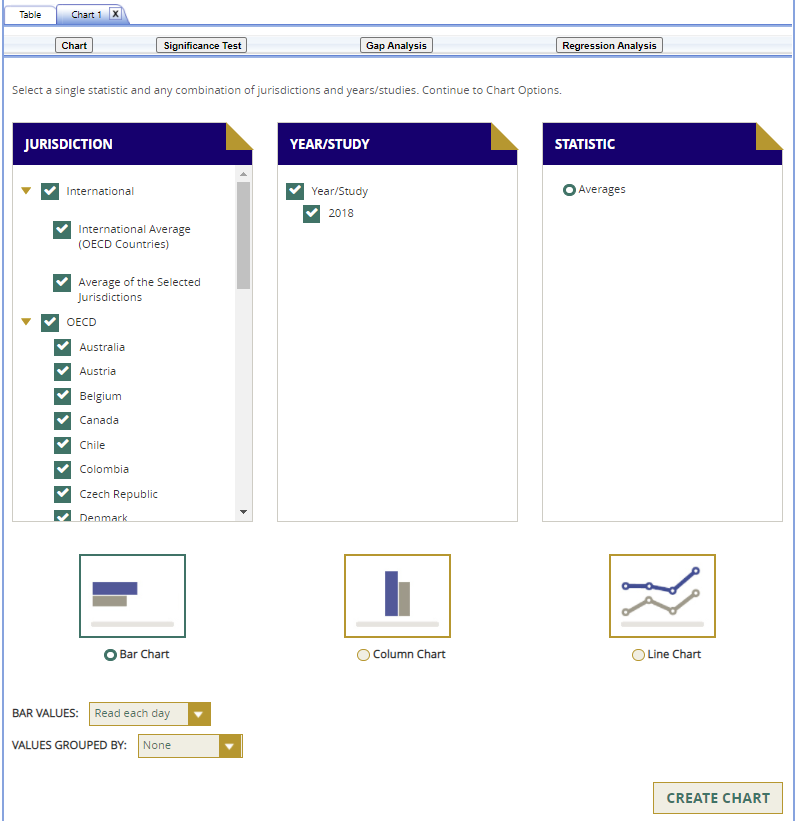
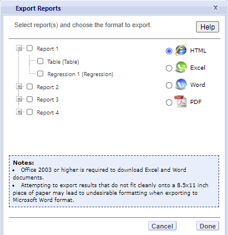

# PISA IDE Walkthrough {#pisawalkthrough}

There are four general steps for exploring each IDE page (see exhibit 3). Each step is described in more detail in the following sub-sections. 

Exhibit 3. What you will see in the IDE environment and what each step entails
{width="100%" style="display: block; margin: 0 auto"}


## 1. Select Criteria

### 1.A. Overview 

Your data query in the PISA IDE begins on the **Select Criteria** screen
(see exhibit 3).

Select a **Language** from the drop-down menu and then select a
**Subject** from the drop-down menu. Once the screen resets, you can
choose one or more **Years**, **Measures,** and **Jurisdictions** for
the data you wish to view or compare. Use the **Reset** button, located
in the upper-right portion of the screen (just below the **Help**
button), to cancel your selections and begin again.

Click on a blue sideways-facing arrow (►) to open up a category and
click on a blue downward-facing arrow (▼) to close a category.

Exhibit 3. Selecting criteria

{width="6.236430446194226in"
height="5.361384514435696in"}

### 1.B. Choose Subject

Under **Subject**, you have the choice of **Mathematics, Reading, and
Science**; **Financial Literacy**; **Collaborative Problem Solving;
Problem Solving**; **Science (2003)**; **Science (2000)**; or
**Mathematics (2000)**. Once a subject is chosen, the screen resets and
you can select **Year**(s), **Measure**(s), and **Jurisdiction**(s).

The PISA mathematics and science frameworks were revised in 2003 and
2006, respectively. Because of changes in the frameworks, it is not
possible to compare learning outcomes from PISA 2000 with those from
later cycles in mathematics and learning outcomes from PISA 2000 and
2003 with those from later cycles in science. Thus, mathematics data
from 2000 and science data from 2000 and 2003 appear separately in the
Subject dropdown.

### 1.C. Choose Year

At the top of the **Measure** and **Jurisdiction** sections, you have
the choice of selecting 2018, 2015, 2012, 2009, 2006, 2003, and/or 2000
by checking the appropriate box. To include data from all years, check
the "All Years" box to the left of the individual years. Reading,
mathematics, and science data are available for all years. Currently,
problem-solving data are available for 2012, collaborative
problem-solving data are available for 2015, and financial literacy data
are available for 2012, 2015, and 2018.

### 1.D. Choose Measure 

After choosing a subject, you can choose between the overall scale
and/or any of the subject's subscales. However, subscales are only
available for the subject area that was the major domain in a particular
year. Note that the overall scale is the default.

In addition, there are a number of continuous variables other than scale
scores that you may choose as a measure of analysis. These variables
fall under different categories, such as Student and Family
Characteristics and School and Classroom Climate, and include variables
such as student age in years, size of class, and an index of computer
availability.

### 1.E. Choose Jurisdiction

With your **Measure**(s) and **Year**(s) selected, next choose at least
one **Jurisdiction.**

Jurisdictions are found under the following groups: **OECD**,
**Non-OECD**, and **US States and Territories.** There is also a group
category called **International,** with options to display the
**International Average (OECD Countries)** and the **Average of the
Selected Jurisdictions.**

The general procedures for selecting one or more jurisdictions are as
follows:

1.  To open or close jurisdictions, click on the arrow. Jurisdictions in
    the group are open and can be selected when the blue arrow points
    down (see exhibit 4).  

2.  Click the checkboxes next to the specific jurisdictions that you are
    interested in, or uncheck those jurisdictions that you wish to
    deselect. If you click the checkbox next to the group name (e.g.,
    "OECD"), you will select all the jurisdictions within that group. If
    desired, uncheck the group name to deselect all.

3.  If you want to close a group (for example, close the list of OECD
    countries in order to readily see the non-OECD jurisdictions), click
    the blue arrow next to the group name. The closed group's arrow
    points to the right. Be advised that closing the group will not
    deselect your choices.

Exhibit 4. Choosing jurisdictions

{width="6.243375984251968in"
height="5.375276684164479in"}

To continue in the IDE, click the **Select Variables** button at the
bottom right of the page or the tab at the top of the page to go to the
next screen (see exhibit 4).

## 2. Select Variables

### 2.A. Overview 

Step 2, **Select Variables,** can only be accessed after choosing
criteria at step 1, **Select Criteria**.

To continue your data query and edit a report, *you must choose at least
one variable on this screen.* You can browse for variables using the
**Category** and **Sub Category** lists or by using the **Search**
function (see exhibit 5). You can return to this screen to change
variable selections at any time.

Exhibit 5. Select variables overview

{width="6.271155949256343in"
height="4.569679571303587in"}

### 2.B. Search Using Category and Sub Category Lists

On the **Select Variables** screen, choose at least one variable for
your report. One way to do this is to search for variables using the
**Category** and **Sub Category** lists. If you don't wish to choose
from any of the specified categories and subcategories, then select
**All students** in the **All Students** category.

The variables shown are tied to the criteria you selected at step 1
(**Measure, Year,** and **Jurisdiction**), which are indicated at the
top of the screen. To change any of these criteria, return to step 1,
**Select Criteria**.

To browse for variables, get details about them, select them, and view
them:

1.  Click the blue arrows to open and close categories and subcategories
    of variables (see exhibit 6).

```{=html}
<!-- -->
```
4.  Click **details** or **hide details** to show or hide the full title
    of a given variable, the PISA ID, and the values (i.e., value
    labels). Note that some variables have the same or similar short
    titles, but comparing details will show you how they differ. See the
    example in exhibit 6, which shows two **Grandparents** variables
    (SU002004 and SU012305). The differences between these two variables
    are described in the details.

5.  Click the checkbox next to a variable to select it for your
    analysis/report. You will see the count increase next to **View
    Selected**.

6.  Click the **View Selected** tab to see the variables you have
    chosen. To return to the full list of variables by category, click
    the **View All** tab.

7.  Remember to select the year for which you wish to build a report and
    make sure that data are available for your chosen year and
    variables.

8.  Searching variables is an option from the **Search** box. See
    Section 2.C Search Function for more details about this function.

Exhibit 6. Select variables using category and sub category lists

{width="6.305879265091863in"
height="4.583568460192476in"}

When selecting **Financial Literacy** as the subject, additional student
questionnaire items will appear under the category **Students' Financial
Awareness and Experiences.** These items address key areas related to
students' experience and exposure to financial literacy including access
to information and education, access to money and financial products,
and spending and saving behaviors.

When you have selected the variable(s) you want to include, continue by
clicking the **Edit Reports** button at the bottom of the page or the
tab at the top of the page to go to the next screen.

### 2.C. Search Function

The second way to search for variables is to use the **Search** function
on the **Select Variables** screen. 

Type a term in the **Search** box and click **Go** (or hit "Enter" on
your keyboard) to find variables by keywords in the question and/or
details for the variable (see exhibit 7). If you use multiple keywords,
"and" is assumed. You can narrow your search by using "or," "not," or
"and not." The search function operates on an exact phrase if it is
contained in quotes. The variable(s) that include the search term(s) in
the question or its details will be listed.

Exhibit 7. Select variables using the search function

{width="6.2642104111986in"
height="4.590513998250219in"}

When you have selected the variable(s) you want to include, continue by
clicking the **Edit Reports** button at the bottom of the page or the
tab at the top of the page to go to the next screen.

## 3. Edit Reports

### 3.A. Overview

You can access step 3, **Edit Reports,** after choosing criteria at step
1, **Select Criteria**, and choosing variables at step 2, **Select
Variables**. The IDE will automatically build reports based on your
selections from steps 1 and 2. However, at step 3, the **Edit Reports**
phase, you may modify your selections for each report.

At this step, you can

-   preview and edit the layout of your reports;

-   copy reports or create new reports based on the variables selected;

-   change formatting options, such as number of decimal places to
    display, for all reports (these may also be changed in individual
    reports, but format options can overwrite previous edits);

-   change statistics options, such as averages, for all reports (these
    may also be changed in individual reports, but statistics options
    can overwrite previous edits);

-   select reports to be built into tables and charts at step 4, **Build
    Reports**; and  

-   delete reports.

Using your chosen criteria, the IDE will return a separate data report
for each variable you have chosen. If you have selected two or three
variables (not counting **All Students**), you will also see a
cross-tabulated report for these variables. If you have chosen four or
more variables you will get tables for each variable, but you won't get
the cross-tabulation. If your selected criteria include more than one
measure (e.g., overall mathematics scale and one or more subscale or
continuous variable), a separate set of data reports will be generated
for each measure (see exhibit 8).

**Exhibit 8. Edit reports overview**

{width="6.10416447944007in"
height="3.2216437007874017in"}

The **Edit Reports** step shows detailed information on the layout of
your reports. The **Report** column indicates the report, or
cross-tabulation report, number based on the variable(s) chosen during
the criteria selection. Under the **All** tab, reports may be chosen for
the report-building phase, either by selecting **All** or selecting
individual reports. The **Action** column gives you the option to
**Preview**, **Edit, Delete**, or **Copy** the report. The **Measure**
column shows which measure the report will portray. The **Variable**
column indicates the variable(s) included in the report. The **Year**
column shows which years you have selected for comparison. The
**Jurisdiction** column shows the countries and subnational education
systems selected for comparison, and the **Statistic** column provides
the type of statistic output that will be generated in the
report-building phase.

### 3.B. Preview Report

Select **Preview,** in the **Action** column (see exhibit 8), to see how
your report will be laid out. The preview will not provide actual data
but will show how the data will be arranged in rows and columns (see
exhibit 9). You can select **Preview** at any time to see how your
changes will affect the report's final layout.

Exhibit 9. Using preview report

{width="6.5in" height="4.865971128608924in"}

### 3.C. Edit Report

To edit the report, select the **Edit** command, in the **Action**
column, next to the report number (see exhibit 8). (Another way to edit
a report is to select the **Edit** tab when you are previewing a
report.) The following can be done using the edit function (see exhibit
10):

1.  Name your report. You have the option of giving each report a
    distinctive name, up to a limit of 50 characters, using only
    letters, numbers, spaces, underscores, and hyphens. (Otherwise, by
    default, the report is named Report 1, Report 2, etc., or
    Cross-Tabulated Report 1, Cross-Tabulated Report 2, etc.)

```{=html}
<!-- -->
```
9.  Select a measure. You can choose a measure if more than one was
    selected at step 1.

10. Select which jurisdictions, variables, years (if applicable), and
    statistics to include (out of the selections previously made at
    steps 1 and 2). You can select up to two statistics options from the
    following: averages, percentages, standard deviations, and
    percentiles. (For further information, see Section 3.G. Statistics
    Options.)

11. To create a new variable while editing a report, click on **Create
    New...** under the **Variable** heading. Section 3.D below explains
    the process for creating a new variable.

12. Change the table layout by dragging elements to determine which
    items will appear in rows and which will appear in columns. Some of
    the arrangements will not be permissible, but a pop-up alert will
    explain this.

Exhibit 10. Editing reports

{width="6.052084426946632in"
height="4.539062773403325in"}

To save changes, make sure to select **Done** in the upper-right portion
of the screen before closing the **Edit Report** window.

### 3.D. Create New Variables

To create a new variable, select **Edit,** in the **Action** column, and
select **Create new...** under **Variable** (see exhibit 10). The new
variable is created by combining values for an existing variable. The
steps are as follows:

1.  Click **Create new\...** under the **Variable** heading.

2.  Select the variable for which you wish to combine values.

```{=html}
<!-- -->
```
13. Select the values you want to combine by checking the boxes to the
    left of the values (see exhibit 11).

14. Create a name for the new value, and press **Create**. The collapsed
    values will appear in gray to indicate that they have already been
    used.

15. Wait for the screen to refresh, and press **Done**.

16. The new variable will appear in the **Variable** list in the **Edit
    Report** window or **Create New Report** window, designated as
    "collapsed."

17. Check the box next to the new variable to view it in the report. You
    can click **Preview** to see how the table will be laid out before
    retrieving data.

Exhibit 11. Creating new variables

{width="3.909073709536308in"
height="4.354166666666667in"}

A new variable that you create is applicable only to a specific report;
it does not apply to the other reports listed on the **Edit Reports**
screen. For example, if you selected multiple measures of science
literacy for analysis, then you would need to create the new variable
for each measure, or create a copy of the report and edit it
accordingly. To do the latter, click on **Copy** report on the **Edit
Reports** screen (copied reports appear at the end of the list of
reports) and then, for the new copy, click on **Edit** (using the above
example, you can change the measure and give the report a new name).

You can repeat the process and combine different values of a variable to
create additional new variables. Using the **Create New Report**
function, you can create a new report for each new variable that you
create. (For further information, see section 3.E. Create New Report,
below.)

If you selected two or three variables from which to create new
variables, you can repeat the process for each of them. Using the
**Create New Report** or **Edit Report** function, these collapsed
variables will be listed and available for cross-tabulation (see exhibit
12). If you have chosen four or more variables (not counting **All
Students**) you won't get the cross-tabulation. You can click
**Preview** to see how the table will be laid out before retrieving
data.

Exhibit 12. Edit reports with collapsed variables

{width="6.445249343832021in"
height="4.854166666666667in"}

### 3.E. Create New Report

From the main **Edit Reports** screen, clicking on **Create New Report**
brings up the same options as **Edit Report**, but with no checkboxes
marked and without any new variables you may have created. Thus,
**Create New Report** provides a clean slate for your selections from
the first two steps, **Select Criteria** and **Select Variables** (see
exhibit 13). Each new report you create will appear at the end of the
list of reports. If you do not give the report a specific name, it will
be called "New Report".

Exhibit 13. Creating new reports

{width="6.5in" height="4.825694444444444in"}

### 3.F. Format Options 

From the main **Edit Reports** screen, clicking on **Format Options**
will allow you to make formatting changes applicable to all the reports
listed. The following formatting options are available using this
function (see exhibit 14):

1.  **Variable Labels (Long)** displays a more detailed description of
    the variables selected in a query than the default short label. For
    variables from questionnaires, the full text of the question is
    displayed. Be advised that the length of the extra detail may
    sometimes interfere with table formatting.

```{=html}
<!-- -->
```
18. **Show data for values categorized as "missing"** will include the
    percentage of students in the total sample or in a reporting group
    for whom membership in a particular response category is unknown
    because no response was given by the students, their teacher, or
    their school. The percentage of "missing" will be shown in the
    right-most table column. Missing data are available only for queries
    that involve percentages as the statistic type. Unless you check
    this option, the default is for missing responses not to be included
    in the percentage distribution shown.

19. **Decimal Places** allows you to specify the level of precision for
    a particular statistic. Depending on the value range of the
    dependent variable (for example, the dependent variable "PISA
    Mathematics Scale: Overall Mathematics \[PVMATH\]" ranges from 0 to
    1,000; the dependent variable "Index economic, social and cultural
    status \[ESCS15\]" ranges from -5 to 5), the default decimal places
    for a report could be from zero to three. Also, standard errors will
    be shown to one more decimal place than is shown for their
    respective statistic. For example, if you request that average
    scores be displayed to one decimal place (by default, the average
    scores are rounded to the nearest whole number), the corresponding
    standard errors will display two decimal places. If you export to
    Excel, you will be able to increase the number of decimal places in
    most cases. Note that only integer-level precision is allowed for
    percentages; that is, the number of decimal places is fixed at
    "none" for percentages and the corresponding standard errors are
    shown to one decimal place.

20. **Include** gives you the option of showing standard errors. By
    default, standard errors are shown inside parentheses, but you can
    choose to show them without parentheses*.* You can preview the
    effects of your selection in the **Sample Display** area (see the
    blue-shaded box at the bottom of exhibit 14 below).

Exhibit 14. Format options

{width="2.2777766841644795in"
height="3.4166666666666665in"}

Be advised that the choices you make in the **Format Options** window
will apply to all reports and cannot be changed for individual reports.
Use the **Reset** button, located in the upper-right portion of the main
**Edit Reports** screen (just below the **Help** button), to restore the
**Format Options** to the default settings (although caution is advised,
as this will also delete any new reports that you have created).

### 3.G. Statistics Options

Available only from the main **Edit Reports** screen, clicking on
**Statistics Options** allows you to designate up to two statistics. The
selections you make are applicable to all the reports listed, although
you can also change the statistics for an individual report when you
edit it. (For further information, see Section 3.C. Edit Report.)

The following statistics options are available (see exhibit 15):

1.  **Averages.** This statistic provides the average value for a
    selected continuous variable or score (i.e., overall score or
    subscale score). For the PISA assessment, student performance is
    reported on scales that range from 0 to 1,000. By default, the
    standard errors of the scores are shown in parentheses.

2.  **Percentages.** This statistic shows the percentage of students as
    a row percentage. For example, if the first column lists countries,
    then each country will display its own percentage distribution
    across its row. By default, percentage distributions do not include
    missing data. For information on how to show data for values
    categorized as missing, see Section 3.F. Format Options.

3.  **Standard deviations.** The standard deviation is a measure of how
    widely or narrowly dispersed scores are for a particular dataset.
    Under general normality assumptions, 95 percent of the scores are
    within two standard deviations of the mean. For example, if the
    average score of a dataset is 500 and the standard deviation is 100,
    it means that 95 percent of the scores in this dataset fall between
    300 and 700. The standard deviation is the square root of the
    variance.

4.  **Percentiles.** This statistic shows the threshold (or cutpoint)
    score for the following:

    -   10^th^ percentile -- the bottom 10 percent of students

    -   25^th^ percentile -- the bottom quarter of students

    -   50^th^ percentile -- the median (half the students scored below
        the cutpoint and half scored above it)

    -   75^th^ percentile -- the top quarter of students

    -   90^th^ percentile -- the top 10 percent of students

Exhibit 15. Statistics options

{width="2.7916666666666665in"
height="3.5369531933508314in"}

As previously noted, the selections you make in **Statistics Options**
will be applied automatically to all reports, although you can change
the statistics for an individual report when you edit it. Be advised
that if you use **Statistics Options** after editing the statistics in
one or more of your individual reports, the statistics options selected
will overwrite your previously edited selections. If you wish to use the
same criteria and variables in a report with a different selection of
statistics, consider using the **Create New Report** function to
generate a new report with different statistics. (For further
information, see Section 3.E. Create New Report.) You can also make a
copy of an individual report.

You can use the **Reset** button, located in the upper-right portion of
the main **Edit Reports** screen (just below the **Help** button), to
restore the **Statistics Options** to the default setting, which is
averages for all reports (this will also delete any new reports that you
created).

Not all statistics are available for all reports. Their availability
depends on other selections you have made to define the content and
format of your report:

-   Percentages will not display if jurisdictions or years appear in
    columns.

-   If proficiency levels are selected in the variable section, only
    average scores and percentages will be displayed.

Please note that the statistics produced by the IDE may not match the
statistics in reports published by the OECD due to differences in
certain statistical standards. In particular, NCES and the OECD may
differ in the minimum sample sizes required for publishing estimates. In
the IDE, statistics for a group are suppressed if they are based on less
than 62 cases. In the OECD reports, statistics are suppressed if there
are fewer than 30 students or fewer than 5 schools with valid data.

### 3.H. Select Reports to Build

As you edit your reports, you can give them distinct names (up to 50
characters) to differentiate them, as well as make changes to the
jurisdictions and variables previously selected, the statistics, and the
layout of the rows and columns. (For further information, see section
3.C. Edit Report.) You may make copies of reports with these changes. In
order to proceed to step 4, **Build Reports**, each report for which you
want to retrieve data should be previewed using the **Preview**
function. To decrease processing time as you move to step 4, you can
uncheck any reports for which you do not wish to retrieve data. By
default, all reports are checked. To uncheck one or more reports, you
can either uncheck the reports individually or click on the **All** box.
(Doing the latter will uncheck all of the reports and allow you to check
only those for which you wish to retrieve data.) In the example that
follows (see exhibit 16), data will be retrieved for all reports.

Exhibit 16. Selecting reports to build
{width="6.2503215223097115in"
height="3.319615048118985in"}

If you wish to delete a report from the list of reports, click
**Delete** (see 1 above) in the **Action** column. Use the **Reset**
button (see 2 above), located in the upper-right portion of the screen
(just below the **Help** button), to restore the deleted reports
(although caution is advised, as this will also delete any new reports
that you created and restore the **Format Options** and **Statistics
Options** to the default settings).

To continue to the last step in the IDE, click the **Build Reports**
button at the bottom of the page (see 3 above) or the tab at the top of
the page to go to the next screen.

## 4. Build Reports

### 4.A. Overview

You can access step 4, **Build Reports**, after choosing criteria at
step 1, **Select Criteria**, in which case the default report built will
provide data for just averages and for the **All Students** variable.
After step 1, you may also go on to steps 2 and 3, where you can select
additional variables and edit reports, before moving on to **Build
Reports**. In **Build Reports**, you can do the following:

1.  Generate a data table for each report as shown in the **Select
    Report** drop-down feature (see 1 in exhibit 17). By default, all
    reports are checked at step 3, although you can uncheck any reports
    for which you do not wish to retrieve data. (For further
    information, see section 3.H. Select Reports to Build.)

```{=html}
<!-- -->
```
21. Export and save data tables into various formats using the **Export
    Reports** button (see 2 in exhibit 17). The output formats include
    HTML (print-friendly), Microsoft Excel, Microsoft Word, and Adobe
    PDF.

22. Select the **Chart** tab (see 3 in exhibit 17) to create and
    customize charts for each report and save them for export in the
    above formats.

23. Select the **Significance Test** tab (see 4 in exhibit 17) to run a
    significance test on your results, customize it, and export it.

Exhibit 17. Building reports overview
{width="6.271155949256343in"
height="3.5487937445319333in"}

### 4.B. View Reports as Data Tables

Some reports will take longer than others to process, so please do not
hit the "Back" button on your browser once you click on **Build
Reports** (see exhibit 18). Your table will appear once the processing
is complete. To select a different table to view, go to the **Select
Report** drop-down menu (see 1 in exhibit 17) and choose the table of
interest. To change the formatting or statistics options of a table or
to generate a table from a report not included in your selection, return
to step 3, **Edit Reports**.

Exhibit 18. Processing data{width="6.5in"
height="3.2909722222222224in"}

### 4.C. Charts

To create a chart, go to **Select Report** on the **Build Reports**
screen to choose the report of interest from the drop-down menu, and
then click the **Chart** link (see exhibit 19).

You will be able to create many types of charts and customize them.
Section 4.E. Create Charts -- Chart Options provides a summary of the
available features and how they can be customized.

Exhibit 19. Viewing reports as charts
{width="6.278100393700788in"
height="2.1181649168853895in"}

### 4.D. Create Charts

When you click **Chart,** you will first make selections pertaining to
**Jurisdiction, Year/Study, and** **Statistic** (see exhibit 20). All
**Jurisdictions** and **Studies** are selected by default, while you can
only choose one **Statistic**. Uncheck any of the criteria that you do
not wish to chart, as long as you have one selected in each category.

Only the statistics option(s) used to report data in the previous step
will be presented, and only one statistics option can be selected at a
time. For example, **Percentiles** will appear as the only data option
to build the chart if the table created in the previous step is
reporting data with only percentiles selected as the statistics option.

Once you are finished with the Data Options, click the **Create**
**Chart** button in the lower-right corner of the screen.

Exhibit 20. Data options for charts

{width="6.343741251093613in"
height="6.5347703412073495in"}

### 4.E. Create Charts -- Chart Options

Next, you can make selections regarding the chart options located below
on the same page.

1.  Select **Bar Chart**, **Column Chart**, or **Line Chart** (see 1 in
    > exhibit 21). If the Percentiles Statistic is selected, you can
    > also select from a **Percentiles Chart** option.

2.  After selecting a chart type, change any data dimensions from the
    > drop-down menus for **Bar**, **Column**, or **Line Values** and
    > **Values Grouped by** (see 2 in exhibit 21). Any new variables
    > that you created at step 3, **Edit Reports**, will be available
    > for selection, but only if you selected the variables (by clicking
    > the checkbox next to them) and pressed **Done** after you edited
    > the report.

3.  Create your chart by clicking the **Create Chart** button in the
    > lower-right corner (see 3 in exhibit 21).

**Exhibit 21. Chart options**

{width="6.413897637795276in"
height="6.6070395888014in"}

While previewing your chart, you can do the following (see exhibit 22 as
an example of a **Percentile Chart** and exhibit 23 as an example of a
**Bar Chart**):

1.  Use the drop-down menus to change the jurisdiction and other
    > variables as applicable.

2.  Place your cursor over the bars of the chart to see the data points
    > and value label(s).

Exhibit 22. Percentile chart {width="6.5in"
height="6.060416666666667in"}

Exhibit 23. Bar chart

{width="5.85416447944007in"
height="5.202889326334208in"}

You can choose **"Back to Chart Options"** (located in the upper-left
corner, below the **Chart** link) to make more changes.

To make an additional chart from the same report or table, click the
**Chart** link on the **Build Reports** screen. It is recommended that
you provide a new chart name (the default is Chart 1, Chart 2, etc.). If
you don't start the process again by clicking the **Chart** link, the
new chart will overwrite the previous one.

If you wish to make charts from other reports, select another report in
the **Select Report** drop-down list. If other reports were not checked
in step 3, **Edit Reports**, go back to step 3 and check the ones you
want. Then, when you advance to step 4, **Build Reports**, the reports
will appear in the **Select Report** drop-down list. If you need to
create new reports, go back to step 1, **Select Criteria**, and/or step
2, **Select Variables**. Remember to export any completed charts you
want to save by clicking **Done** and using the **Export Reports**
function before leaving the **Build Reports** screen. (For further
information, see **Section 4.I. Export Reports**.)

### 4.F. Significance Tests

Tests for statistical significance indicate whether observed differences
between estimates are likely to have occurred because of sampling error
or chance. "Significance" here does not imply any judgment about
absolute magnitude or educational relevance. It refers only to the
statistical nature of the difference and whether that difference likely
reflects a true difference in the population.

With your report of interest selected, click the **Significance Test**
link, which is located to the right of the **Chart** link (see exhibits
17 and 24). You first need to decide which variable you want to test and
the criterion by which you want to test it (i.e., between jurisdictions,
within variables, or across years). You will compare or look across the
variable's range of values, so it must have more than one value. You can
look across jurisdictions for a variable (that is, compare between two
or more jurisdictions) or you can look across the values within a
variable for a single jurisdiction. For example, with the variable shown
in exhibit 24, you could choose to compare scores of female students
between countries and subnational education systems, or you could choose
to compare scores of female students and male students.

The general steps for running significance tests are as follows (see
exhibit 24):

1.  In the **Significance Test** window, select either **Between
    Jurisdictions**, **Within Variables**, or **Across Years**. Then,
    select the appropriate jurisdiction(s), variable(s), year(s), and
    statistic(s). For **Between Jurisdictions**, select at least two
    jurisdictions. For **Within Variables**, select one or more
    jurisdictions. For **Across Years**, more than one year needs to be
    selected.

```{=html}
<!-- -->
```
24. You can enter a **Test Title** limited to 25 characters, using only
    letters, numbers, spaces, underscores, and hyphens (otherwise, by
    default, the test is named "Sig Test 1").

25. Select the output type as either **Table** or **Map**. The table
    option will show the significance test results as a matrix. The map
    option will show the significance test results on a world map,
    highlighting countries and subnational education systems that have
    been selected. The map output is only available when **Between
    Jurisdictions** is selected in the first step.

26. Additional options allow you to select **Show Score Details** to
    display the estimates and standard errors for the table cells. If
    you selected a map, this option is not applicable, as the map will
    automatically show score details.

27. Click the **Preview** tab located in the upper-left corner, or the
    **Preview** button located in the bottom-left corner.

28. Click the **Edit** tab in the upper-left corner of the screen if you
    wish to go back and make changes to the selections you made for
    running the significance tests.

29. Click the **Done** button in the upper- or lower-right corner of the
    screen to run the significance tests.

Exhibit 24. Significance test options

{width="6.20833552055993in"
height="4.816951006124235in"}

When the table option is selected, you will get a significance test
matrix in which you will see the differences and *p* values. Using the
symbols shown in the legend of the matrix, an indication is also
provided of whether one estimate is significantly lower or higher than
another estimate or whether there is no significant difference (see
exhibit 25).

The alpha level for all *t*-tests is .05. All comparisons within a
jurisdiction, within the same year, are made using dependent *t*-tests.
Comparisons between jurisdictions are treated as independent, and
comparisons of achievement across years are made using independent
*t*-tests with a linking error taken into account.

PISA assessments are linked across years. That is, the sets of items
used to assess mathematics, reading, and science across years include a
subset of common items, referred to as link items. To establish common
reporting metrics for PISA, the difficulty of the link items, measured
on different occasions, is compared. The comparison of the item
difficulties on the different occasions is used to determine a score
transformation that allows the reporting of the data on a common scale.
As each item provides slightly different information about the link
transformation, it follows that the chosen sample of link items will
influence the estimated transformation. The consequence is an
uncertainty in the transformation due to the sampling of link items,
just as there is an uncertainty in country means due to the sampling of
students. The uncertainty that results from the link-item sampling is
referred to as linking error, and this error must be taken into account
when making certain comparisons using the PISA assessment data. As with
sampling errors, the likely range of magnitude for the errors is
represented as a standard error. Significance tests for scores across
years within the IDE take into account the linking errors applicable to
each subject.

Exhibit 25. Significance test table output

{width="6.166984908136483in"
height="4.5418996062992125in"}

When the **map option** is selected, a global map is shown with the
countries and subnational education systems selected shaded (see exhibit
26). The focal jurisdiction is shaded in teal green, with all other
countries compared to it. The other countries are shaded in colors that
indicate whether they are higher, lower, or not significantly different
from the focal jurisdiction on whatever measure has been selected. (Note
that a light shade of gray is the default color for jurisdictions not
selected for comparison.) When you hover over a jurisdiction, a text
bubble displays the numerical difference in estimates between that
jurisdiction and the focal jurisdiction. At any point, you may choose a
different focal jurisdiction by clicking on another country. You may
also choose a different variable category for comparison by using the
drop-down menu above the map.

Exhibit 26. Map of significance tests
{width="6.362637795275591in"
height="8.490845363079615in"}

Please note that the IDE does not apply adjustments for multiple
comparisons. This is consistent with current NCES statistical standards
and practice. However, the U.S. PISA 2000 national report published by
NCES, and the PISA 2000 international report published by the OECD, did
adjust for multiple comparisons in significance testing (using the
Bonferroni method). Therefore, results from significance testing
obtained from the IDE may not match those in the NCES and OECD PISA 2000
reports.

### 4.G. Gap Analysis

Gap Analysis is included in the IDE to compare differences in gaps shown
in a map, table, or chart. These gap differences can be compared between
jurisdictions and/or across years.

Exhibit 27. Gap analysis link selection

{width="6.557871828521435in"
height="1.7507108486439196in"}

With your report of interest selected, click on the **Gap Analysis**
link, which is located to the right of the **Significance Test** link
(see exhibit 27). You will need to decide which variable you would like
to test (e.g., gender) and the criterion by which you want to test it
(i.e., between jurisdictions or across years). The difference measure,
or gap, can be viewed between groups, between years, between groups and
years, or between percentiles within the selected variable. For example,
if you compute average mathematics literacy scores for two countries at
two time points for males and females, you can:

-   at one time point, compare the male-female gap in one country to the
    male-female gap in another country;

-   compare the male-female gap at two time points within a country;

-   compare the difference between the male-female gap at two time
    points in one country to the difference between the male-female gap
    at two time points in another country; or

-   compare the gap for females at two time points in one country to the
    gap for females at two time points in another country.

Exhibit 28. Gap analysis options

{width="6.375990813648294in"
height="4.900762248468942in"}

The steps for running a gap analysis are similar to those for conducting
a statistical significance test (see exhibit 28). Thus, to run a gap
analysis, follow the instructions under section **4.F. Significance
Tests**, noting the following differences:

1.  The **Gap Analysis** link should be selected, not the **Significance
    Test** link.

2.  The gap analysis does not have a **Within Variables** option for
    analysis; the options are **Between Jurisdictions** and **Across
    Years.**

3.  The difference measure (gap) of analysis must be selected from the
    following: **Between Groups, Between Years, Between Groups and
    Years,** and **Between Percentiles** (if variables are selected for
    which a difference measure is not feasible, the difference measure
    option will not appear as available in the Gap Analysis menu).

The gap analysis output is presented in a format similar to that of the
significance test output, with one difference: the difference estimate
shown in the output is the difference between the gaps selected for
analysis. Note that you will still see the significance of these
differences, just like in a significance test. For example, exhibit 29
shows cross-national differences between male-female score gaps.

The gap analysis function computes and statistically tests differences
between score, percentage, or percentile gaps. For gap analysis tables,
all comparisons are independent tests with an alpha level of 0.05. Note
that the reference group for the gaps is kept constant during the
analysis, as opposed to taking the absolute value of the gaps.
Therefore, the gap analysis tests whether the magnitude of the gaps
differ from each other only when the gaps go in the same direction
(e.g., comparing a 5-point gender gap favoring females in one country
with a 15-point gender gap favoring females in another country).

Exhibit 29. Gap analysis output

{width="6.464490376202975in"
height="4.833333333333333in"}

Note that a gap analysis across years cannot be combined with the
Between Years or Between Groups and Years difference measures, so you
will select the difference measure Between Groups, or, if you have
selected percentiles as one of your statistics, you may choose Between
Percentiles.

### 4.H. Regression Analysis

Regression Analysis is included in the IDE to test for the relationship
between one or more independent variables with a dependent variable,
with the independent variables controlling for each other. The type of
analysis performed in this feature of the IDE is referred to as linear
regression, with the dependent variable being a continuous variable
selected at step 1. To run a regression, first go to **Build Reports**
and choose the report of interest from the drop-down **Select Report**
menu. Then click on the **Regression Analysis** link, which is to the
right of the **Gap Analysis** link (see exhibit 30).

Exhibit 30. Regression analysis link selection

{width="6.512162073490813in"
height="2.2088451443569554in"}

The general steps for running a regression analysis are as follows (see
exhibit 31):

1.  In the **Regression Analysis** pop-up window, you can enter a
    **Name** limited to 25 characters, using only letters, numbers,
    spaces, underscores, and hyphens (otherwise, by default, the test
    will be named "Regression 1").

2.  Select the appropriate jurisdiction, year, and variable(s) for
    analysis. Please note that you may only choose one jurisdiction and
    year at a time, but you may choose up to three independent variables
    to be in your report. In order to use up to three independent
    variables, you must have already created and selected a
    cross-tabulated report (by selecting three variables in Step 2,
    **Select Variables**).

3.  Click the **Preview** tab located in the upper-left corner to view
    the table format into which your output will be populated. In the
    Preview tab, an "X" denotes where the output will display.

4.  Click the **Edit** tab in the upper-left corner of the screen if you
    wish to go back and make changes to the selections you made for
    running the analysis.

5.  Click the **Done** button in the upper- or lower-right corner of the
    screen to run the regression analysis.

**Exhibit 31. Regression analysis options**

{width="6.416719160104987in"
height="3.4791666666666665in"}

After you have clicked **Done**, your regression analysis output will
load onto the screen (see exhibit 32). A 0-1 contrast coding is used to
code the independent variable, where the first subgroup of the
independent variable is the reference group. Using dummy-coded variables
in a linear regression is useful for comparing each subgroup against a
reference group. For example, in exhibit 32, if the subgroup "Native" is
the reference group for the independent variable **Index immigration
status (IMMIG)**, the IDE creates a "Second Generation" dummy variable
(1 for respondents who answered "Second Generation," 0 otherwise), a
"First Generation" dummy variable (1 for respondents who answered "First
Generation," 0 otherwise). Reference group "Native" is excluded from the
regression analysis.

Exhibit 32. Regression analysis output

{width="6.33369094488189in"
height="3.0869477252843396in"}

Using the output from exhibit 32, you can compare the average
mathematics literacy scores of first- and second-generation students to
scores of native-born students. When a single dummy-coded variable is
used in a regression, the *intercept* is the mean of the reference group
(e.g., 510.009), and the *regression coefficient* is the difference
between the mean of the reference group and the group identified
(coded 1) with the dummy-coded variable (e.g., 1.8959 for second
generation and -31.2536 for first generation.) Since the regression
coefficients are presented with a standard error and a *t* value, they
can be used to test whether a difference between means is statistically
significant. Under the Significance column in the output you will see
three possible signs: (1) \< signifies a significant negative
difference, (2) \> signifies a significant positive difference, and (3)
x signifies the difference is not statistically significant.

### 4.I. Export Reports

Click on the **Export Reports** button/arrow located on the right side
of the **Build Reports** screen to save or print your tables, charts,
and significance tests. The report names that appear in the **Export
Reports** window are those that were checked off at step 3, **Edit
Reports**.

Check the files you want to export and select one of the file formats:
**HTML** (print-friendly), **Excel, Word,** or **PDF** (see exhibit 33).
All reports that you select at the same time will be exported in one
file. In the Excel format, you will be able to increase the visible
decimal places visible wherever more precision is available. Because
there are many different operating systems in use, you may get an error
message with Excel or one of the other formats. Usually this will not
affect your ability to export, so please wait for the software errors to
resolve.

Exhibit 33. Export report options

{width="3.3478258967629047in"
height="3.4608694225721783in"}


