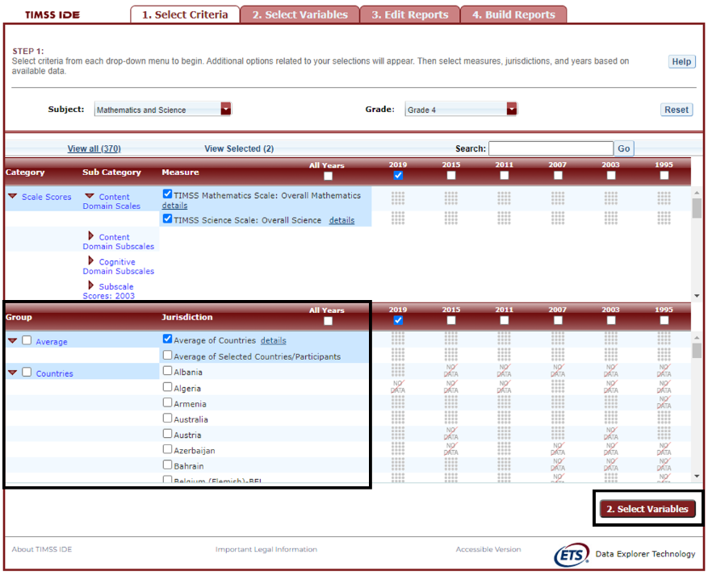

# IDE Walkthrough {#walkthrough}

There are four general steps for exploring each IDE page (see exhibit 3). Each step is described in more detail in the following sub-sections. 

Exhibit 3. What you will see in the IDE environment and what each step entails

The following subsections covers the steps in details to explore data in the IDE. The IDE process is similar across all studies, so this guide primarily uses the screenshots from the PISA IDE by default. However, relevant screenshots from the other IDEs are included as needed to illustrate differences between studies. By following the instructions below, users can explore the data from any of IDEs.

## Select Criteria

### Overview

Your data query in the IDE begins on the Select Criteria screen (see exhibit 2).
Choose one *Subject*, one *Grade*, and one or more *Measures*, *Years*, and *Jurisdictions* for the data you wish to view or compare.
Use the *Reset* button, located in the upper-right portion of the screen (just below the *Help* button), to cancel your selections and begin again.
Click on a red sideways-facing arrow (►) to open up a category and click on a red downward-facing arrow (▼) to close a category.

### Choose Subject

Under *Subject*, you have the choice of *Mathematics and Science*, *TIMSS Advanced: Advanced Mathematics*, or *TIMSS Advanced: Physics*. 

### Choose Year

At the top of the *Measure* and (Jurisdiction) sections, you have the choice of selecting 2019, 2015, 2011, 2007, 2003, 1999, and/or 1995 by checking the appropriate box. To include data from all years, check the “All Years” box to the left of the individual years. Mathematics and science data are available for 2019, 2015, 2011, 2007, 2003, 1999, and 1995. In 1999, no data for grade 4 were collected in mathematics or science. Advanced mathematics and physics data are available for 2015 only. 

### Choose Measure

After choosing a subject, you can choose between the overall scale and/or any of the subject’s subscales. The overall scale and subscales can be used for trend analyses across years where applicable.

In addition, there are a number of continuous variables other than scale scores that you may choose as a measure of analysis. These variables fall under different categories, such as “Student and Family Characteristics” and “Teacher Background Characteristics, Formal Education, and Training” and include variables such as age, teaching experience, and class size. 

### Choose Jurisdiction

With your* Measure(s)* and *Year(s)* selected, next choose at least one *Jurisdiction*. 

Jurisdictions are found under the following groups: *Countries*, *U.S. Jurisdictions*, and *Benchmarking Participants*. There is also a group category called *Average*, with options to display the *Average of Countries* and the *Average of Selected Countries/Participants*. *Average of Countries* displays the average statistic for all available jurisdictions under the “*Countries*” group, except when “*All students*” is selected at step 2, in which case *Average of Countries* displays the TIMSS scale centerpoint of 500.

The general procedures for selecting one or more jurisdictions are as follows:

1.	To open or close jurisdictions, click on the arrow. Jurisdictions in the group are open and can be selected when the red arrow points down (see exhibit 3).    
2.	Click the checkboxes next to the specific jurisdictions that you are interested in, or uncheck those jurisdictions that you wish to deselect. If you click the checkbox next to the group name (e.g., “Countries”), you will select all the jurisdictions within that group. If desired, uncheck the group name to deselect all.  
3.	If you want to close a group (e.g., close the list of countries in order to readily see the benchmarking participants), click the red arrow next to the group name. The closed group’s arrow points to the right. Be advised that closing the group will not deselect your choices. 

Exhibit 3. Choosing jurisdictions 

To continue in the IDE, click the *Select Variables* button at the bottom right of the page or the tab at the top of the page to go to the next screen (see exhibit 3). 

## Select Variables

### Overview 

### Search Using Category and Sub Category Lists 

### Search Function

## Edit Reports

### Overview 

### Preview Report

### Edit Report

### Create New Variables

### Create New Report

### Format Options

### Statistics Options

### Select Reports to Build

## Build Reports

### Overview

### View Reports as Data Tables

### Charts

### Create Charts—Chart Options

### Significance Tests

### Gap Analysis

### Regression Analysis

### Export Reports

