# PIRLS IDE Walkthrough {#pirlswalkthrough}

There are four general steps for exploring each IDE page (see exhibit 3-1). Each step is described in more detail in the following sub-sections. 

Exhibit 3-1. What you will see in the IDE environment and what each step entails
{width="100%" style="display: block; margin: 0 auto"}

## Select Criteria
### Overview
Your data query in the IDE (International Data Explorer) begins on the
**Select Criteria** screen (see exhibit 3-2).

Choose one **Subject**, and one or more **Dependent Variables, Years,** and
**Jurisdictions** for the data you wish to view or compare.

Use the **Reset** button located in the upper right portion of the
screen (just below the **Help** button) to erase your choices and begin
again.

Click on a blue sideways facing arrow (►) to open up a category and
click on a blue downward facing arrow (▼) to close a category.

Exhibit 3-2. Select criteria
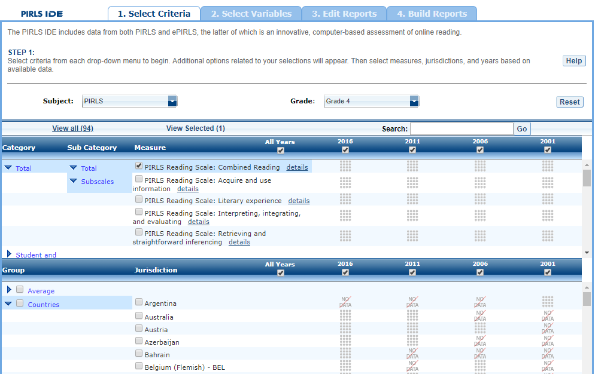{width="6.5in" height="5.289788932633421in"}

### Choose Subject
Under **Subject**, you have the choice of **PIRLS** or **ePIRLS**. Once
a subject is chosen, the screen resets and you can select **Year**(s),
**Dependent Variable**(s), and **Jurisdiction**(s).

### Choose Dependent Variableand Year
Under **Dependent Variable,** you can choose the combined reading scale and/or any
of the reading subscales. Note that the combined reading scale is the
default (as shown in exhibit 3-2). The 2001 and 2006 reading subscales
have been rescaled to allow for comparisons to 2011 and later years.

In addition, there are a number of variables other than scale scores
that you may choose as a dependent variable (see exhibit 3-3). These variables---such
as age, teaching experience, and class size---are all continuous
variables and are used as a dependent variable of analysis.

You may also choose the survey year (All years, 2016, 2011, 2006, or
2001) at the top of either step 1 or 2. Notice for which years a
dependent variable, jurisdiction, or variable data are available by looking below
each year for the grid of dots (which means data are available) or the
"No data" icon .

Exhibit 3-3. Dependent Variables
{width="100%" style="display: block; margin: 0 auto"}

### Choose Jurisdiction
With your dependent variable selected, next choose at least one **Jurisdiction.**

Jurisdictions are found under the following groups: **Country** and
**Benchmarking jurisdictions,** and **Off-Grade Level Participants.**
There is also a group category called **Average,** with options to
display the **Average of Countries** and the **Average of Selected
Countries/Participants.** Please note that selecting **Average of
Countries** or **Average of Selected Countries/Participants** may
produce an error message in the **Build Reports** step due to the high
volume of information contained in these groups.

The general procedures for selecting one or more jurisdictions are as
follows:

1.  To open or close jurisdictions, click on the arrow. Jurisdictions in
    the group are open and can be selected when the blue arrow points
    down (see exhibit 3-4).

2.  Click the checkboxes next to specific jurisdictions that you are
    interested in, or uncheck those jurisdictions that you wish to
    deselect. If you click the checkbox next to the group name (e.g.,
    "Country"), you will select all the jurisdictions within that group.
    If desired, uncheck the group name to deselect all.

3.  If you want to close a group (for example, close the list of
    countries in order to readily see the benchmarking jurisdictions),
    click the blue arrow next to the group name. The closed group's
    arrow points to the right. Be advised that closing the group will
    not deselect your choices.

Exhibit 3-4. Choosing jurisdictions
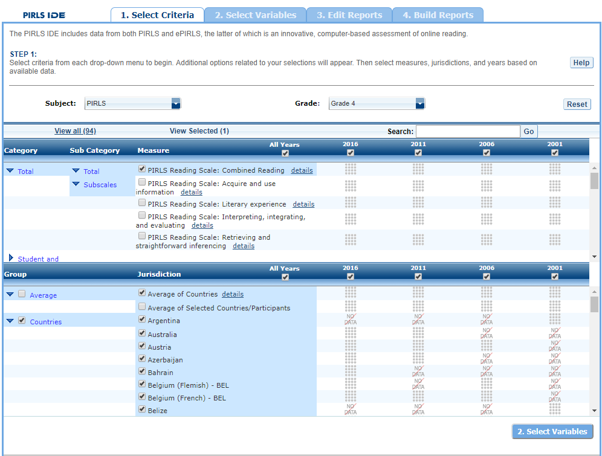{width="100%" style="display: block; margin: 0 auto"}

To continue in the IDE, click the **Select Grouping Variables** button at the
bottom of the page or the tab at the top of the page to go to the next
screen (see exhibit 3-4 above).

## Select Grouping Variables
### Overview
Step 2, **Select Grouping Variables,** can only be accessed after choosing
criteria at step 1, **Select Criteria**.

To continue your data query and edit a report, *you must choose at least
one variable on this screen.* You can browse for variables either by
using the **Category** and **Sub Category** lists or by using the
**Search** function (see exhibit 3-5). You can return to this screen to
change variable selections at any time.

Exhibit 3-5. Selecting variables overview
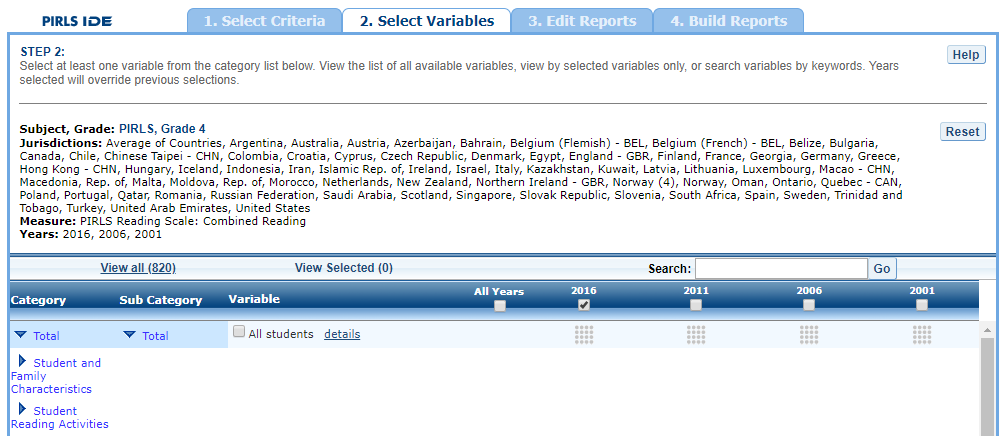{width="100%" style="display: block; margin: 0 auto"}

### Search Using Category and Subcategory Lists
Choose at least one variable on this screen for your report. One way to
do this is to search for variables using the **Category** and **Sub
Category** lists. If you don't wish to choose from any of the specified
categories and subcategories, then select **All cases.**

The variables shown are tied to the criteria you selected at step 1
(**Dependent Variable, Year** and **Jurisdiction**), which are indicated at the top
of the screen. To change any of these criteria, return to step 1,
**Select Criteria**.

To browse for variables, get details about them, select them, and view
them:

1.  Click the blue arrows to open and close categories and subcategories
    of variables (see exhibit 3-6).

2.  Click **details** or **hide details** to show or hide the full title
    of a given variable, the PIRLS ID, and the values (i.e., variable
    labels). Note that some variables have the same or similar short
    titles but comparing details will show you how they differ. See the
    example in exhibit 3-6, which shows general things in the student's
    home (ASBGBOOK and ASBGTA1).

3.  Click the checkbox next to a variable to select it for your
    analysis/report. You will see the count increase next to **View
    Selected**.

4.  Click the **View Selected** tab to see the variables you have
    chosen. To return to the full list of variables by category, click
    the **View All** tab.

5. Remember to select the year for which you wish to build a report and
    make sure that data are available for your chosen year and
    variables.

6. Searching variables is an option from the Search box.

Exhibit 3-6. Select grouping variables using category and subcategory lists
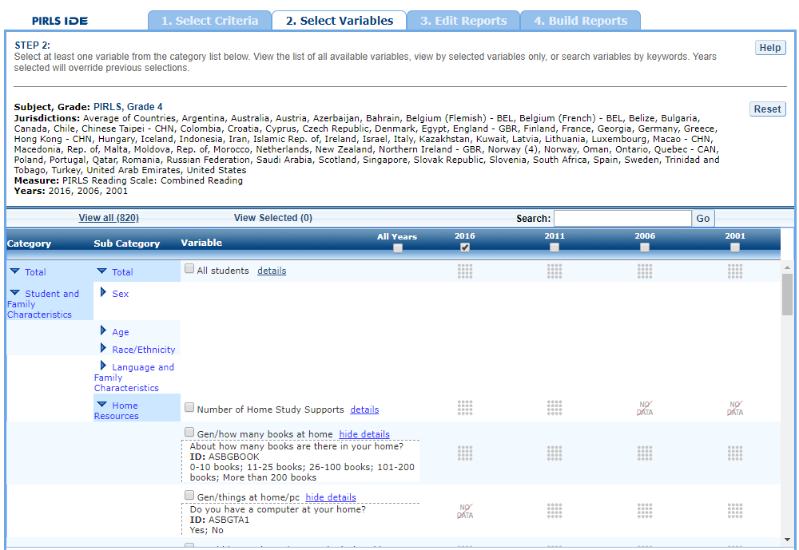{width="100%" style="display: block; margin: 0 auto"}

When you have selected the variable(s) you want to include, continue by
clicking the **Edit Reports** button at the bottom of the page or the
tab at the top of the page to go to the next screen.

### Search Function
The second way to search for variables is to use the **Search** function
on the **Select Grouping Variables** screen.

Type a term in the **Search** box and click **Go** (or hit "Enter" on
your keyboard) to find variables by keywords in the question and/or
details for the variable (see exhibit 3-7). If you use multiple keywords,
"and" is assumed. You can also narrow your search by using "or," "not,"
or "and not." The search function operates on an exact phrase if it is
contained in quotes. The variable(s) that include the search term(s) in
the question or its details will be listed.

See Section Search Using Category and Subcategory Lists
for information on how to get details about variables, selecting
variables, and viewing variables.

Exhibit 3-7. Select grouping variables using the search function
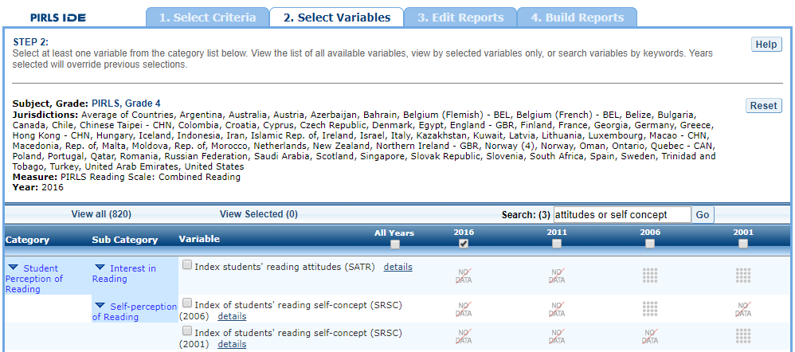{width="100%" style="display: block; margin: 0 auto"}

When you have selected the variable(s) you want to include, continue by
clicking the **Edit Reports** button at the bottom of the page or the
tab at the top of the page to go to the next screen.

## Edit Reports
### Overview 
You can access step 3, **Edit Reports,** after choosing criteria at step
1, **Select Criteria**, and choosing at least one variable at step 2,
**Select Grouping Variables**. The IDE will automatically build reports based on
your selections from steps 1 and 2. However, at step 3, the **Edit
Reports** phase, you may modify your selections for each report.

At this step, you can:

-   Preview and edit the layout of your reports;

-   Copy reports or create new reports based on the variables selected;

-   Change formatting options, such as the number of decimal places to
    display, for all reports (these may also be changed in individual
    reports, but formatting options can overwrite previous edits);

-   Change statistics options, such as averages and achievement levels,
    for all reports (these may also be changed in individual reports,
    but statistics options can overwrite previous edits);

-   Select reports to be built into tables and charts at step 4, **Build
    Reports**; and

-   Delete reports.

Using your chosen criteria, the IDE will return a separate data report
for each variable you have chosen. If you have selected two or three
variables (not counting **All cases**), you will also see a
cross-tabulated report that crosses these variables. If your selected
criteria include more than one dependent variable (e.g., combined reading scale and
age), a separate set of data reports will be generated for each dependent variable
(see exhibit 3-8).

Exhibit 3-8. Edit reports overview
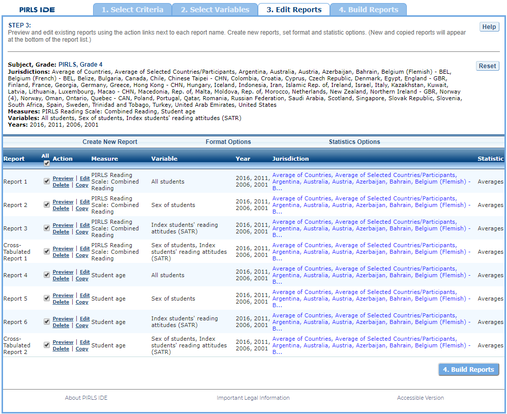{width="6.5in" height="5.289788932633421in"}

The **Edit Reports** step shows detailed information on the layout of
your reports (see exhibit 3-8). The **Report** column indicates the
report, or cross-tabulation report, number based on the variable(s)
chosen during the criteria selection. The **Action** column gives you
the option to **Preview**, **Edit, Delete**, or **Copy** the report.
Here, reports may be chosen for the report-building phase under the
**All** tab, either by selecting **All** or selecting individual
reports. The **Grouping Variable** column indicates the variable(s) included in
the report. The **Year** column shows which years you have selected for
comparison. The **Jurisdiction** column labels the countries and
subnational education systems for comparison, and the **Statistic**
column provides the type of statistic output that will be generated in
the report-building phase.

### Preview Report
Select **Preview** under the **Action** column to see how your report
will be laid out (see exhibit 3-8). The preview will not provide actual
data, but will show how the data will be arranged in rows and columns
(see exhibit 3-9). You can select **Preview** at any time to see
how your changes will affect the report's final layout.

Exhibit 3-9. Using preview report
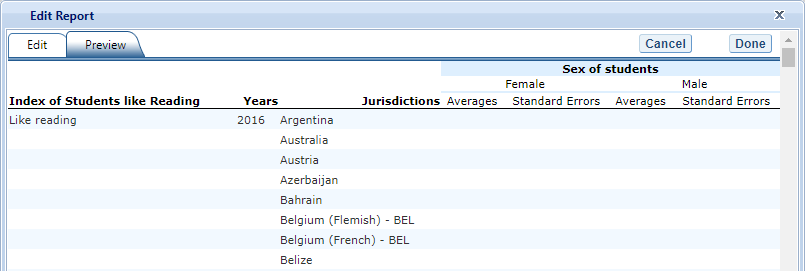{width="100%" style="display: block; margin: 0 auto"}

### Edit Report
To edit the report, select the command under the **Action** column next
to the report (see exhibit 3-8 above). Another way to edit a report is to
select the **Edit** tab when you are previewing a report. The following
can be done using this function (see exhibit 3-10).

Exhibit 3-10. Editing reports
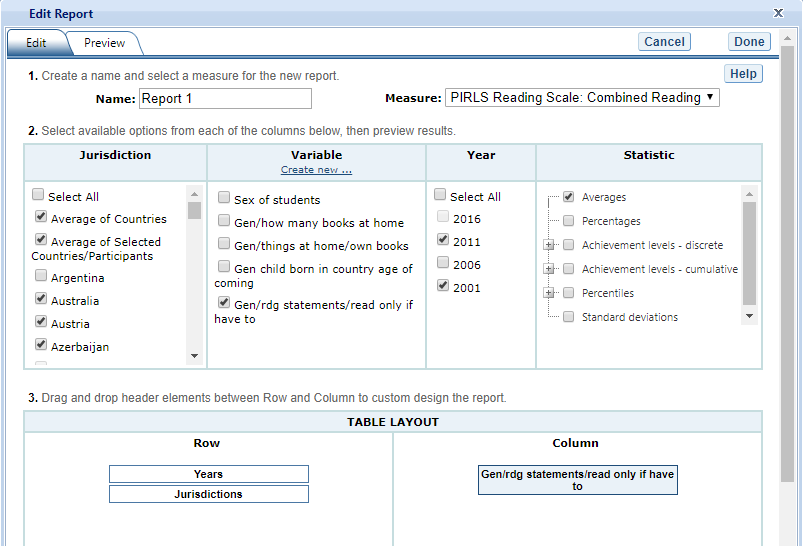{width="6.5in" height="5.289788932633421in"}

1.  Name your report. You have the option of giving each report a
    distinctive name, up to a limit of 50 characters, using only
    letters, numbers, spaces, underscores, and hyphens. (Otherwise, the
    default name is Report 1, Report 2, etc., and Cross-Tabulated Report
    1, Cross-Tabulated Report 2, etc.).

2. Select a dependent variable. You can choose a dependent variable if more than one was
    selected at step 1.

3. Select which jurisdictions, grouping variables, years (if applicable), and
    statistics to include (out of the selections previously made at
    steps 1 and 2). You can select up to two statistics options from the
    following: averages, percentages, achievement levels---discrete,
    achievement levels---cumulative, percentiles, and standard
    deviations. (For further information, see Section Statistics
    Options.)

4. To create a new variable while editing a report, click on **Create
    New...** under the **Grouping Variable** heading. 

5. Change the table layout by dragging elements to determine which
    items will appear in rows and which will appear in columns. Some of
    the arrangements will not be permissible, but a pop-up alert will
    explain this.

To save changes, make sure to select **Done** in the upper or lower
right portion of the screen before closing the **Edit Report** window.

### Create New Variables
To create a new variable, select **Edit** under the **Action** column
and select **Create new...** under **Grouping Variable** (see exhibit 3-10). The
new variable is created by combining values for an existing variable.
The steps are as follows:

1.  Click **Create New** under the **Grouping Variable** heading.

2.  Select the variable for which you wish to combine values.

3.  Select the values you want to combine by checking the boxes to the
    left of the values (see exhibit 3-11).

4.  Create a name for the new value, and press **Create**. The collapsed
    values will appear in gray to indicate that they have already been
    used.

5.  Wait for the screen to refresh, and press **Done**.

6.  The new variable will appear in the **Grouping Variable** list (in the **Edit
    Report** window, if you access it that way, or else in the **Create
    New Report** window) with the new variable name designated as
    "(Collapsed)". How the new variable displays will depend upon how it
    was created originally from the two options mentioned above.

7.  Check the box next to the new (collapsed) variable to view it in the
    report. You can click **Preview** to see how the table will be laid
    out before retrieving data.

Exhibit 3-11. Creating new variables
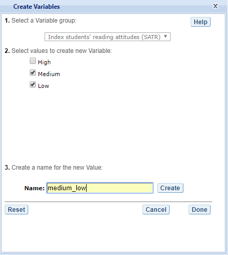{width="3.5in" height="4in"}

A new variable that you create is applicable to that specific report; it
does not apply to the other reports appearing in the **Edit Reports**
screen. For example, if you selected multiple dependent variables of reading
literacy for analysis, then you would need to create the new variable
for each dependent variable or create a copy of the report and edit it accordingly.
To do the latter, click on **Copy** report in the **Edit Reports**
screen (copied reports appear at the end of the list of reports) and
then **Edit** the new copy (using the above example, you can change the
dependent variable and give the report a new name).

You can repeat the process and combine different values of a variable to
create additional new variables. Using the **Create New Report**
function, you can create a new report for each new variable that you
create. (For further information, see Section Create New Report)

If you selected two or three variables from which to create new
variables, you can repeat the process for each of them. Using the
**Create New Report** or **Edit Report** function, these collapsed
variables will be listed and available for cross-tabulation (see exhibit
3-12). You can click **Preview** to see how the table will be laid out
before retrieving data.

Exhibit 3-12. Edit report with collapsed variables
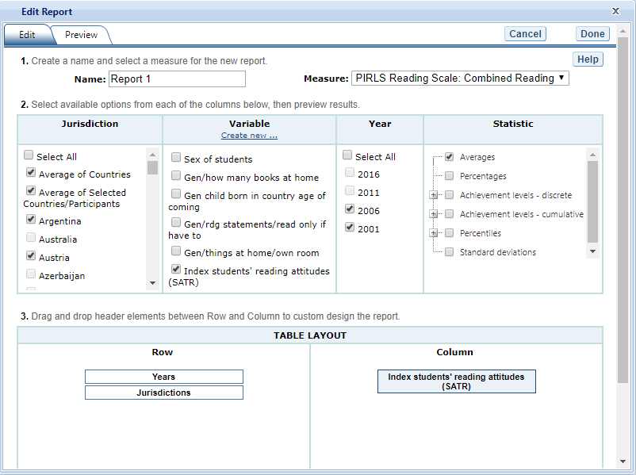{width="6.5in" height="5.289788932633421in"}

### Create New Report
From the main **Edit Reports** screen, clicking on **Create New Report**
brings up the same options as **Edit Report**, but with no checkboxes
marked and without any new variables you may have created. Thus,
**Create New Report** provides a clean slate for your selections from
the first two steps, **Select Criteria** and **Select Grouping Variables** (see
exhibit 3-13). Each new report you create will appear at the end of the
list of reports. If you do not give the report a specific name, it will
be called "New Report."

Exhibit 3-13. Creating new reports
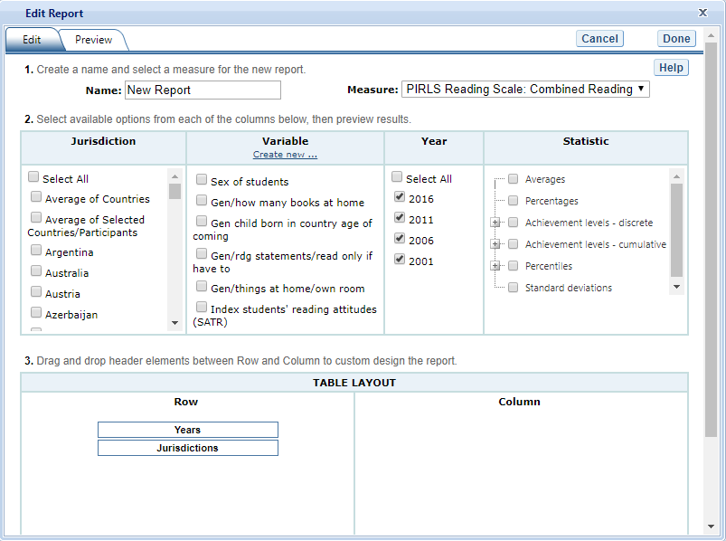{width="6.5in" height="5.289788932633421in"}

### Format Options
From the main **Edit Reports** screen, clicking on **Format Options**
will allow you to make formatting changes applicable to *all* the
reports listed. The following formatting options are available using
this function (see exhibit 3-14):

1.  **Variable Labels (Long)** displays a more detailed description of
    the variables selected in a query than the default short label. For
    variables from questionnaires, the full text of the question is
    displayed. Be advised that the length of the extra detail may
    sometimes interfere with table formatting.

2.  **Show data for values categorized as "missing"** will include the
    percentage of students in the total sample or in a reporting group
    for whom membership in a particular response category is unknown
    because no response was given by the students, their teacher, or
    their school. The percentage of "missing" will be shown in the
    right-most table column. Missing data are available only for queries
    that involve percentages as the statistic type. Unless you check
    this option, the default is for missing responses not to be included
    in the percentage distribution shown.

3.  **Decimal Places** allows you to specify a greater level of
    precision for a particular statistic (one or two decimal places)
    than does the default, which is whole numbers. Note that only
    integer-level precision is allowed for percentages; that is, the
    number of decimal places is fixed at "none" for percentages. Also,
    standard errors will be shown to one more decimal place than is
    shown for a particular statistic. For example, if you request that
    the averages be displayed to one decimal place, the corresponding
    standard errors will be displayed to two decimal places. If you
    export to Excel, you will be able to increase the number of decimal
    places in most cases.

4. **Include** gives you the option to show standard errors of the
    estimates and, if you choose to show them, the option to show them
    inside parentheses/brackets. Unless you indicate otherwise, the
    default is to show standard errors inside parentheses. You can
    preview the effects of your selection in the Sample Display area
    (see the blue-shaded box at the bottom of exhibit 3-14).

Exhibit 3-14. Format options
{width="3.5in" height="4in"}

Be advised that choices you make in the **Format Options** window will
apply to all reports (i.e., they cannot be changed for individual
reports). Use the **Reset** button located in the upper right portion of
the screen (just below the **Help** button) to restore the **Format
Options** to the default settings (a word of caution: as this will also
delete any new reports that you have created).

### Statistics Options
Available only from the main **Edit Reports** screen, clicking on
**Statistics Options** allows you to designate up to two statistics. The
selections made are applicable to *all* the reports listed, although you
can also change the statistics for an individual report when you edit
that report. (For further information, see Section Edit Report)

The following statistics options are available (see exhibit 3-15):

1.  **Averages.** This statistic provides the average value for a
    selected continuous variable or the average scale score for the
    combined reading scale or one of the reading subscales. For the
    PIRLS assessment, student performance is reported on scales that
    range from 0 to 1,000. PIRLS reports the average scale score for a
    variety of demographic samples of the student population (e.g., the
    average scale score in reading for literary purposes for female
    students).

2. **Percentages.** This statistic shows the percentage of students as
    a row percentage. For example, if the first column lists countries,
    then each country will display its own percentage distribution
    across its row. If the table cell for Black female students in the
    United States is 9 percent, then Black females constituted 9 percent
    of U.S. fourth-graders. By default, percentage distributions do not
    include missing data. For information on how to show data for values
    categorized as missing, see Section Format Options.

3. **Achievement levels---discrete.** Discrete achievement levels are
    reported as the percentage of students performing *at* each
    international benchmark (*low, intermediate, high,* or *advanced)*,
    counted separately from the other benchmarks:

    -   *Below low*---below 400

    -   *At* *low*---between 400 and 475

    -   *At* *intermediate*---between 475 and 550

    -   *At* *high*---between 550 and 625

    -   *At* *advanced*---above 625

4. **Achievement levels---cumulative.** Cumulative achievement levels
    are reported as the percentage of students performing *at or above*
    each international benchmark:

    -   *At or above* *low*---at or above 400

    -   *At or above* *intermediate*---at or above 475

    -   *At or above* *high*---at or above 550

    -   *At advanced*---above 625

5. **Percentiles.** This statistic shows the threshold (or cutpoint)
    score for the following:

    -   10^th^ percentile---the bottom 10 percent of students

    -   25^th^ percentile---the bottom quarter of students

    -   50^th^ percentile---the bottom half of students (half the
        students scored at or below the cutpoint and half scored above
        it)

    -   75^th^ percentile---the top quarter of students

    -   90^th^ percentile---the top 10 percent of students

6. **Standard deviations.** The standard deviation is a dependent variable of how
    widely or narrowly dispersed scores are for a particular dataset.
    Under general normality assumptions, 
    95 percent of the scores are within two standard deviations of the
    mean. For example, 
    if the average score of a dataset is 500 and the standard deviation
    is 100, it means that 
    95 percent of the scores in this dataset fall between 300 and 700.
    The standard deviation is the square root of the variance.

Exhibit 3-15. Statistics options
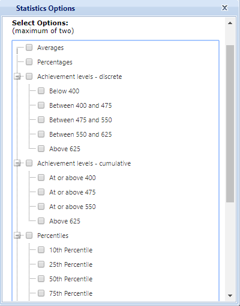{width="4.5in" height="5.289788932633421in"}

The selections you make in **Statistics Options** will be applied
automatically to all reports, although you can change the statistics for
an individual report when you edit it. Be advised that if you use
**Statistics Options** after editing the statistics in one or more of
your individual reports, the statistics options selected will overwrite
your previously edited selections. If you wish to use the same criteria
and variables in a report with a different selection of statistics,
consider using the **Create New Report** function to generate a new
report with different statistics. (For further information, see Section Create New Report). You can also make a copy of an
individual report.

You can use the **Reset** button located in the upper right portion of
the screen (just below the **Help** button) to restore the **Statistics
Options** to the default setting, which is **Averages** for all reports
(this will also delete any new reports that you have created).

Not all statistics are available for all reports. Their availability
depends on other selections you have made to define the content and
format of your report:

-   Percentages will not display if jurisdictions or years appear in
    columns.

-   Achievement-level results cannot be displayed in both columns and
    rows.

-   Achievement-level results are available only for the composite or
    overall scale.

-   If achievement levels are selected as a variable, only percentages
    will be displayed.

Please note that the statistics produced by the IDE may not match the
statistics shown in reports published by the International Association
for the Evaluation of Educational Achievement (IEA) due to differences
in certain statistical standards. In particular, organizations such as
NCES and the IEA differ in the minimum sample sizes required for
publishing student scores. Furthermore, in IEA reports, if a student has
more than one teacher, estimates for teacher variables are calculated as
an average of data reported by all of the teachers. In comparison, in
the IDE, a student is randomly assigned one teacher, and the teacher
estimate represents the data reported by the teacher assigned to the
student.

### Select Reports to Build
As you edit your reports, you can give them distinct names (up to 50
characters) to differentiate them, as well as make changes to the
jurisdictions and variables previously selected, the statistics, and the
layout of the rows and columns. (For further information, see Section Edit Report). You may make copies of reports with these
changes. In order to proceed to step 4, **Build Reports**, each report
for which you want to retrieve data should be previewed/inspected using
the **Preview** function. To decrease processing time as you move to
step 4, you can uncheck any reports for which you do not wish to
retrieve data. By default, all reports are checked. To uncheck one or
more reports, you can either uncheck the reports individually or click
on the **All** box. Doing the latter will uncheck all of the reports and
allow you to check only those for which you wish to retrieve data. In
the example that follows (see exhibit 3-16), data will be retrieved only
for the combined reading dependent variable.

Exhibit 3-16. Selecting reports to build
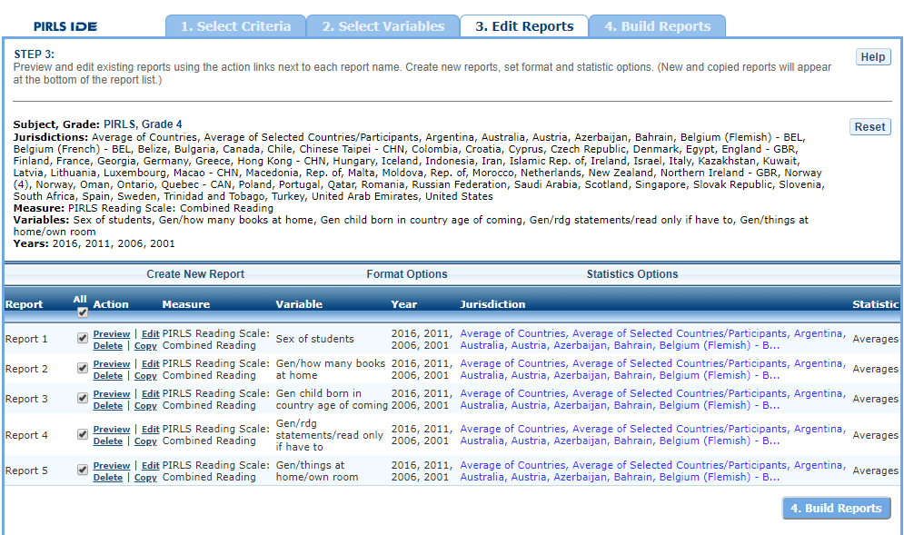{width="6.5in" height="5.289788932633421in"}

If you wish to delete a report from the list of reports, click
**Delete** in the **Action** column. Use the **Reset**
button located in the upper right portion of the screen
(just below the **Help** button) to restore the deleted reports (a word
of caution: this will also delete any new reports that you have created
and restore the Format Options and Statistics Options to the default
settings).

To continue to the last step in the IDE, click the **Build Reports**
button at the bottom of the page or the tab at the top of the page to go
to the next screen.

## Build Reports
### Overview
You can access step 4, **Build Reports**, after choosing criteria at
step 1, **Select Criteria**, in which case the default report built will
provide **Averages** data for the **All cases** variable. After step
1, you may also go on to steps 2 and 3, where you can select additional
variables and edit reports, before moving on to **Build Reports**. In
**Build Reports**, you can do the following:

1.  Generate a data table for each report selected in step 3, as shown
    by the **Select Reports** drop-down feature (see exhibit 3-17).
    By default, all reports are checked, though you can uncheck any
    reports for which you do not wish to retrieve data. (For further
    information, see Section Select Reports to Build).

2. Export and save data tables into various formats using the **Export
    Reports** button (see exhibit 3-17). The output formats include
    HTML (print-friendly), Microsoft Word, Microsoft Excel, and Adobe
    PDF.

3. Select the **Chart** tab (see exhibit 3-17) to create and
    customize charts for each report and save them for export in the
    above formats.

4. Select the **Significance Test** tab (see exhibit 3-17) to run a
    significance test on your results, customize it, and export it.

Exhibit 3-17. Building reports overview 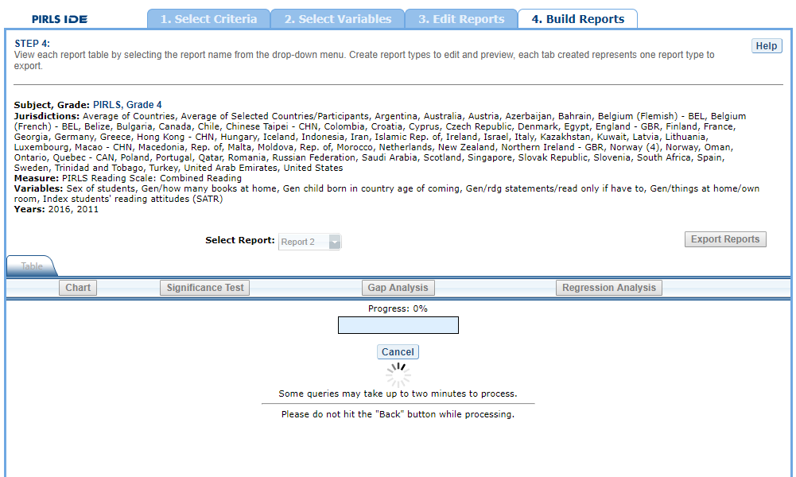{width="6.5in" height="5.289788932633421in"}

### View Reports as Data Tables
Once you click on **Build Reports,** the words "Processing Data" will
appear on your screen (see exhibit 3-17). Some reports will take longer
than others to process, so please do not hit the "Back" button during
this stage. To view a table, go to the **Select Report** drop-down menu
(see exhibit 3-17) and choose a table of interest. Your table will
appear once the processing is complete (see exhibit 3-18). To change the
formatting or statistics options of a table or to generate a table from
a report not included in your selection, return to step 3, **Edit
Reports**.

Exhibit 3-18. Viewing reports as data tables
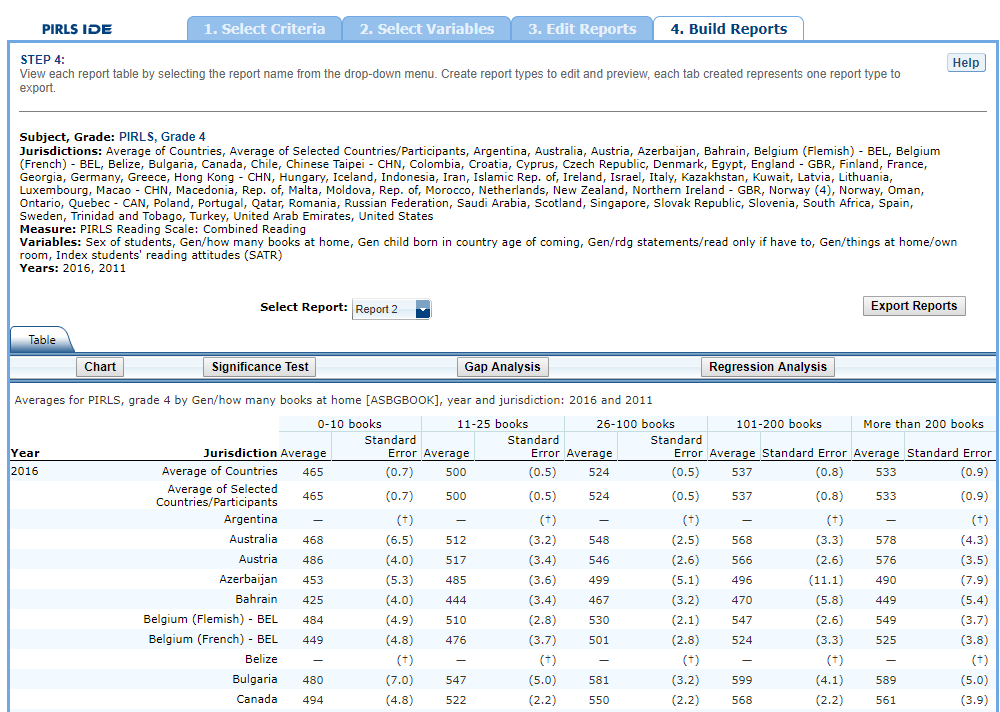{width="6.5in" height="5.289788932633421in"}

### Charts
Go to **Select Report** to choose the report of interest from the
drop-down menu, and then click the **Chart** link (see exhibit 3-19).

You will be able to create many types of charts and customize them.
Section Create Charts---Chart Options provides a summary
of the available features and how they can be customized.

Exhibit 3-19. Viewing reports as charts
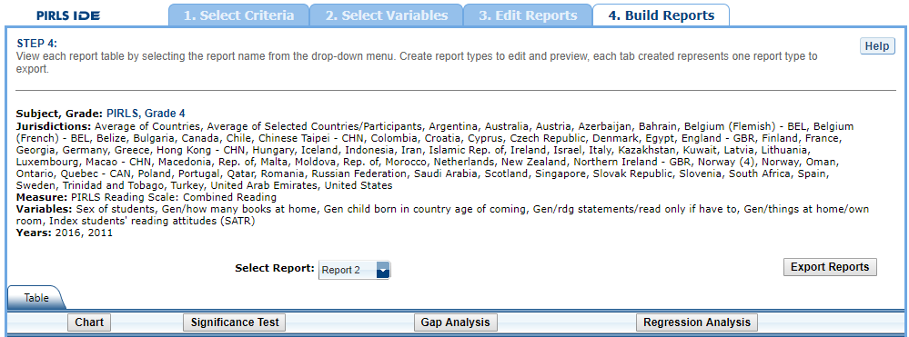{width="100%" style="display: block; margin: 0 auto"}

### Create Charts---Data Options
When you click **Chart,** your screen will present **Data Options**
pertaining to **Statistic, Year,** and **Jurisdiction.** All are
selected by default, except that you can have only one statistic (see
exhibit 3-20). Uncheck any of the criteria that you do not wish to chart,
as long as you have one selected in each category.

Once you are finished with the Data Options, click the **Chart Options**
button in the lower right corner of the screen.

Exhibit 3-20. Data options for charts
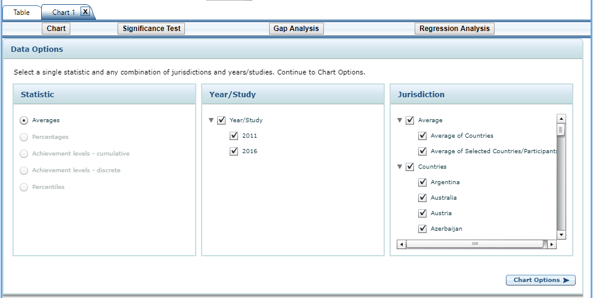{width="6.5in" height="5.289788932633421in"}

### Create Charts---Chart Options
On the Chart Options screen, select **Bar Chart, Column Chart,** or
**Line Chart** (see exhibit 3-21). For data on achievement levels, you
also have the option of selecting a **Discrete** or **Cumulative
Chart**.

After selecting a chart type, change any data dimensions from the
drop-down menus for **Bar, Column,** or **Line Values** and **Values
Grouped by.** Any new variables that you created at step 3, **Edit
Reports**, will be available for selection, but only if you selected the
variables (i.e., placed a check mark next to them) and clicked on
**Done** after you edited the report.

Enter a **Chart Name** limited to 25 characters, using only letters,
numbers, spaces, underscores, and hyphens (otherwise, the default name
is "Chart 1").

Preview your chart by clicking the **Preview** button in the lower right
corner or go back to the data options and make different selections by
clicking the **Data Options** button in the lower left corner.

Exhibit 3-21. Chart options 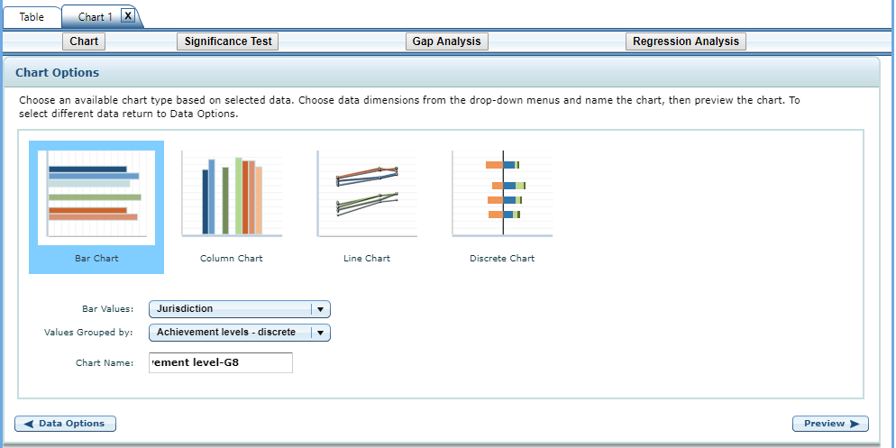{width="6.5in" height="5.289788932633421in"}

While previewing your chart, you can do the following (see exhibit 3-22 as
an example of a **Discrete Chart** and exhibit 3-23 as an example of a
**Bar Chart**):

1.  Use the drop-down menus to change the jurisdiction and other
    variables as applicable. Notice that when you change your selection,
    the change occurs slowly enough that you get a sense of the size and
    direction of the change---particularly if you didn't previously
    specify in the data dimensions how you want your values grouped.

2.  For the **Discrete Chart,** you can select where you want the
    divider by clicking one of the achievement-level buttons above the
    bars. This makes it easier to compare the percentages at a given
    level(s). In the example shown in exhibit 3-22, the percentages of
    students at the high and advanced levels are shown to the right of
    the divider.

3.  Place your cursor over the bars to see the data points and value
    label(s).

4.  Choose between using colors or patterns for the bars by clicking the
    alternating **Pattern** or **Color** button located just below the
    **Chart** tab in the upper left portion of the screen. For the
    **Discrete Chart** and the **Cumulative Chart,** choose between
    **Color** or **Grayscale.**

5.  Change the color of the bars with a single click on each level in
    the bars. That click brings up a thumbnail of a color chart. Click
    on the thumbnail to reveal a color grid, and then select the color
    you desire.

6. Change the pattern of the bars with a single click on each level in
    the bars. Continuous clicking brings up various patterns to choose
    from.

Exhibit 3-22. Preview of discrete chart
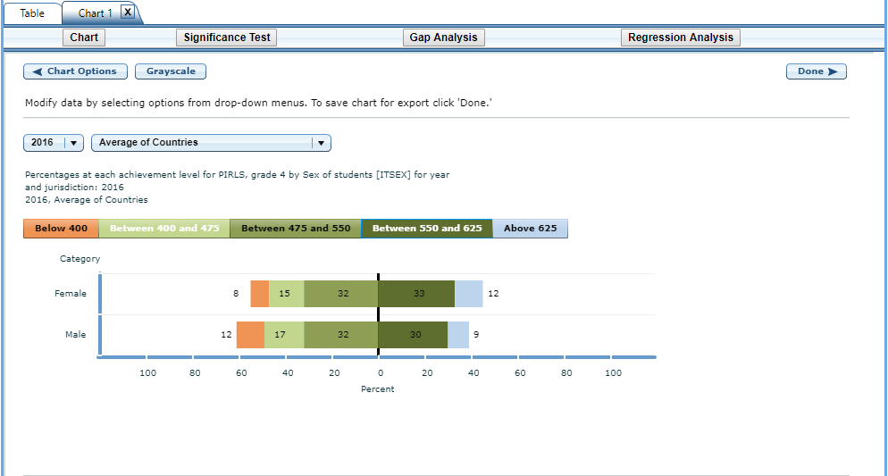{width="6.5in" height="5.289788932633421in"}

Exhibit 3-23. Preview of bar chart
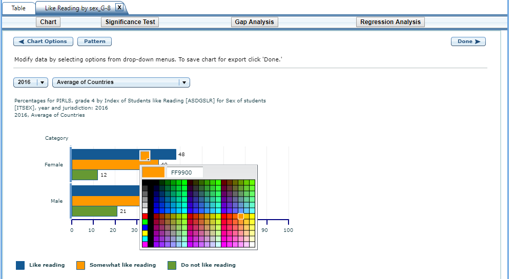{width="6.5in" height="5.289788932633421in"}

Click the **Done** button located on the right side of the screen or
click back to **Chart Options** and/or **Data Options** to change your
selection criteria. You must click **Done** if you wish to later save
and/or print your chart via **Export Reports**.

Clicking **Done** takes you to the exportable version of the chart (see
exhibit 3-24). You can subsequently **"Click here to edit this chart"**
(located in the upper left corner, below the **Chart** link) to make
more changes. Alternatively, the entire chart area, if clicked, will
take you to the edit screen.

Exhibit 3-24. Completed chart
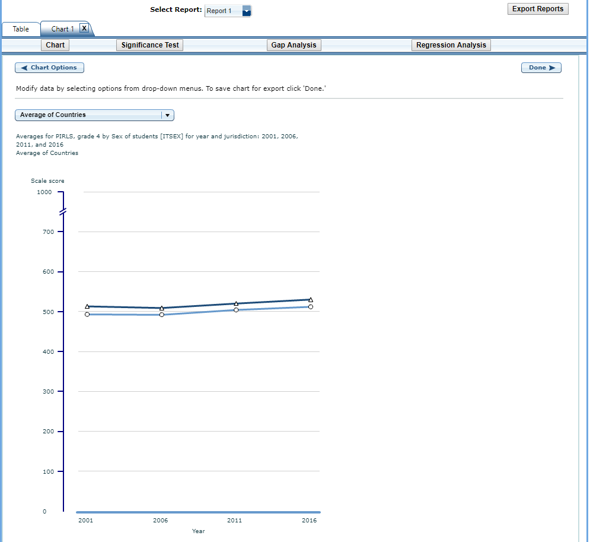{width="6.5in" height="5.289788932633421in"}

To make an additional chart from the same report/table, click the Chart
link to begin a new chart. It is recommended that you provide a new
chart name (the default is Chart 1, Chart 2, etc.). If you don't start
the process again by clicking the Chart link, the new chart will
overwrite the previous one.

If you wish to make charts from other reports, select "other report" in
the **Select Report** drop-down list. If other reports were not checked
in Step 3, **Edit Reports**, go back to step 3 and check the ones you
want. Then, when you advance to step 4, **Build Reports**, the reports
will appear in the **Select Report** drop-down list. If you need to
create new reports, go back to step 1, **Select Criteria**, and/or step
2, **Select Grouping Variables**. Remember to export any completed charts you
want to save by clicking **Done** and using the **Export Reports**
function before leaving the **Build Reports** screen. (For further
information, see Section Export Reports).

### Significance Tests
Tests for statistical significance indicate whether observed differences
between assessment results are likely to have occurred because of
sampling error or chance. "Significance" here does not imply any
judgment about absolute magnitude or educational relevance. It refers
only to the statistical nature of the difference and whether that
difference likely reflects a true difference in the population.

With your report of interest selected, click the **Significance Test**
link, which is located to the right of the **Chart** link (see exhibit
3-24, above). You first need to decide which variable you want to test and
the criterion by which you want to test it (i.e., within or between
variable values or across years). You will compare or "look across" the
variable's range of values, so it must have more than one value. You can
look across jurisdictions for a variable (that is, compare between two
or more jurisdictions) or you can look across the values within a
variable for a single jurisdiction.

The general steps for running significance tests are as follows (see
exhibit 3-25):

1.  In the **Significance Test** window, select either **Between
    Jurisdictions**, **Within Grouping Variables**, or **Across Years.** Then,
    select the appropriate jurisdiction(s), variable(s), and
    statistic(s). For **Between Jurisdictions**, select at least two
    jurisdictions. For **Within Grouping Variables**, select one or more
    jurisdictions. For **Across Years,** more than one year needs to be
    selected.

2.  Enter a **Name** limited to 25 characters, using only letters,
    numbers, spaces, underscores, and **hyphens** (otherwise, the
    default name is "Sig Test 1").

3.  Select the **output** **type** as either **Table** or **Map**. The
    table option will show the significance test results as a matrix.
    The map option will show the significance test results on a world
    map, highlighting countries that have been selected. The map output
    is only available when "Between Jurisdictions" is selected in the
    first step.

4.  Located under the output type, you can check **Show Score Details**
    to display the estimates and standard errors for the table cells. If
    you selected a map, this option is not applicable, as the map will
    automatically show score details.

5.  Click the **Preview** tab located in the upper left corner of the
    screen or the **Preview** button located in the bottom left corner.

6.  Click the **Edit** tab in the upper left corner of the screen if you
    wish to go back and make changes to the selections you made for
    running the significance tests.

7.  Click the **Done** button in the upper or lower right corner of the
    screen to run the significance tests.

Exhibit 3-25. Significance test options
{width="6.5in" height="5.289788932633421in"}

When the table option is selected, you will get a significance test
matrix in which you will see the differences and *p* values. Using the
symbols shown in the legend of the matrix, an indication is also
provided of whether one estimate is significantly lower or higher than
another estimate or whether there is no significant difference (see
exhibit 3-26). 

The alpha level for all *t*-tests is .05. All comparisons within a jurisdiction, within the same year, are made using dependent *t*-tests. Comparisons between jurisdictions are treated as independent. Non-achievement comparisons across years are treated as independent. Comparisons of achievement across years are made using independent *t*-tests with a linking error taken into account. A part-whole adjustment is implemented for comparisons between a jurisdiction and a group that the jurisdiction is part of (e.g. Average of Countries).

Exhibit 3-26. Significance test table output
{width="6.5in" height="5.289788932633421in"}

When the map option is selected, a global map is shown with the
countries selected shaded (see exhibit 3-27). The focal jurisdiction is
shaded in blue and represents a comparison for all the other countries.
The other countries are shaded in colors that indicate whether they are
higher, lower, or not significantly different from the focal
jurisdiction on whatever dependent variable has been selected. When you scroll over
a country, a text bubble pops up describing the strength of the
difference between that country and the focal jurisdiction. At any point
you may choose a different focal jurisdiction by clicking on another
country.

Exhibit 3-27. Significance test map output
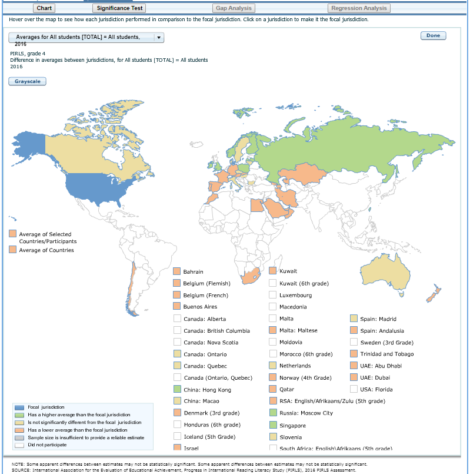{width="6.5in" height="5.289788932633421in"}

### Gap Analysis
Gap Analysis is included in the IDE to compare differences in gaps shown
in a map, table, or chart. These gap differences can be compared between
jurisdictions and/or across years.

Exhibit 3-28. Gap analysis link selection
{width="100%" style="display: block; margin: 0 auto"}

With your report of interest selected, click on the **Gap Analysis**
link, which is located to the right of the **Significance Test** link
(see exhibit 3-28). You will need to decide which variable you would like
to test (e.g., sex of students) and the criterion by which you want to
test it (i.e., between jurisdictions or across years). The difference
dependent variable, or gap, can be viewed between groups, between years, between
groups and years, or between percentiles within the selected variable.
For example, if you compute average reading scores for two countries at
two time points for males and females, you can:

-   at one time point, compare the male-female gap in one country to the
    male-female gap in another country;

-   compare the male-female gap at two time points within a country;

-   compare the difference between the male-female gap at two time
    points in one country to the difference between the male-female gap
    at two time points in another country; or

-   compare the gap for females at two time points in one country to the
    gap for females at two time points in another country.

Exhibit 3-29. Gap analysis options
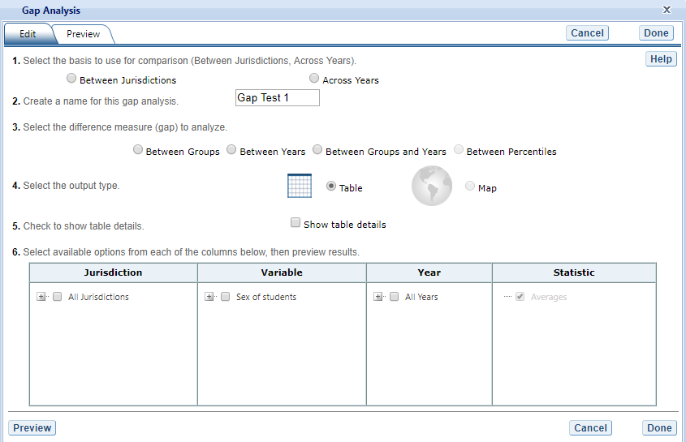{width="6.5in" height="5.289788932633421in"}

The steps for running a gap analysis are similar to those for conducting
a statistical significance test (see exhibit 3-29). Thus, to run a gap
analysis, follow the instructions under section **Significance
Tests**, noting the following differences:

1.  The **Gap Analysis** link should be selected, not the **Significance
    Test** link.

2.  The gap analysis does not have a **Within Grouping Variables** option for
    analysis; the options are **Between Jurisdictions** and **Across
    Years.**

3.  The difference measure (gap) of analysis must be selected from the
    following: **Between Groups, Between Years, Between Groups and
    Years,** and **Between Percentiles** (if variables are selected for
    which a difference measure is not feasible, the difference measure
    option will not appear as available in the Gap Analysis menu).

The gap analysis output is presented in a format similar to that of the
significance test output, with one difference: the difference estimate
shown in the output is the difference between the gaps selected for
analysis. Note that you will still see the significance of these
differences just like in a significance test. For example, exhibit 3-30
shows the difference between jurisdictions in the average reading score
gap between male and female 4^th^ grade students in 2016.

The gap analysis function computes and statistically tests differences
between average value/score, percentage, or percentile gaps. Note that
the reference group for the gaps is kept constant during the analysis,
as opposed to taking the absolute value of the gaps. Therefore, the gap
analysis tests whether the magnitude of the gaps differ from each other
only when the gaps go in the same direction (e.g., comparing a 5-point
gender gap favoring females in one country with a 15-point gender gap
favoring females in another country).

Exhibit 3-30. Gap analysis output
{width="6.5in" height="5.289788932633421in"}

**Note**: A gap analysis across years cannot be combined with the
Between Years or Between Groups and Years difference measures, so you
will select the difference measure Between Groups, or, if you have
selected percentiles as one of your statistics, you may choose Between
Percentiles.

### Regression Analysis
Regression Analysis is included in the IDE to test for trends across
more than two data points. The type of analysis performed in this
feature of the IDE is referred to as linear regression within the field
of statistics. To run a regression, first go to **Build Reports** and
choose the report of interest from the drop-down **Select Report** menu.
Then click on the **Regression Analysis** link, which is to the right of
the **Gap Analysis** link (see exhibit 3-31).

Exhibit 3-31. Regression analysis link selection
{width="100%" style="display: block; margin: 0 auto"}

The general steps for running a regression analysis are as follows (see
exhibit 3-32):

1.  In the **Regression Analysis** pop-up window, enter a **Name**
    limited to 25 characters, using only letters, numbers, spaces,
    underscores, and hyphens (otherwise, by default, the test will be
    named "Regression 1").

2.  Select the appropriate jurisdiction, year, and variable(s) for
    analysis. Please note that you may only choose one jurisdiction and
    year at a time, but you may choose up to 3 variables to be in your
    report. In order to use up to 3 variables, you must have already
    created and selected a cross-tabulated report (by selecting 3
    variables in Step 2, **Select Grouping Variables**).

3.  Click the **Preview** tab located in the upper-left corner to view
    the table format into which your output will be populated. In the
    Preview tab, an "X" denotes where the output will display.

4.  Click the **Edit** tab in the upper-left corner of the screen if you
    wish to go back and make changes to the selections you made for
    running the analysis.

5.  Click the **Done** button in the upper- or lower-right corner of the
    screen to run the regression analysis.

Exhibit 3-32: Regression analysis options
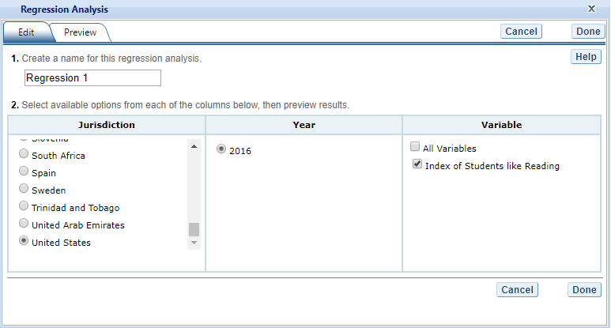{width="6.5in" height="5.289788932633421in"}

After you have clicked **Done**, your regression analysis output will
load onto the screen (see exhibit 3-33). A 0-1 contrast coding is used to
code the independent variable, where the first subgroup of the
independent variable is the reference group. Using dummy-coded variables
in a linear regression is useful for comparing each subgroup against a
reference group. For example, in exhibit 3-33, if the subgroup \"Like
reading\" is the reference group for the independent variable **Index of
Students like Reading (2016) [ASDGSLR]**, the IDE creates a "Somewhat
like reading" dummy variable (1 for respondents who answered "Somewhat
like reading", 0 otherwise), a "Do not like reading" dummy variable (1
for respondents who answered "Do not like reading", 0 otherwise).
Reference group "Like reading" is excluded from the regression analysis.

Exhibit 3-33. Regression analysis output
{width="6.5in" height="5.289788932633421in"}

Using the output from exhibit 3-33 you can compare the mean reading score
of 4^th^ grade students who somewhat like reading or do not like reading
to the mean reading score of those who like reading. When a single
dummy-coded variable is used in a regression, the *intercept* is the
mean of the reference group (e.g., 557.3185), and the *regression
coefficient* is the difference between the mean of the reference group
and the group identified (coded 1) with the dummy-coded variable (e.g.,
-4.4723 for Somewhat like reading). Since the regression coefficients
are presented with a standard error and a *t* value, these can be used
to test whether a difference between means is statistically significant.
Under the Significance column in the output you will see 3 possible
signs: 1) \< signifies a significant negative difference, 2) \>
signifies a significant positive difference, and 3) x signifies the
difference is not statistically significant.

### Export Reports
Click on the **Export Reports** button/arrow located on the right side
of the screen to save or print your tables, charts, and significance
tests. The report names that appear in the **Export Reports** window are
those that were checked off at step 3, **Edit Reports**.

Check the files you want to export, and select one of the file formats:
**HTML** (print-friendly), **Excel, Word,** or **PDF** (see exhibit 3-34).
All reports that you select at the same time will be exported in one
file. In the Excel format, you will be able to increase the decimal
places (wherever more precision is available in the database).
Because there are many different operating systems in use, you may get
an error message with Excel or one of the other formats. Usually, this
will not affect your ability to export, so please wait for software
"errors" to resolve themselves.

Charts for each report will only be available on this menu if you saved
them by clicking **Done** on the last screen after you created them. If a chart that you wish to
save or print is grayed out (not available for selection), cancel the
**Export Reports** tool, go back to the chart, and be sure to click
**Done** on the last screen. After that, it will be available for
export.

Exhibit 3-34. Export report options
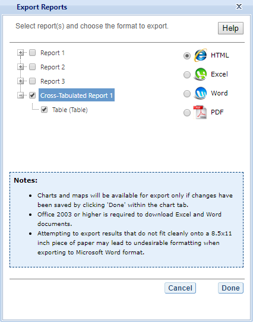{width="4.5in" height="5.289788932633421in"}

If you wish to edit tables or charts before saving or printing them,
remember to do this via the **Export Reports** function before leaving
the **Build Reports** screen. Returning to prior screens to edit report
table formats or change variables or criteria will overwrite the report
tables and charts.
