# PIAAC IDE Walkthrough {#piaacwalkthrough}

There are four general steps for exploring each IDE page (see exhibit 5-1). Each step is described in more detail in the following sub-sections. 

Exhibit 5-1. What you will see in the IDE environment and what each step entails
{width="100%" style="display: block; margin: 0 auto"}


## 1. Select Criteria

### 1.A. Overview 

Your data query in the PIAAC IDE begins on the Step 1. **Select
Criteria** screen (see exhibit 5-2, on next page).

Select a **Display** from the drop-down menus. Once the screen resets,
you can choose one or more of the years and studies or **All
Years/Studies**, **Measures,** and **Jurisdictions** for the data you
wish to view or compare. Use the **Reset** button, located in the
upper-right portion of the screen (just below the **Help** button), to
clear selections and start over.

Click on a blue sideways-facing arrow (►) to open up a category, and
click on a blue downward-facing arrow (▼) to close a category.

Exhibit 5-2. Selecting criteria

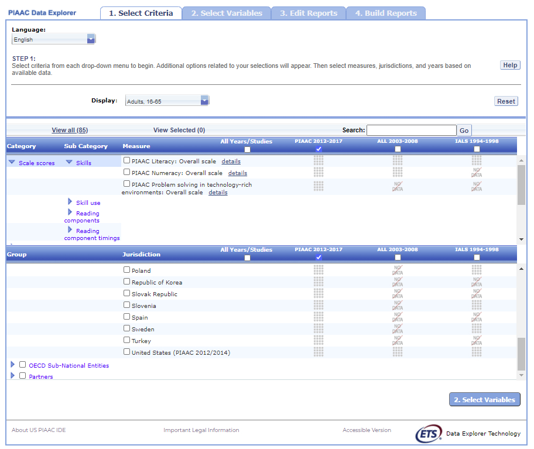{width="6.333659230096238in"
height="5.326662292213474in"}

### 1.B. Display

Under **Display**, choose one of the three different NCES PIAAC IDE
adult sample populations:

> **[U.S. Adults, 16--74 (Household and Prison)]{.underline}:** This
> display contains U.S.-only comparable data from the PIAAC, including
> the 2017 U.S. Household Data (for ages 16--74, and 16--65), combined
> 2012 and 2014 U.S. Household Data (for ages 16--74, and 16--65), and
> Prison Data (for ages 16--74).
>
> **[Young Adults, 16--34]{.underline}**: This display contains
> internationally comparable data from the\
> 3 international rounds of PIAAC (2012--2017 for all countries, except
> the U.S. which combined 2012--2014 data only) Household Data, ages
> 16--34. This display does not include the 2017 U.S. Household Data.
>
> **[Adults, 16--65]{.underline}**: This display contains
> internationally comparable data from the\
> 3 international rounds of PIAAC (2012--2017 for all countries, except
> the U.S. which combined 2012-2014 data only) Household Data, ages
> 16--65. This display does not include the 2017 U.S. Household Data.

Once a display is chosen, the screen resets and you can select one or
more of the years and studies or **All Years/Studies**, **Measure**(s),
and **Jurisdiction**(s).

### 1.C. Choose Year/Study(s)

In the same horizontal bar as the **Measure** and **Jurisdiction**
sections, you have the choice of selecting **PIAAC 2017** and/or **PIAAC
2012/14** by checking the appropriate box if the Display chosen is
**U.S. Adults, 16--74 (Household and Prison)**. You have the choice of
selecting **PIAAC 2012--2017**, **ALL 2003--2008**, and/or **IALS
1994--1998** if the **Display** chosen is **Adults, 16--65**, or **Young
Adults, 16--34**. To include data from all studies, check the **All
Years/Studies** box to the left of the individual year and study
options.

### 1.D. Choose Measure(s)

After choosing a **Display**, you can choose a **Measure** within the
**Select Criteria** tab. Note that the **[PIAAC overall
scales]{.underline}** are the default and you can select more than one
overall scale although analysis for each scale will be done separately.
You can browse for other reporting scales using the **Category** and
**Sub Category** lists or by using the **Search** function.

There are a number of continuous variables other than scale scores that
you may choose as a measure of analysis. These variables are generally
continuous variables from the international and U.S. national background
questionnaires (such as earnings or hours of work per week) and derived
variables from PIAAC, ALL, and IALS. Derived variables from PIAAC
include indices of literacy, numeracy, and computer use at work and at
home and imputed years of formal education, among others. Analysis of
the continuous variables in terms of the continuous literacy, numeracy
and problem solving TRE scale scores is not possible, but it is possible
to analyze the continuous variables in terms of the literacy, numeracy,
and problem solving proficiency level variables available in the list of
**Variables**. For example, one cannot analyze the average number of
hours of work per week in relationship to score, but one can analyze the
average number of hours of work per week for adults at each proficiency
level.

> **[Percentage across full sample]{.underline}**: The adults in the
> sample population that did not answer the assessment will be displayed
> along with those that did answer the assessment if you select the
> **Percentage across full sample** measure under the **Population**
> category and **Population** subcategory.
>
> **[Reading components]{.underline}**: There is a separate reporting
> scale for the Reading Components domain of the PIAAC survey. The
> Reading Components domain is used to measure literacy at the very low
> end of the spectrum, with components such as sentence completion,
> passage comprehension, and vocabulary. This domain was given to
> respondents who decided not to take the computer-based assessment or
> who did not pass a set of core information and computer technology
> tasks and failed a set of core literacy/numeracy tasks.

### 1.E. Choose Jurisdiction(s)

With your **Measure**(s), one or more of the years and studies or **All
Years/Studies** selected, next choose at least one **Jurisdiction.**

Jurisdictions are found under **OECD National Entities**, **OECD
Sub-National Entities** and **Partners.**

There is also a group category called **International**, with options to
display the **Average of All Jurisdictions** and the **Average of the
Selected Jurisdictions.** Please note that selecting **Average of All
Jurisdictions** or **Average of the Selected Jurisdictions** increases
the frequency of receiving an error message in the **Build Reports**
step due to the high volume of information contained in these groups.

The general procedures for selecting one or more jurisdictions are as
follows:

1.  To open groups of jurisdictions, click on the arrow (►).
    Jurisdictions in the group are open and can be selected when the
    blue arrow points down (▼) (see exhibit 5-3).

2.  Click the checkboxes next to the specific jurisdictions that you are
    interested in, or uncheck those jurisdictions that you wish to
    deselect. If you click the checkbox next to the group name (e.g.,
    "**OECD National Entities**"), you will select all the jurisdictions
    within that group. If desired, uncheck the group name to deselect
    all.

3.  If you want to close a group (for example, close the list of **OECD
    National Entities** jurisdictions in order to readily see the **OECD
    Sub-National Entities** jurisdictions), click the blue arrow
    pointing down (▼) next to the group name. The closed group's arrow
    will now point to the right (►). Be advised that closing the group
    will not deselect your choices.

    NOTE: The U.S. Adults 16--74 (Household and Prison) Display only
    includes data for the United States. The U.S. Household (16--74
    years old), U.S. Prison (16--74 years old), and U.S. Household
    (16--65) are the only selections available in the **Jurisdiction**
    menu. However, users may choose to work with the U.S. prison sample,
    or one of the U.S. household samples, or select more than one for
    analysis as jurisdictions.

Exhibit 5-3. Choosing jurisdictions

{width="6.2503215223097115in"
height="5.319717847769029in"}

To continue in the IDE, click the **Select Variables** button at the
bottom right of the page or the tab at the top of the page to go to the
next screen (see exhibit 5-3).

## 2. Select Variables

### 2.A. Overview 

Step 2, **Select Variables,** can only be accessed after choosing
criteria at step 1, **Select Criteria**.

To continue your data query and edit a report, *you must choose at least
one variable on this screen.* You can browse for variables using the
**Category** and **Sub Category** lists or by using the **Search**
function (see exhibit 5-4). You can return to this screen to change
variable selections at any time.

Exhibit 5-4. Select variables overview

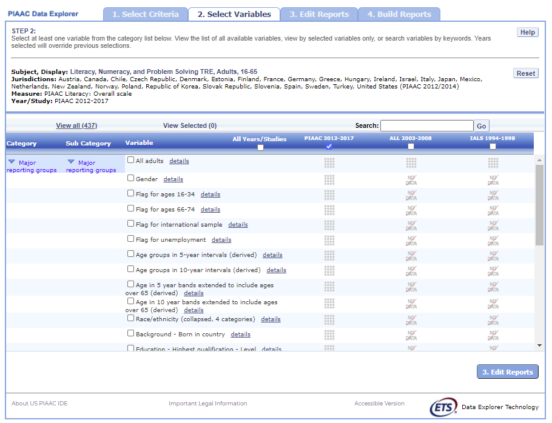{width="6.319769247594051in"
height="4.847471566054243in"}

### 2.B. Search Using Category and Sub Category Lists

On the **Select Variables** screen, choose at least one variable for
your report. One way to do this is to search for variables using the
**Category** and **Sub Category** lists.

If you do not wish to choose from any of the specified categories and
subcategories, then select **[All adults]{.underline}** in the **Major
reporting groups** sub category.

The variables shown are tied to the criteria you selected at step 1
(**Measure,** one or more of the years and studies or **All
Years/Studies** selected**,** and **Jurisdiction**), which are indicated
at the top of the screen. To change any of these criteria, return to
step 1, by clicking on **Select Criteria**.

To browse for variables, get details about them, select them, and view
them:

1.  Click the blue arrows to open and close categories and subcategories
    > of variables (see exhibit 5-5).

```{=html}
<!-- -->
```
4.  Click **details** or **hide details** to show or hide the full title
    > of a given variable, the PIAAC ID (e.g., GENDERR), and the values
    > (i.e., variable labels). Note that some variables have the same or
    > similar short titles, but comparing details will show you how they
    > differ. See the example in exhibit 5-5, which shows **Last job -
    > Employee or self-employed** and **Last Job - Economic sector.**
    > The differences between these two variables are described in the
    > details.

5.  Click the checkbox next to a variable to select it for your
    > analysis/report. You will see the count increase next to **View
    > Selected** that appears above the Variable list.

6.  Click the **View Selected** tab to see the variables you have
    > chosen. To return to the full list of variables by category, click
    > the **View All** tab to the left of the **View Selected** tab.

7.  Click **Reset** button in the upper-right portion of the screen if
    > you wish to deselect all the selected variables.

    NOTE: Remember to select the year/study for which you wish to build
    a report and make sure that data are available for your chosen
    year/study and variables.

    Searching variables is an option from the Search box. See **Section
    2.C Search Function** (on next page) for more details about this
    function.

Exhibit 5-5. Select variables using category and sub category lists

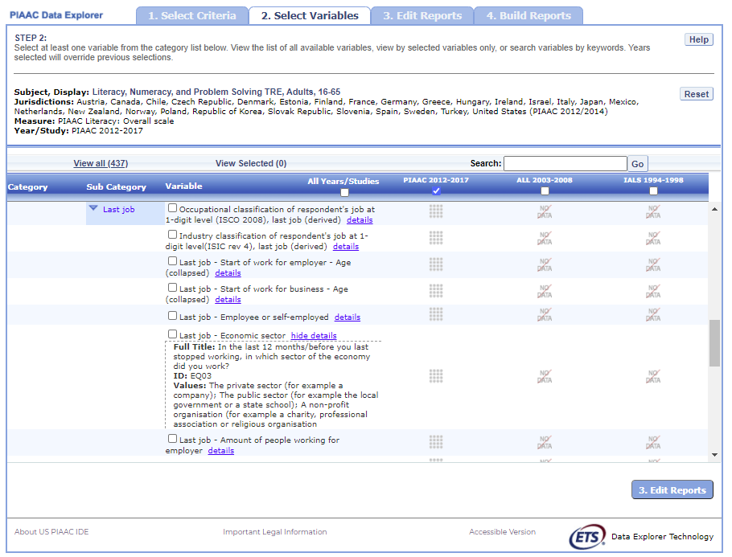{width="6.319769247594051in"
height="4.8127471566054245in"}

When you have selected the variable(s) you want to include, continue by
clicking the **Edit Reports** button at the bottom of the page or the
tab at the top of the page to go to the next screen.

### 2.C. Search Function

The second way to search for variables is to use the **Search** function
on the **Select Variables** screen.  

Type a term in the **Search** box and click **Go** (or hit "Enter" on
your keyboard) to find variables by keywords in the question and/or
details for the variable (see exhibit 5-6). The search function operates
on whole words or on an exact phrase (if it is contained in quotes). To
search for less than a whole word or exact phrase, include an asterisk
(\*) after the search term. If you use multiple keywords, "and" is
assumed. You can narrow your search by using "or," "not," or "and not."

Exhibit 5-6. Select variables using the search function

{width="6.305879265091863in"
height="4.8266371391076115in"}

When you have selected the variable(s) you want to include, continue by
clicking the **Edit Reports** button at the bottom of the page or the
tab at the top of the page to go to the next screen.

## 3. Edit Reports

### 3.A. Overview

You can access step 3, **Edit Reports,** after choosing criteria at step
1, **Select Criteria**, and choosing variables at step 2, **Select
Variables**. The IDE will automatically build reports based on your
selections from steps 1 and 2. However, at step 3, the **Edit Reports**
phase, you may modify your selections for each report. At this step, you
can:

-   preview and edit the layout of your reports;

-   copy reports or create new reports based on the variables selected;

-   change formatting options, such as number of decimal places to
    display, for all reports (these may also be changed in individual
    reports, but format options can overwrite previous edits);

-   change statistics options, such as average scale scores and
    achievement levels, for all reports (these may also be changed in
    individual reports, but statistics options can overwrite previous
    edits);

-   select reports to be built into tables and charts at step 4, **Build
    Reports**; and  

-   delete reports.

Using your chosen criteria, the PIAAC IDE will return a separate data
report for each variable you have chosen. If you have selected two or
three variables (not counting **[All adults]{.underline}**), you will
also see a **cross-tabulated report** for these variables. If you have
chosen four or more variables you will get tables for each variable, but
a cross-tabulation report will not be produced. If your selected
criteria include more than one **Measure** (e.g., overall literacy scale
and one or more continuous variable from step 1, **Select Criteria**), a
separate set of data reports will be generated for each **Measure** (see
exhibit 5-7).

Exhibit 5-7. Edit reports overview
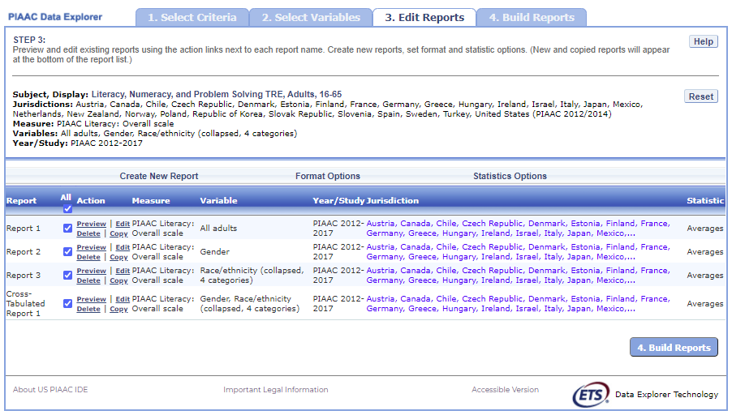{width="6.2642104111986in"
height="3.555738188976378in"}

### 3.B. Preview Report

Select **Preview,** in the **Action** column (see exhibit 5-7), to see how
your report will be laid out. The preview will not provide actual data
but will show how the data will be arranged in rows and columns (see
exhibit 5-8). You can select **Preview** at any time to see how your
changes will affect the report's final layout.

Exhibit 5-8. Using preview report

{width="5.694483814523185in"
height="4.264939851268592in"}

### 3.C. Edit Report

To edit the report, select the **Edit** command, in the **Action**
column, next to the report number (see exhibit 5-7). (Another way to edit
a report is to select the **Edit** tab when you are previewing a
report.) The following can be done using the **Edit** command (see
exhibit 5-9):

1.  [Name your report]{.underline}. You have the option of giving each
    > report a distinctive name, up to a limit of 50 characters, using
    > only letters, numbers, spaces, underscores, and hyphens.
    > (Otherwise, by default, the report is named Report 1, Report 2,
    > etc., or Cross-Tabulated Report 1, Cross-Tabulated Report 2, etc.)

```{=html}
<!-- -->
```
8.  [Select a Measure]{.underline}. You can choose a measure if more
    > than one was selected at step 1, Select Criteria.

9.  [Select which jurisdictions, variables, years (if applicable), and
    > statistics to include]{.underline} (out of the selections
    > previously made at steps 1 and 2). You can select up to two
    > statistics options from the following: **averages**,
    > **percentages**, **standard deviations**, and **percentiles**.
    > (For further information, see **Section 3.G. Statistics
    > Options**.)

10. [Create a new variable]{.underline}. To create a new variable while
    > editing a report, click on **Create New...** under the
    > **Variable** heading. Section 3.D explains the process for
    > creating a new variable.

11. [Change the table layout.]{.underline} By dragging elements to
    > determine which items will appear in rows and which will appear in
    > columns. Some of the arrangements will not permissible, but a
    > pop-up alert will explain this.

> Exhibit 5-9. Editing
> reports{width="5.440339020122485in"
> height="4.052113954505687in"}

To save changes, make sure to select Done in the upper-right portion of
the screen before closing the Edit Report window. If the Done button is
not pressed before the Edit window is closed, you may encounter a system
error.

### 3.D. Create New Variables

To create a new variable, select **Edit,** in the **Action** column, and
select **Create new...** under **Variable** (see exhibit 5-9). The new
variable is created by combining values for an existing variable. The
steps are as follows:

1.  Select the variable for which you wish to combine values.

```{=html}
<!-- -->
```
12. Select the values you want to combine by checking the boxes to the
    left of the values (see exhibit 5-10).

13. Create a name for the new value, and press **Create**. The collapsed
    values will appear in gray to indicate that they have already been
    used.

14. Wait for the screen to refresh, and press **Done**.

Exhibit 5-10. Creating new variables

> 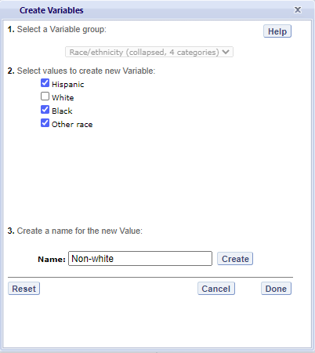{width="3.1816043307086614in"
> height="3.5614971566054243in"}

15. The new variable will appear in the **Variable** list in the **Edit
    Report** window or **Create New Report** window, designated as
    "collapsed."

16. Check the box next to the new variable to view it in the report. You
    can click **Preview** to see how the table will be laid out before
    retrieving data.

A new variable that you create is applicable *only* to a specific
report; it does not apply to the other reports listed on the **Edit
Reports** screen. For example, if you selected multiple measures of
literacy for analysis, then you would need to create the new variable
for each measure, or create a copy of the report and edit it
accordingly. To do the latter, click on **Copy** report on the **Edit
Reports** screen (copied reports appear at the end of the list of
reports) and then, for the new copy, click on **Edit** (using the above
example, you can change the measure and give the report a new name). You
cannot save the new variable for reference or future use.

You can repeat the process and combine different values of a variable to
create additional new variables. Using the **Create New Report**
function, you can create a new report for each new variable that you
create. (For further information, see section **3.E. Create New
Report**.)

If you selected two or three variables from which to create new
variables, you can repeat the process for each of them. Using the
**Create New Report** or **Edit Report** function, these collapsed
variables will be listed and available for cross-tabulation (see exhibit
5-11). If you have chosen four or more variables (not counting **All
adults**) you will not get the cross-tabulation. You can click
**Preview** to see how the table will be laid out before retrieving
data.

Exhibit 5-11. Edit reports with collapsed variables

{width="5.041925853018372in"
height="3.7571380139982504in"}

### 3.E. Create New Report

From the main **Edit Reports** screen, clicking on **Create New Report**
brings up the same options as **Edit Report**, but with no checkboxes
marked and without any new variables you may have created. Thus,
**Create New Report** (see exhibit 5-12a and 5-12b) provides a clean slate
for your selections from the first two steps, **Select Criteria** and
**Select Variables**. Each new report you create will appear at the end
of the list of reports. If you do not give the report a specific name,
it will be called "New Report." If you create a second new report, the
system will attempt to save it with the "New Report" name again;
however, it will fail and will prompt you to enter a different name in
the Name text box.

Exhibit 5-12a. Creating new reports

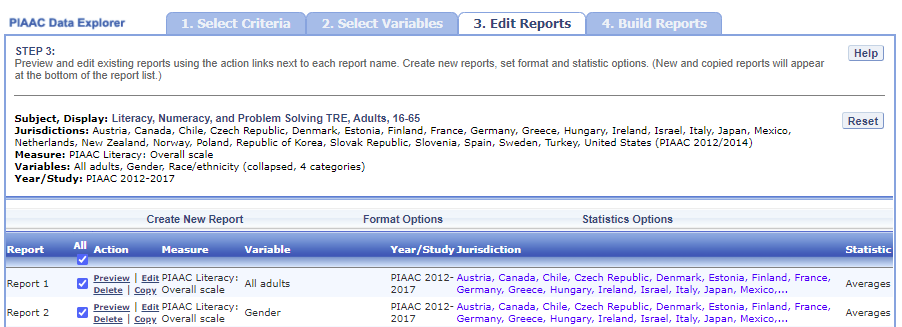{width="6.2642104111986in"
height="2.2709503499562556in"}

Exhibit 5-12b. Creating new reports

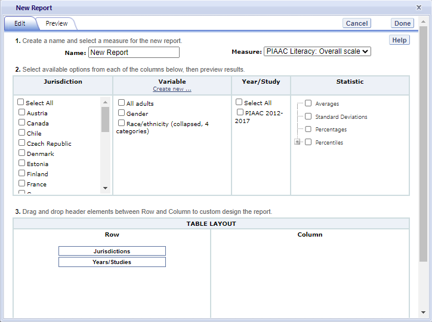{width="6.399686132983377in"
height="4.764407261592301in"}

### 3.F. Format Options 

From the main **Edit Reports** screen, clicking on **Format Options**
will allow you to make formatting changes applicable to all the reports
listed. The following formatting options are available using this
function (see exhibit 5-13):

1.  **Variable Labels (Long)** displays a more detailed description of
    the variables selected in a query than the default short label. For
    variables from the background questionnaire, the full text of the
    question is displayed. Be advised that the length of the extra
    detail may sometimes interfere with table formatting.

```{=html}
<!-- -->
```
17. **Show data for values categorized as "missing"** will include the
    percentage of adults in the total sample or in a reporting group for
    whom membership in a particular response category is unknown because
    no response was given by the adults. The percentage of "missing"
    will be shown in the right-most table column. Missing data are
    available only for queries that involve percentages as the statistic
    type. Unless you check this option, the default is for missing
    responses not to be included in the percentage distribution shown.

18. **Year Order** allows you the option to display the most recent year
    first or the oldest year first.

19. **Decimal Places** allows you to specify the level of precision for
    a particular statistic. Depending on the value range of the
    dependent variable (for example, the dependent variable "PIAAC
    Literacy: Overall scale \[PVLIT\]" ranges from 0 to 1000; the
    dependent variable "Index of use of ICT skills at home (derived)
    \[ICTHOME\]" ranges from 0 to 4), the default decimal places for a
    report could be from zero to three. Also, standard errors will be
    shown to one more decimal place than is shown for a particular
    statistic. For example, if you request that average scores be
    displayed to one decimal place (by default, the average scores is
    displayed to be the whole number), the corresponding standard errors
    will be displayed to two decimal places. If you export to Excel, you
    will be able to increase the number of decimal places in most cases.
    Note that only integer-level precision is allowed for percentages;
    that is, the number of decimal places is fixed at "none" for
    percentages and the corresponding standard errors are shown to one
    decimal place.

20. **Include** gives you the option of showing standard errors. By
    default, standard errors are shown inside parentheses, but you have
    the option of choosing to show them without parentheses*.* You can
    preview the effects of your selection in the **Sample Display** area
    (see the blue-shaded box at the bottom of exhibit 5-13).

Exhibit 5-13. Format options

{width="3.7040201224846894in"
height="4.924821741032371in"}

Be advised that the choices you make in the **Format Options** window
will apply to all reports and cannot be changed for individual reports.
Use the **Reset** button, located in the upper-right portion of the main
**Edit Reports** screen (just below the **Help** button), to restore the
**Format Options** to the default settings (although caution is advised,
as this will also delete any new reports that you have created).

### 3.G. Statistics Options

Available only from the main **Edit Reports** screen, clicking on
**Statistics Options** allows you to designate up to two statistics. The
selections you make are applicable to all the reports listed, although
you can also change the statistics for an individual report when you
edit it. (For further information, see **Section 3.C. Edit Report**.)

The following statistics options are available (see exhibit 5-14):

1.  **Averages.** For the PIAAC assessment, adult performance is
    reported on scales that range from 0 to 500. PIAAC reports the
    average scale score for a variety of demographic samples of the
    adult population (e.g., the average scale score in literacy for
    female adults). Averages for other continuous variables are in the
    same units as the variables themselves (e.g., average hourly
    earnings for hourly earnings variable). By default, the standard
    errors of the scale scores are shown in parentheses.

2.  **Percentages.** This statistic shows the percentage of adults as a
    row percentage. For example, if the first column lists
    jurisdictions, then each jurisdiction will display its own
    percentage distribution across its row. By default, percentage
    distributions do not include missing data. For information on how to
    show data for values categorized as missing, see **Section 3.F.
    Format Options**.

3.  **Standard deviations.** The standard deviation is a measure of how
    widely or narrowly dispersed scores are for a particular variable.
    Under general normality assumptions, 95 percent of the scores are
    within two standard deviations of the mean. For example, if the
    average value of a variable is 500 and the standard deviation is
    100, it means that 95 percent of the values in this variable fall
    between 300 and 700. The standard deviation is the square root of
    the variance.

4.  **Percentiles.** This statistic shows the threshold (or cutpoint)
    for the following:

    -   10^th^ percentile---the bottom 10 percent of adults

    -   25^th^ percentile---the bottom quarter of adults

    -   50^th^ percentile---the median (half the adults scored below the
        cutpoint and half scored above it)

    -   75^th^ percentile---the top quarter of adults

    -   90^th^ percentile---the top 10 percent of adults

Exhibit 5-14. Statistics options

{width="2.985404636920385in"
height="3.8220581802274713in"}

As previously noted, the selections you make in **Statistics Options**
will be applied automatically to all reports, although you can change
the statistics for an individual report if you use the **Edit** command
in the **Action** column. Be advised that if you use **Statistics
Options** after editing the statistics in one or more of your individual
reports, the statistics options selected will overwrite your previously
edited selections. If you wish to use the same criteria and variables in
a report with a different selection of statistics, consider using the
**Create New Report** function to generate a new report with different
statistics. (For further information, see **Section 3.E. Create New
Report**.) You can also make a copy of an individual report.

You can use the **Reset** button, located in the upper-right portion of
the main **Edit Reports** screen (just below the **Help** button), to
restore the **Statistics Options** to the default setting, which is the
average for all reports (this will also delete any new reports that you
created).

Not all statistics are available for all reports. Their availability
depends on other selections you have made to define the content and
format of your report:

-   Percentages will not display if jurisdictions or years appear in
    > columns.

-   If proficiency levels are selected in the variable section, only
    > average scores and percentages will be displayed.

Please note that the statistics produced by the IDE may not match the
statistics in reports published by the OECD or in the OECD PIAAC IDE,
due to differences in certain statistical standards. In particular, NCES
and the OECD may differ in the minimum sample sizes required for
publishing adult scores, as well as in the requirements for stability of
estimates for results to be reportable. For more details on the
differences in statistical standards, refer to the technical notes in
the NCES First Look report.[^1]

### 3.H. Select Reports to Build

As you edit your reports, you can give distinct names (up to 50
characters) to differentiate them, as well as make changes to the
jurisdictions and variables previously selected, the statistics, and the
layout of the rows and columns. (For further information, see **Section
3.C. Edit Report.)** You may make copies of reports with these changes.

Before proceeding to step 4, **Build Reports**, you can preview each
report for which you want to retrieve data by using the **Preview**
action. To decrease processing time as you move to step 4, you can
uncheck any reports for which you do not wish to retrieve data. By
default, all reports are checked. To uncheck one or more reports, you
can either uncheck the reports individually or click on the **All** box.
(Doing the latter will uncheck all of the reports and allow you to check
only those for which you wish to retrieve data.) In the example that
follows (see exhibit 5-15), data will be retrieved for all reports.

Exhibit 5-15. Selecting reports to build

{width="6.486347331583552in"
height="3.681829615048119in"}

If you wish to delete a report from the list of reports, click
**Delete** (see 1 in exhibit 5-15) in the **Action** column. Use the
**Reset** button (see 2 in exhibit 5-15), located in the upper-right
portion of the screen (just below the **Help** button), to restore the
deleted reports with the criteria and variables selected in the previous
steps (although caution is advised, as this will not restore any new
reports or variables that you created in the session and will delete any
new reports and variables that you most recently created; the **Reset**
action will also restore the **Format Options** and **Statistics
Options** to the default settings).

To continue to the last step in the IDE, click the **Build Reports**
button at the bottom of the page (see 3 in exhibit 5-15) or the tab at the
top of the page to go to the next screen.

## 4. Build Reports

### 4.A. Overview

You can access step 4, **Build Reports**, after choosing criteria at
step 1, **Select Criteria**, in which case the default report built will
provide average data for the **All Adults** variable. After step 1, you
may also go on to steps 2 and 3, where you can select additional
variables and edit reports, before moving on to **Build Reports**. In
**Build Reports**, you can do the following:

-   Generate a data table for each report selected in step 3, as shown
    > by the **Select Reports** drop-down feature. By default, all
    > reports are checked, although you can uncheck any reports for
    > which you do not wish to retrieve data. (For further information,
    > see **Section 3.H. Select Reports to Build**.)

-   Export and save data tables into various formats using the **Export
    Reports** button. The output formats include HTML (print-friendly),
    Microsoft Word, Microsoft Excel, and Adobe PDF (in NCES PIAAC only)

-   Select the **Chart** tab to create and customize charts for each
    report and save them for export in the above formats.

-   Select the **Significance Test** tab to run a significance test on
    your results and customize it.

**Exhibit 5-16. Building reports overview**
{width="6.236431539807524in"
height="3.493234908136483in"}

### 4.B. View Reports as Data Tables

Once you click on **Build Reports,** the sentence "Some queries may take
up to two minutes to process." will appear on your screen (see exhibit
5-17). Some reports will take longer than others to process, so please do
not hit the "Back" button on your browser during this stage. Your table
will appear once the processing is complete. To select a different table
to view, go to the **Select Report** drop-down menu and choose the table
of interest. To change the formatting or statistics options of a table
or to generate a table from a report not included in your selection,
return to step 3, **Edit Reports**.

Exhibit 5-17. Processing data

{width="6.291990376202975in"
height="2.9885936132983377in"}

### 4.C. Charts

To create a chart, go to **Select Report** on the **Build Reports**
screen to choose the report of interest from the drop-down menu, and
then click the **Chart** link (see exhibit 5-18).

You will be able to create many types of charts and customize them.
**Section 4.E. Create Charts -- Chart Options** provides a summary of
the available features and how they can be customized.

Exhibit 5-18. Viewing reports as charts

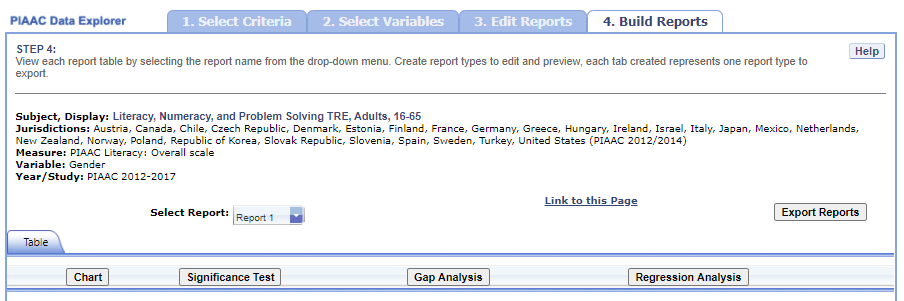{width="6.278100393700788in"
height="2.0903849518810147in"}

### 4.D. Create Charts

When you click **Chart,** you will first make selections pertaining to
**Jurisdiction,** **Year/Study**, and **Statistic**, which are data
options of the chart (see exhibit 5-19). All **Jurisdictions** and
**Studies** are selected by default, while you can only choose one
**Statistic**. Uncheck any of the criteria that you do not wish to
chart, as long as you have one selected in each category.

**Exhibit 5-19. Data options for charts**
{width="6.613910761154855in"
height="6.74410542432196in"}

Next, you can make selections regarding the chart options located below
on the same page.

1.  Select **Bar Chart**, **Column Chart**, or **Line Chart** (see 1 in
    > exhibit 5-20). If the Percentiles Statistic is selected, you can
    > also select from a **Percentiles Chart** option.

2.  After selecting a chart type, change any data dimensions from the
    > drop-down menus for **Bar**, **Column**, or **Line Values** and
    > **Values Grouped by** (see 2 in exhibit 5-20). Any new variables
    > that you created at step 3, **Edit Reports**, will be available
    > for selection, but only if you selected the variables (by clicking
    > the checkbox next to them) and pressed **Done** after you edited
    > the report.

3.  Create your chart by clicking the **Create Chart** button in the
    > lower-right corner (see 3 in exhibit 5-20).

**\
**

**Exhibit 5-20. Chart options**

{width="6.5in" height="6.627987751531059in"}

After creating your chart, you can do the following (see exhibit 5-21 as
an example of a **Percentile Chart** and exhibit 5-22 as an example of a
**Bar Chart**):

1.  Use the drop-down menus to change the jurisdiction and other
    > variables as applicable (see 1 in exhibit 5-21).

2.  Place your cursor over the bars of the chart to see the data points
    > and value label(s) (see 2 in exhibit 5-21).

Exhibit 5-21. Percentile chart
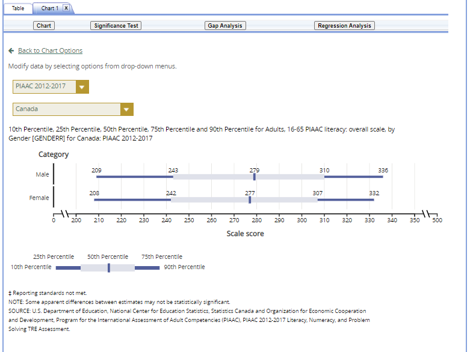{width="6.607097550306212in"
height="4.9259011373578305in"}

Exhibit 5-22. Bar chart

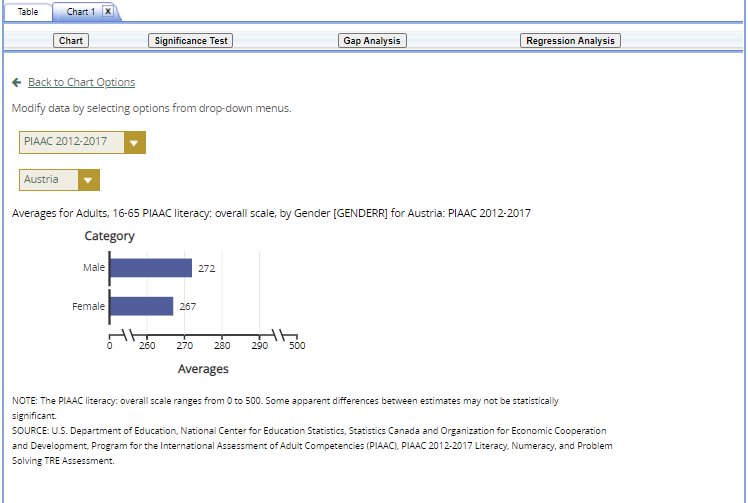{width="6.5066021434820644in"
height="4.375428696412948in"}

You can choose **"Back to Chart Options"** (located in the upper-left
corner, below the **Chart** link) to make more changes.

To make an additional chart from the same report or table, click the
**Chart** link on the **Build Reports** screen. If you do not start the
chart process again by clicking the **Chart** link, the new chart will
overwrite the previous one.

If you wish to make charts from other reports, select a different report
from the **Select Report** drop-down list. If you do not see the other
reports that you would like to make charts from, they may not have been
selected in step 3, **Edit Reports**. Go back to step 3 and check the
reports you want to use for making charts. When you advance to step 4,
**Build Reports**, the reports will appear in the **Select Report**
drop-down list. If you need to create new reports, go back to step 1,
**Select Criteria**, and/or step 2, **Select Variables**. Remember to
export any completed charts you want to save using the **Export
Reports** function before leaving the **Build Reports** screen.
Otherwise, you will lose the charts you have created when going back to
step 1, **Select Criteria**. (For further information, see **Section
4.H. Export Reports**.)

### 4.E. Significance Tests

Tests for statistical significance indicate whether observed differences
between assessment results are likely to have occurred because of
sampling error or chance. "Significance" here does not imply any
judgment about absolute magnitude or educational relevance. It refers
only to the statistical nature of the difference and whether that
difference likely reflects a true difference in the population.

With your report of interest selected, click the **Significance Test**
link, which is located to the right of the **Chart** link (see exhibit
5-22). You first need to decide which variable you want to test and the
criterion by which you want to test it (i.e., between jurisdictions,
within variables, or across years). You will compare or "look across"
the variable's range of values, so it must have more than one value. You
can look across jurisdictions for a variable (that is, compare two or
more jurisdictions) or you can look across the values within a variable
for a single jurisdiction. Once the primary criterion is chosen, all
other criteria must be restricted to a single value.

The general steps for running significance tests are as follows (see
exhibit 5-23):

1.  In the **Significance Test** window, select **Between
    > Jurisdictions**, **Within Variables**, or **Across Years**. Then,
    > select the appropriate jurisdiction(s), variable(s), one or more
    > of the years and studies, and statistic(s). For **Between
    > Jurisdictions**, select at least two jurisdictions. For **Within
    > Variables**, select one or more jurisdictions. For **Across
    > Years**, more than one year/study needs to be selected.

```{=html}
<!-- -->
```
21. Enter a **Name** limited to 25 characters, using only letters,
    > numbers, spaces, underscores, and hyphens (otherwise, by default,
    > the test is named "Sig Test 1").

22. Select the output type as either **Table** or **Map** or
    > **Comparison**. The table option will show the significance test
    > results as a matrix. The comparison option will show the
    > jurisdictions selected which are significantly higher, not
    > different, or lower to each other in score and statistical
    > significance. The map option will show the significance test
    > results on a world map, highlighting the selected jurisdictions
    > different from the one that has been identified as the benchmark.
    > Identifying a benchmark jurisdiction is done on the map itself
    > (see exhibit 5-25). The map output is only available when **Between
    > Jurisdictions** is selected in the first step.

23. Additional options allow you to select **Show Score Details** to
    > display the estimates and standard errors for the table cells. If
    > you selected a map, this option is not applicable, as the map will
    > automatically show score details.

24. Click the **Preview** tab located in the upper-left corner, or the
    > **Preview** button located in the bottom-left corner.

25. Click the **Edit** tab in the upper-left corner of the screen if you
    > wish to go back and make changes to the selections you made for
    > running the significance tests.

26. Click the **Done** button in the upper- or lower-right corner of the
    > screen to run the significance tests.

Exhibit 5-23. Significance test options

{width="6.4941185476815395in"
height="4.465343394575678in"}

When the table option is selected, you will get a significance test
matrix in which you will see the differences and *p* values. Using the
symbols shown in the legend of the matrix, an indication is also
provided of whether one estimate is significantly lower or higher than
another estimate or whether there is no significant difference (see
exhibit 5-24). Most comparisons are independent with an alpha level of
.05, except for within-jurisdiction comparisons on any given year, which
are dependent with an alpha level of .05. For example, gender
differences are treated as dependent samples with standard errors
computed taking this dependency into account.

For more information on the significance testing between years/studies,
see section **5. Statistical Notations and Other Notes** under *Linking
error*.

Exhibit 5-24. Significance test table output

{width="2.9332928696412948in"
height="4.443720472440945in"}

Exhibit 5-25. Map of significance tests

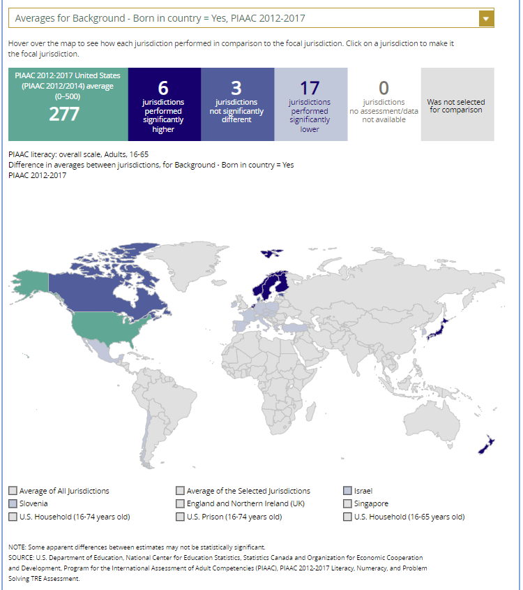{width="6.36410542432196in"
height="7.170225284339457in"}

When the map option is selected, a global map is shown with the selected
jurisdictions shaded (see exhibit 5-25). The focal jurisdiction is shaded
in teal green and represents a comparison for all the other
jurisdictions. The other jurisdictions are shaded in colors that
indicate whether they are higher, lower, or not significantly different
from the focal jurisdiction on whatever measure has been selected. (Note
that a light shade of gray is the default color for jurisdictions
categorized as "not selected for comparison.") When you scroll over a
jurisdiction a text bubble pops up describing the difference between
that jurisdiction and the focal jurisdiction. At any point, you may
choose a different focal jurisdiction by selecting another jurisdiction
of your choosing. You may also choose a different variable category for
comparison by using the drop down menu above the map.

### 4.F. Gap Analysis

Gap Analysis is included in the IDE to compare differences in gaps shown
in a map, table, or chart. These gap differences can be compared between
jurisdictions and/or across years.

**Exhibit 5-26. Gap analysis link selection**

{width="6.3927930883639545in"
height="2.1225087489063865in"}

With your report of interest selected, click on the **Gap Analysis**
link, which is located to the right of the **Significance Test** link
(see exhibit 5-26). You will need to decide which variable you would like
to test (e.g., gender) and the basis to use for comparison (i.e.,
between jurisdictions or across years). The difference measure, or gap,
can be viewed between groups, between years, between groups and years,
or between percentiles within the selected variable. For example, if you
compute average literacy scores for two jurisdictions at two time points
for males and females, you can:

-   at one time point, compare the male-female gap in one jurisdiction
    to the male-female gap in another jurisdiction;

-   compare the male-female gap at two time points within a
    jurisdiction;

-   compare the difference between the male-female gap at two time
    points in one jurisdiction to the difference between the male-female
    gap at two time points in another jurisdiction; or

-   compare the gap for females at two time points in one jurisdiction
    to the gap for females at two time points in another jurisdiction.

**Exhibit 5-27. Gap analysis options**

{width="6.40424321959755in"
height="4.15873031496063in"}

The steps for running a gap analysis are similar to those for conducting
a statistical significance test (see exhibit 5-27). Thus, to run a gap
analysis, follow the instructions under **Section 4.E. Significance
Tests**, noting the following differences:

-   The **Gap Analysis** link should be selected, not the **Significance
    Test** link.

-   The gap analysis does not have a **Within Variables** option for
    analysis; the options are **Between Jurisdictions** and **Across
    Years.**

-   The difference measure (gap) of analysis must be selected from the
    following: **Between Groups, Between Years, Between Groups and
    Years,** and **Between Percentiles** (if variables are selected for
    which a difference measure is not feasible, the difference measure
    option will not appear as available in the Gap Analysis menu).

The gap analysis output is presented in a format similar to that of the
significance test output, with one difference: the difference estimate
shown in the output is the difference between the gaps selected for
analysis. Note that you will still see the significance of these
differences just like in a significance test. For example, exhibit 5-28
shows the difference between jurisdictions in the average problem
solving in technology-rich environments score gap between males and
females.

The gap analysis function computes and statistically tests differences
between average value/score, percentage, or percentile gaps. Note that
the reference group for the gaps is kept constant during the analysis,
as opposed to taking the absolute value of the gaps. Therefore, the gap
analysis tests whether the magnitude of the gaps differ from each other
only when the gaps go in the same direction (e.g., comparing a 5-point
gender gap favoring females in one jurisdiction with a 15-point gender
gap favoring females in another jurisdiction).

**Exhibit 5-28. Gap analysis output**

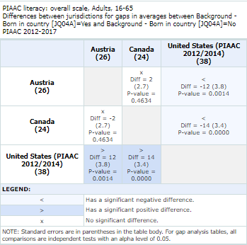{width="3.4977198162729657in"
height="3.467654199475066in"}

NOTE: A gap analysis across years cannot be combined with the **Between
Years** or **Between Groups** and **Years** difference measures, so you
will select the difference measure **Between Groups**, or, if you have
selected percentiles as one of your statistics, you may choose **Between
Percentiles**.

### 4.G. Regression Analysis

Regression Analysis is included in the IDE to test for trends across
more than two data points. The type of analysis performed in this
feature of the IDE is referred to as linear regression within the field
of statistics.

**\
**

**Exhibit 5-29. Regression analysis link selection**

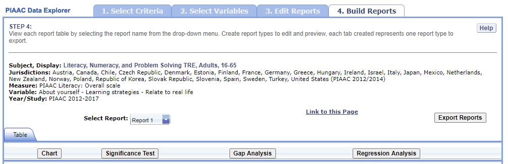{width="6.5in" height="2.1041666666666665in"}

A regression analysis can be performed based on the selections that were
made to build your table in the IDE by selecting the **Regression
Analysis** button above the table (see exhibit 5-29). The Measure, or
continuous variable, that you selected in Step 1 and that is displayed
in your table will automatically become your dependent variable for the
regression analysis (in exhibit 5-29 this is "PIAAC Literacy: Overall
scale"). Please note that continuous variables cannot be used as
independent variables. The variables that you selected in Step 2 and
that are displayed in your table will become your independent variable
options for the regression analysis (in exhibit 5-29 this is "About
yourself -- Learning strategies -- Relate to real life").

**Exhibit 5-30. Regression analysis options**

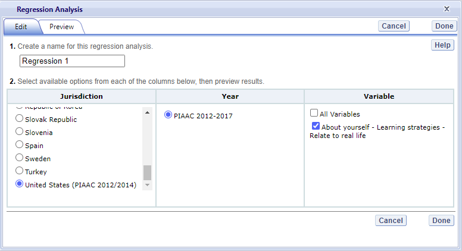{width="6.4842421259842515in"
height="3.5262248468941384in"}

The general steps for running a regression analysis are as follows (see
exhibit 5-30):

1.  In the **Regression Analysis** pop-up window, enter a **Name**
    limited to 25 characters, using only letters, numbers, spaces,
    underscores, and hyphens (otherwise, by default, the test will be
    named "Regression 1").

2.  Select the appropriate jurisdiction, year, and independent
    variable(s) for analysis. Please note that you may only choose one
    jurisdiction and year at a time, but you may choose up to 3
    independent variables to be in your report. In order to use up to 3
    variables, you must have already created and selected a
    cross-tabulated report (by selecting 3 variables in Step 2, **Select
    Variables**).

3.  Click the **Preview** tab located in the upper-left corner to view
    the table format into which your output will be populated. In the
    Preview tab, an "X" denotes where the output will display.

4.  Click the **Edit** tab in the upper-left corner of the screen if you
    wish to go back and make changes to the selections you made for
    running the analysis.

5.  Click the **Done** button in the upper- or lower-right corner of the
    screen to run the regression analysis.

After you have clicked **Done**, your regression analysis output will
load onto the screen (see exhibit 5-31). A 0-1 contrast coding is used to
code the independent variable, where the first subgroup of the
independent variable is the reference group. Using dummy-coded variables
in a linear regression is useful for comparing each subgroup against a
reference group. For example, in exhibit 5-31, if the subgroup "Not at
all" is the reference group for the independent variable **About
yourself -- Learning strategies -- Relate to real life \[IQ04B\]**, the
IDE creates a "Very little" dummy variable (1 for respondents who
answered "Very little," 0 otherwise), a "To some extent" dummy variable
(1 for respondents who answered "To some extent," 0 otherwise), a "To a
high extent" dummy variable (1 for respondents who answered "To a high
extent," 0 otherwise), and a "To a very high extent" dummy variable (1
for respondents who answered "To a very high extent," 0 otherwise).

**Exhibit 5-31. Regression analysis output**

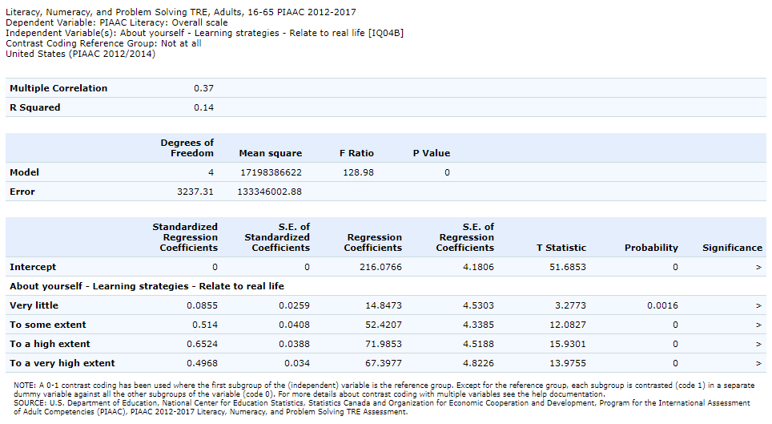{width="6.5in" height="3.566666666666667in"}

Using the output from exhibit 5-31 you can compare the average literacy
scores of adults who report "Not at all" to the background question to
average literacy scores of adults who report "Very little," "To some
extent," "To a high extent," or "To a very high extent" to the
background question. When a single dummy-coded variable is used in a
regression, the *intercept* is the mean of the reference group (e.g.,
216.0766), and the *regression coefficient* is the difference between
the mean of the reference group and the group identified (coded 1) with
the dummy-coded variable (e.g., 14.8473 for adults who report "Very
little" to the background question). Since the regression coefficients
are presented with a standard error and a *t* value, these can be used
to test whether a difference between means is statistically significant.
Under the Significance column in the output you will see 3 possible
signs: 1) \< signifies a significant negative difference, 2) \>
signifies a significant positive difference, and 3) *x* signifies the
difference is not statistically significant.

### 4.H. Export Reports

Click on the **Export Reports** button/arrow located on the right side
of the **Build Reports** screen to save or print your tables, charts,
and significance tests. The report names that appear in the **Export
Reports** window are those that were checked off at step 3, **Edit
Reports**.

Exhibit 5-32. Export report options

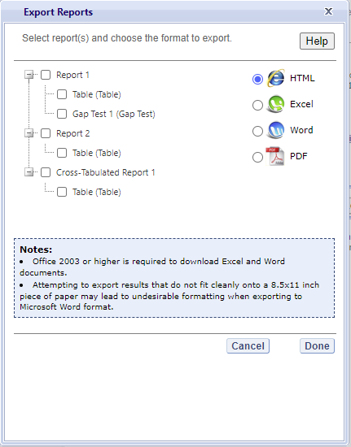{width="2.9932097550306214in"
height="3.8196402012248467in"}

Check the files you want to export and select one of the file formats:
**HTML** (print-friendly), **Excel**, **Word**, or **PDF** (see exhibit
5-32). All reports that you select at the same time will be exported in
one file. In the Excel format, you will be able to increase the decimal
places visible (wherever more precision is available in the database).
Because there are many different operating systems in use, you may get
an error message with Excel or one of the other formats. Usually, this
will not affect your ability to export, so please wait for the software
errors to resolve.


