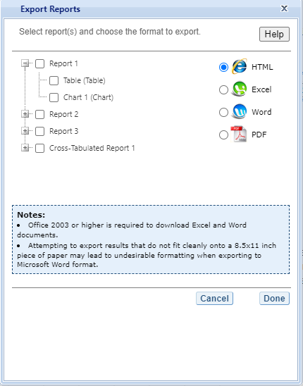

# TALIS IDE Walkthrough {#taliswalkthrough}

There are four general steps for exploring each IDE page (see exhibit 3). Each step is described in more detail in the following sub-sections. 

Exhibit 3. What you will see in the IDE environment and what each step entails


## 1. Select Criteria

### 1.A. Overview 

Your data query in the TALIS IDE begins on the **Select Criteria**
screen (see exhibit 2).

Select a **Subject** and **Education level** from the drop-down menus.
Once the screen resets, you can choose one or more **Year**,
**Measure,** and **Jurisdiction** for the data you wish to view or
compare. Use the **Reset** button, located in the upper-right portion of
the screen (just below the **Help** button), to cancel your selections
and begin again.

Click on a blue sideways-facing arrow (►) to open up a category, and
click on a blue downward-facing arrow (▼) to close a category.

Exhibit 2. Selecting criteria

{width="6.5in" height="5.277777777777778in"}

### 1.B. Choose a Subject

The first option you must choose in step 1, **Select Criteria,** is a
**Subject**. When using the TALIS IDE, you have the option to run either
a school- or teacher-level analysis. Click to open the drop-down menu
next to Subject, which provides the choice of selecting either
**School** or **Teacher**. Selecting the **School** option provides
school information that is an attribute of *schools* (thus estimates are
reported, for example, as the "percentage of schools"), while selecting
the **Teacher** option provides teacher or school information that is an
attribute of *teachers* (thus estimates are reported, for example, in
terms of the "percentage of teachers").

### 1.C. Choose an Education Level

The second option to choose in step 1, **Select Criteria,** is an
**Education Level**. TALIS collects data on ISCED 1 (Primary), ISCED 2
(Lower Secondary), and ISCED 3 (Upper Secondary). Please note that the
IDE default is ISCED 2.

### 1.D. Choose Year(s)

To the right of the **Measure** and **Jurisdiction** tab titles, you
have the choice of selecting TALIS 2018, 2013, or 2008 data for analysis
by checking the appropriate box underneath the year listed. To include
data from all three years, check the "**All Years**" box to the left of
the individual years.

### 1.E. Choose Measure(s)

After choosing a **Subject** and **Education Level**, you can then
choose a **Measure** within the **Select Criteria** tab. Note that the
Full Population Estimate is the default for selection, but instead of,
or in addition to, the Full Population Estimate, you can select from
among a number of continuous variables listed under Measure. You can
search for continuous variables using the **Category** and **Sub
Category** lists or by using the **Search** function. The continuous
variables are first organized by **Category** (such as Teacher and
Principal Characteristics, School Staffing and Resources, and Classroom
Climate), then organized by **Sub Category** (such as Principal
Demographics and Principal Work Experience). Finally, selecting a **Sub
Category** will display a list of continuous variables you may select to
use as a **Measure** in your analysis.

### 1.F. Choose Jurisdiction(s)

With your **Measure**(s) and **Year**(s) selected, next choose at least
one **Jurisdiction.**

Jurisdictions are found under the following groups: **OECD National
Entities**, **OECD Sub-National Entities**, and **Partners.** There is
also a group category called **International,** with options to display
the **Average of All Jurisdictions** and the **Average of the Selected
Jurisdictions.**

The general procedures for selecting one or more jurisdictions are as
follows:

1.  To open or close jurisdictions, click on the arrow. Jurisdictions in
    the group are open and can be selected when the blue arrow points
    down (see exhibit 3).  

2.  Click the checkboxes next to the specific jurisdictions that you are
    interested in, or uncheck those jurisdictions that you wish to
    deselect. If you click the checkbox next to the group name (e.g.,
    "OECD National Entities"), you will select all the jurisdictions
    within that group. If desired, uncheck the group name to deselect
    all.

3.  If you want to close a group (for example, close the list of OECD
    countries), click the blue arrow next to the group name. The closed
    group's arrow points to the right. Be advised that closing the group
    will not deselect your choices.

Exhibit 3. Choosing jurisdictions

{width="6.5in" height="5.277777777777778in"}

To continue in the IDE, click the **Select Variables** button at the
bottom right of the page or the tab at the top of the page to go to the
next screen (see exhibit 3).

## 2. Select Variables

### 2.A. Overview 

Step 2, **Select Variables,** can only be accessed after choosing
criteria at step 1, **Select Criteria**.

To continue your data query and edit a report, *you must choose at least
one variable on this screen.* You can browse for variables using the
**Category** or **Sub-category lists** or by using the **Search**
function (see exhibit 4). You can return to this screen to change
variable selections at any time by clicking **Select Variables**.

**Exhibit 4. Select variables overview**

{width="6.5in" height="4.478472222222222in"}

### 2.B. Select Variables using Category and Sub Category Lists

On the **Select Variables** screen, choose at least one independent
variable for your report. One way to do this is to search for
independent variables using the **Category** and **Sub Category** lists.
If you don't wish to choose from any of the specified categories and
subcategories, then select **All Cases** in the **Total** sub category
(displayed as the default independent variable on the Select Variables
screen).

The variables shown are tied to the criteria you selected at step 1
(**Subject, Education Level**, **Measure, Year,** and **Jurisdiction**),
which are indicated at the top of the screen. To change any of these
criteria, return to step 1 by clicking on **Select Criteria**.

To browse for variables and get details about them:

1.  Click the blue arrows to open and close Category and Sub Category
    lists of variables (see exhibit 5).

2.  Click **details** or **hide details** to show or hide the full title
    of a given variable, the TALIS IDE identification name (e.g.,
    SC10012), and the values (i.e., variable labels). Note that some
    variables have similar short titles, but comparing details will show
    you how they differ. See the example in exhibit 5, which shows
    **School location** and **School location (2013)**. The differences
    between these two variables are further described in the details.

3.  Click the checkbox next to a variable to select it for your
    analysis/report. You will see the count increase next to **View
    Selected**.

4.  Click the **View Selected** tab to see the variables you have
    chosen. To return to the full list of variables by Category and Sub
    Category, click **View all.**

5.  Remember to select the year for which you wish to build a report and
    make sure that data are available for your chosen year and
    variables.

6.  Searching for variables is an option from the **Search** box. See
    **Section 2.C. Select Variables using the Search Function** on the
    next page for more details about this function.

Exhibit 5. Select variables using category and sub category lists

{width="6.5in" height="4.686111111111111in"}

### 2.C. Select Variables using the Search Function

The second way to search for variables is to use the **Search** function
on the **Select Variables** screen.  

Type a term in the **Search** box and click **Go** (or hit "Enter" on
your keyboard) to find variables by keywords in the variable title
and/or details for the variable (see exhibit 6). The search function
operates on whole words or on an exact phrase (if it is contained in
quotes). To search for less than a whole word or exact phrase, include
an asterisk (\*) after the search term. If you use multiple keywords,
"and" is assumed. You can narrow your search by using "or," "not," or
"and not."

Exhibit 6. Select variables using the search function

{width="6.5in" height="3.0861111111111112in"}

When you have selected the independent variable(s) you want to include,
continue by clicking the **Edit Reports** button at the bottom of the
page or the tab at the top of the page to go to the next step.

## 3. Edit Reports

### 3.A. Overview

You can access step 3, **Edit Reports,** only after choosing criteria at
step 1, **Select Criteria**, and then choosing variables at step 2,
**Select Variables**. The IDE will automatically build reports based on
your selections from steps 1 and 2. However, at step 3, you may modify
your selections for each report.

At this step, you can

-   preview and edit the layout of your reports;

-   copy reports or create new reports based on the variables selected;

-   change formatting options, such as year order or number of decimal
    places to display for all reports (these may also be changed in
    individual reports, but format options can overwrite previous
    edits);

-   change statistics options, such as average scores and percentages,
    for all reports (these may also be changed in individual reports,
    but statistics options can overwrite previous edits). Please note
    that no more than two statistics can be included in every report;

-   select reports to be built into tables and charts at step 4, **Build
    Reports**; and

-   delete reports.

Using your chosen criteria, the TALIS IDE will return a separate data
report for each variable you have chosen. If you have selected two or
three independent variables (not counting **All Cases**), you will also
see a **cross-tabulated report** for these variables (see exhibit 7). If
you have chosen four or more variables, you will get data reports for
each variable, but a cross-tabulation report will not be produced. If
you have selected more than one **Measure** (e.g., a continuous variable
from step 1, **Select Criteria**), a separate set of data reports will
be generated for each **Measure**.

**Exhibit 7. Edit reports overview**
{width="6.66382217847769in"
height="3.275667104111986in"}

The **Edit Reports** step (see exhibit 7) shows detailed information on
the layout of your reports.

-   The **Report** column indicates the report, or cross-tabulation
    report, number based on the variable(s) chosen during the criteria
    selection.

-   Under the **All** column, individual or multiple reports may be
    selected for report building (done in step 4, **Build Reports**),
    either by selecting **All** or selecting individual reports.

-   The **Action** column gives you the option to **Preview**, **Edit,
    Delete**, or **Copy** the report.

-   The **Measure** column shows which measure the report will portray.

-   The **Variable** column indicates the variable(s) included in the
    report. The **Year** column shows which years you have selected for
    comparison.

-   The **Jurisdiction** column labels the countries and subnational
    education systems selected for comparison.

-   The **Statistic** column provides the type of statistic output that
    will be generated in the report-building phase.

### 3.B. Preview Report

Select **Preview,** in the **Action** column (see exhibit 7), to see how
your report will be laid out. The preview will not provide actual data,
but will show how the data will be arranged in rows and columns (see
exhibit 8). You can select **Preview** at any time to see how the
changes you made during step 3, **Edit Reports,** will affect the
report's final layout.

Exhibit 8. Using preview report

{width="5.250795056867892in"
height="3.915094050743657in"}

### 3.C. Edit Report

To edit a report, select the **Edit** command in the **Action** column,
next to the report number (see exhibit 7). (Another way to edit a report
is to select the **Edit** tab when you are previewing a report.) The
following can be done using the **Edit** command (see exhibit 9):

1.  Name your report. You have the option of giving each report a
    distinctive name, up to a limit of 50 characters, using only
    letters, numbers, spaces, underscores, and hyphens. Otherwise, by
    default, the report is named Report 1, Report 2, etc., or
    Cross-Tabulated Report 1, Cross-Tabulated Report 2, etc.

2.  Select a measure. You can choose a measure if more than one was
    selected at step 1.

3.  Select which jurisdictions, variables, years (if applicable), and
    statistics to include (out of the selections previously made at step
    1, **Select Criteria,** and step 2, **Select Variables**). You can
    select up to two statistics options from the following: **averages,
    percentages, percentiles** and **standard deviations.** (For further
    information, see **Section 3.G. Statistics Options**.)

4.  To create a new variable while editing a report, click on **Create
    New...** under the **Variable** heading. **Section 3.D. Create New
    Variables** below explains the process for creating a new variable.

5.  Change the table layout by dragging elements to determine which
    items will appear in rows and which will appear in columns. Some of
    the arrangements will not be permissible, but a pop-up alert will
    explain this.

Exhibit 9. Editing reports {width="6.5in"
height="4.840277777777778in"}

To save changes, make sure to select **Done** in the upper-right portion
of the screen before closing the **Edit Report** window.

### 3.D. Create New Variables

To create a new variable, select **Edit,** in the **Action** column, and
select **Create new...** under **Variable** (see exhibit 9). The new
variable is created by combining values for an existing variable. The
steps are as follows:

1.  Select the variable for which you wish to combine values (see
    exhibit 10).

2.  Select the values you want to combine by checking the boxes to the
    left of the value.

3.  Create a name for the new value, and press **Create**. The collapsed
    values will appear in gray to indicate that they have already been
    used. The variable named can only be 25 characters long.

4.  Wait for the screen to refresh, and press **Done.**

The new variable will appear in the **Variable** list in the **Edit
Report** window or **Create New Report** window, designated as
"collapsed" (see exhibit 11). Check the box next to the new variable to
view it in the report. You can click **Preview** to see how the table
will be laid out before retrieving data.

Exhibit 10. Creating new variables

{width="3.437369860017498in"
height="3.4681299212598424in"}

A new variable that you create is applicable *only* to a specific
report; it does not apply to the other reports listed on the **Edit
Reports** screen.

For example, if you selected multiple measures of teacher and principal
characteristics for analysis, then you would need to create the new
variable for *each* measure or create a copy of the report and edit it
accordingly. To do the latter, click on **Copy** report on the **Edit
Reports** screen (copied reports appear at the end of the list of
reports) and then, for the new copy, click on **Edit** (using the above
example, you can change the measure and give the report a new name).

You can repeat the process and combine different values of a variable to
create additional new variables. Using the **Create New Report**
function, you can create a new report for each new variable that you
create. (For further information, see **Section 3.E. Create New Report**
below.)

If you selected two or three variables from which to create new
variables, you can repeat the process for each of them. Using the
**Create New Report** or **Edit Report** function, these collapsed
variables will be listed and available for cross-tabulation (see exhibit
11). If you have chosen four or more variables (not counting **All
Cases**), you won't get the cross-tabulation. You can click **Preview**
to see how the table will be laid out before retrieving data.

Exhibit 11. Edit reports with collapsed variables

{width="6.5in" height="4.81875in"}

### 3.E. Create New Report

From the main **Edit Reports** screen, clicking on **Create New Report**
(see exhibit 12a) brings up the same options as **Edit Report**, but
with no checkboxes marked and without any new variables you may have
created. Thus, **Create New Report** provides a clean slate for your
selections from the first two steps, **Select Criteria** and **Select
Variables** (see exhibit 12b). Each new report you create will appear at
the end of the list of reports. If you do not give the report a specific
name, it will be called "New Report."

**Exhibit 12a. Creating new reports**

{width="6.5in" height="3.2365562117235345in"}

**Exhibit 12b. Creating new reports**

{width="6.0188681102362205in"
height="4.474925634295713in"}

### 3.F. Format Options 

From the main **Edit Reports** screen, clicking on **Format Options**
will allow you to make formatting changes applicable to all the reports
listed. The following formatting options are available using this
function (see exhibit 13):

1.  **Variable Labels (Long)** displays a more detailed description of
    the variables selected in a query than the default short label. For
    variables from questionnaires, the full text of the question is
    displayed. Be advised that the length of the extra detail may
    sometimes interfere with table formatting.

2.  **Show data for values categorized as "missing"** will include the
    percentage of students in the total sample or in a reporting group
    for whom membership in a particular response category is unknown
    because no response was given by the students, their teacher, or
    their school. The percentage of "missing" will be shown in the
    right-most table column. Missing data are available only for queries
    that involve percentages as the statistic type. Unless you check
    this option, the default is for missing responses not to be included
    in the percentage distribution shown.

3.  **Year Order** will order the data tables in each report built, with
    either the most current year of data, or the oldest year of data,
    displaying first.

4.  **Decimal Places** gives you the option of specifying a lower level
    of precision for a particular statistic (none or one decimal place)
    than does the default, which displays averages and percentages to
    two decimal places. Also, standard errors will be shown to one more
    decimal place than is shown for a particular statistic. For example,
    if you request that average scores be displayed to one decimal
    place, the corresponding standard errors will be displayed to two
    decimal places. If you export to Excel, you will be able to increase
    the number of decimal places in most cases.

5.  **Include** gives you the option of showing standard errors. By
    default, standard errors are shown inside parentheses, but you have
    the option of choosing to show them without parentheses*.* You can
    preview the effects of your selection in the **Sample Display** area
    (see the blue-shaded box at the bottom of exhibit 13 below).

Exhibit 13. Format options

{width="3.8963768591426073in"
height="5.854983595800525in"}

Be advised that the choices you make in the **Format Options** window
will apply to *all* reports and cannot be changed for individual
reports. Use the **Reset** button, located in the upper-right portion of
the main **Edit Reports** screen (just below the **Help** button), to
restore the **Format Options** to the default settings (although caution
is advised, as this will also delete any new reports that you have
created).

### 3.G. Statistics Options

Available only from the main **Edit Reports** screen, clicking on
**Statistics Options** allows you to designate up to two statistics. The
selections you make are applicable to all the reports listed, although
you can also change the statistics for an individual report when you
edit it. (For further information, see **Section 3.C. Edit Report**.)

The following statistics options are available (see exhibit 14):

1.  **Averages.** For the TALIS assessment, teacher and principal
    averages for continuous variables are in the same units as the
    variables themselves (e.g., average age of teachers). By default,
    the standard errors of the averages are shown in parentheses.
    Averages will only display in the TALIS IDE if you have selected a
    continuous variable from step 1, **Select Criteria**.

2.  **Percentages.** This statistic shows the percentage of teachers or
    schools as a row percentage. For example, if the first column lists
    countries or subnational education systems, then each country or
    subnational education system will display its own percentage
    distribution across its row. By default, percentage distributions do
    not include missing data. For information on how to show data for
    values categorized as missing, see **Section 3.F. Format Options**.

```{=html}
<!-- -->
```
3.  **Percentiles.** This statistic shows the threshold (or cut-point)
    score for the following:

10^th^ percentile -- the bottom 10 percent of schools or teachers

25^th^ percentile -- the bottom quarter of schools or teachers

50^th^ percentile -- the median (half scored below the cut-point and
half scored above it)

75^th^ percentile -- the top quarter of schools or teachers

90^th^ percentile -- the top 10 percent of schools or teachers

4.  **Standard deviations.** The standard deviation is a measure of how
    > widely or narrowly dispersed scores are. Under general normality
    > assumptions, 95 percent of the scores are within two standard
    > deviations of the mean. For example, if the average score is 35
    > and the standard deviation is 5, it means that 95 percent of the
    > scores fall between 30 and 40. The standard deviation is the
    > square root of the variance. **\
    > **

Exhibit 14. Statistics options

{width="3.5107458442694663in"
height="4.5188681102362205in"}

As previously noted, the selections you make in **Statistics Options**
will be applied automatically to all reports, although you can change
the statistics for an individual report if you use the **Edit** command
in the **Action** column. Be advised that if you use **Statistics
Options** after editing the statistics in one or more of your individual
reports, the statistics options selected will overwrite your previously
edited selections. If you wish to use the same criteria and variables in
a report with a different selection of statistics, consider using the
**Create New Report** function to generate a new report with different
statistics. (For further information, see **Section 3.E. Create New
Report**.) You can also make a copy of an individual report.

You can use the **Reset** button, located in the upper-right portion of
the main **Edit Reports** screen (just below the **Help** button), to
restore the **Statistics Options** to the default setting, which is
average scale scores for all reports (this will also delete any new
reports that you created).

Not all statistics are available for all reports. Their availability
depends on other selections you have made to define the content and
format of your report.

NOTE: The statistics produced by the IDE may not match the statistics in
reports published by the OECD, due to differences in certain statistical
standards. In particular, NCES and the OECD may differ in the minimum
sample sizes required for publishing teacher and school reports.

### 3.H. Select Reports to Build

In order to proceed to step 4, **Build Reports**, each report for which
you want to retrieve data should be previewed using the **Preview**
function. To decrease processing time as you move to step 4, you can
uncheck any reports for which you do not wish to retrieve data. By
default, all reports are checked. To uncheck one or more reports, you
can either uncheck the reports individually or click on the **All** box.
(Doing the latter will uncheck all of the reports and allow you to check
only those for which you wish to retrieve data.) In the example that
follows (see exhibit 15), all reports are checked, and their data will
be retrieved.

Exhibit 15. Selecting reports to build

{width="6.5in" height="3.236111111111111in"}

1.  **Delete** is used in the **Action** column if you wish to delete a
    > report from the list of reports.

2.  You may use the **Reset** button to restore the deleted reports
    > (although caution is advised, as this will also delete any new
    > reports that you created and restore the **Format Options** and
    > **Statistics Options** to the default settings).

To continue to the last step in the IDE, click the **Build Reports**
button at the bottom of the page or the tab at the top of the page to go
to the next screen.

## 4. Build Reports

### 4.A. Overview

After step 1, **Select Criteria**, you may also go on to step 2,
**Select Variables** and step 3, **Edit Reports** where you can select
additional variables and edit reports, before moving on to step 4,
**Build Reports**. In the **Build Reports** tab (see exhibit 16), you
can do the following:

-   Generate a data table for each report selected in step 3, **Edit
    Reports** as shown by the **Select Reports** drop-down feature. By
    default, all reports are checked, although you can uncheck any
    reports for which you do not wish to retrieve data. (For further
    information, see **Section** **3.H. Select Reports to Build**.)

-   Export and save data tables into various formats using the **Export
    Reports** button. The output formats include HTML (print-friendly),
    Microsoft Word, Microsoft Excel, and Adobe PDF.

-   Select the **Chart** tab to create and customize charts for each
    report and save them for export in the above formats.

-   Select the **Significance Test** tab to run a significance test on
    your results, customize it, and export it.

Exhibit 16. Build Reports overview

{width="6.5in" height="3.1555555555555554in"}

### 4.B. View Reports as Data Tables

Once you click on **Build Reports,** the reports will be generated
(evidenced by the "Progress" percentage bar) and then appear on your
screen as they complete (see exhibit 17). Some reports will take longer
than others to process, so please do not hit the "Back" button on your
browser during this stage. To select a different report to view, go to
the **Select Report** drop-down menu (see 4.B. in exhibit 16) and choose
the report of interest. To change the formatting or statistics options
of a table or to generate a report not included in your selection,
return to step 3, **Edit Reports**.

Exhibit 17. Processing data

{width="6.5in" height="3.4375in"}

### 4.C. Charts

To create a chart, go to **Select Report** on the **Build Reports**
screen to choose the report of interest from the drop-down menu, and
then click the **Chart** link (see exhibit 18).

You will be able to create many types of charts and customize them.
**Section 4.E. Create Charts -- Chart Options** provides a summary of
the available features and how they can be customized.

Exhibit 18. Viewing reports as
charts{width="6.5in"
height="3.1555555555555554in"}

### 4.D. Create Charts 

When you click **Chart,** you will first make selections pertaining to
**Jurisdiction, Year/Study,** and **Statistic** (see exhibit 19). All
**Jurisdictions** and **Studies** are selected by default, while you can
only choose one **Statistic**. You may uncheck any of the criteria that
you do not wish to chart, as long as you have selected one in each
category.

Only the statistics option(s) used to report data in the previous step
will be presented, and only one statistics option can be selected at a
time. For example, **Percentiles** will appear as the only data option
to build the chart if the table created in the previous step is
reporting data with only percentiles selected as the statistics option.

Once you are finished with the Data Options, click the **Create**
**Chart** button in the lower-right corner of the screen.

Exhibit 19. Data options for charts

{width="6.185491032370954in"
height="8.05303258967629in"}

### 4.E. Create Charts -- Chart Options

Next, you can make selections regarding the chart options located below
on the same page.

1.  Select **Bar Chart**, **Column Chart**, **Line Chart,** or
    > **Percentage Chart** (see 1 in exhibit 20). If the Percentiles
    > Statistic is selected, you can also select from a **Percentile
    > Chart** option.

2.  After selecting a chart type, change any data dimensions from the
    > drop-down menus for **Bar**, **Column**, or **Line Values** and
    > **Values Grouped by** (see 2 in exhibit 20). Any new variables
    > that you created at step 3, **Edit Reports**, will be available
    > for selection, but only if you selected the variables (by clicking
    > the checkbox next to them) and pressed **Done** after you edited
    > the report.

3.  Create your chart by clicking the **Create Chart** button in the
    > lower-right corner (see 3 in exhibit 20). **\
    > **

**Exhibit 20. Chart options**

{width="6.185491032370954in"
height="8.05303258967629in"}

While previewing your chart, you can do the following (see exhibit 21 as
an example of a **Percentile Chart** and exhibit 22 as an example of a
**Bar Chart**):

1.  Use the drop-down menus to change the jurisdiction and other
    variables as applicable.

2.  Place your cursor over the bars of the chart to see the data points
    and value label(s).

Exhibit 21. Percentile chart {width="6.5in"
height="4.9534722222222225in"}

Exhibit 22. Bar chart{width="6.5in"
height="5.442361111111111in"}

You can choose **"Back to Chart Options"** (located in the upper-left
corner, below the **Chart** link) to make more changes.

To make an additional chart from the same report or table, click the
**Chart** link on the **Build Reports** screen. It is recommended that
you provide a new chart name (the default is Chart 1, Chart 2, etc.). If
you don't start the process again by clicking the **Chart** link, the
new chart will overwrite the previous one.

If you wish to make charts from other reports, select another report in
the **Select Report** drop-down list. If other reports were not checked
in step 3, **Edit Reports**, go back to step 3 and check the ones you
want. Then, when you advance to step 4, **Build Reports**, the reports
will appear in the **Select Report** drop-down list. If you need to
create new reports, go back to step 1, **Select Criteria**, and/or step
2, **Select Variables**. Remember to export any completed charts you
want to save by clicking **Done** and using the **Export Reports**
function before leaving the **Build Reports** screen. (For further
information, see **Section 4.I. Export Reports**.)

### 4.F. Significance Tests

Tests for statistical significance indicate whether observed differences
between assessment results are likely to have occurred because of
sampling error or chance. "Significance" here does not imply any
judgment about absolute magnitude or educational relevance. It refers
only to the statistical nature of the difference and whether that
difference likely reflects a true difference in the population.

With your report of interest selected, click the **Significance Test**
link, which is located to the right of the **Chart** link (see exhibits
16). You first need to decide which variable you want to test and the
criterion by which you want to test it (i.e., between jurisdictions,
within variables, or across years). You will compare or "look across"
the variable's range of values, so it must have more than one value. You
can look across jurisdictions for a variable (that is, compare between
two or more jurisdictions) or you can look across the values within a
variable for a single jurisdiction. For example, with the variables
shown in exhibit 23, you could choose to compare percentages of female
teachers between countries and subnational education systems, or you
could choose to compare percentages of female teachers and male
teachers. Once the primary criterion is chosen, all other criteria must
be restricted to a single value.

The general steps for running significance tests are as follows (see
exhibit 23):

1.  In the **Significance Test** window, select either **Between
    Jurisdictions**, **Within Variables**, or **Across Years**. Then,
    select the appropriate jurisdiction(s), variable(s), year(s), and
    statistic(s). For **Between Jurisdictions**, select at least two
    jurisdictions. For **Within Variables**, select one or more
    jurisdictions. For **Across Years**, more than one year needs to be
    selected.

2.  Enter a **Name** limited to 25 characters, using only letters,
    numbers, spaces, underscores, and hyphens (otherwise, by default,
    the test is named "Sig Test 1").

3.  Select the output type as either **Table** or **Map**. The table
    option will show the significance test results as a matrix. The map
    option will show the significance test results on a world map,
    highlighting the countries and subnational education systems that
    have been selected. The map output is only available when **Between
    Jurisdictions** is selected in the first step.

4.  Additional options allow you to select **Show Table Details** to
    display the estimates and standard errors for the table cells. If
    you selected a map, this option is not applicable, as the map will
    automatically show statistical details.

5.  Click the **Preview** tab located in the upper-left corner, or the
    **Preview** button located in the bottom-left corner.

6.  Click the **Edit** tab in the upper-left corner of the screen if you
    wish to go back and make changes to the selections you made for
    running the significance tests.

7.  Click the **Done** button in the upper- or lower-right corner of the
    screen to run the significance tests.

Exhibit 23. Significance test options

{width="6.302084426946632in"
height="4.8942136920384955in"}

When the table option is selected, you will get a significance test
matrix in which you will see the differences and *p* values. Using the
symbols shown in the legend of the matrix, an indication is also
provided of whether one estimate is significantly lower or higher than
another estimate or whether there is no significant difference (see
exhibit 24). Most comparisons are independent with an alpha level of
.05, except for (1) within-variable tests for gender, where a dependent
methodology is used; and (2) significance testing across years, where a
linking error is used.

Exhibit 24. Significance test table output

{width="6.5in" height="5.686804461942257in"}

When the **map option** is selected, a global map is shown with the
countries and subnational education systems selected shaded (see exhibit
25). The focal jurisdiction is shaded in teal green, with all other
countries compared to it. The other countries are shaded in colors that
indicate whether they are higher, lower, or not significantly different
from the focal jurisdiction on whatever measure has been selected. Note
that a light shade of gray is the default color for jurisdictions not
selected for comparison.

When you hover over a jurisdiction, a text bubble displays the numerical
difference in estimates between that jurisdiction and the focal
jurisdiction. At any point, you may choose a different focal
jurisdiction by clicking on another country. You may also choose a
different variable category for comparison by using the drop-down menu
above the map.

Exhibit 25. Map of significance tests

{width="6.5in" height="7.472915573053369in"}

Please note that the IDE does not apply adjustments for multiple
comparisons. This is consistent with current NCES statistical standards
and practice.

[]{#_Toc75343119 .anchor}**4.G. Gap Analysis**

Gap analysis is included in the IDE to compare differences in gaps shown
in a table, map, or chart. Gap differences can be compared between
jurisdictions and/or across years.

**Exhibit 26. Gap analysis link selection**

{width="6.5in" height="3.1555555555555554in"}

With your report of interest selected, click on the **Gap Analysis**
link, which is located to the right of the **Significance Test** link
(see exhibit 26). You will need to decide which variable you would like
to test (e.g., principal job satisfaction, good teacher-student
relationships) and the criterion by which you want to test it (i.e.,
between jurisdictions or across years). The difference measure, or gap,
can be viewed **Between Groups**, **Between Years**, **Between Groups
and Years**, or **Between Percentiles** within the selected variable.
For example, if you compute the difference in administrative and
leadership tasks for principals from different age groups for two
countries, you can:

-   at one time point, compare the age-group (e.g., ages below 40 and
    between 40-49) gap in one country/subnational education system to
    the age-group gap in another country/\
    subnational education system;

-   compare the age-group gap at two time points within a
    country/subnational education system;

-   compare the difference between the age-group gap at two time points
    in country/\
    subnational education system to the difference between the age-group
    gap at two time points in another country/subnational education
    system; or

-   compare the gap for ages below 40 at two time points in one
    country/subnational education system to the gap for ages below 40 at
    two time points in another country/subnational education system.

**Exhibit 27. Gap analysis options**

{width="6.5in" height="5.03333552055993in"}

The steps for running a gap analysis (exhibit 27) are similar to those
for conducting a statistical significance test. Thus, to run a gap
analysis, follow the instructions under **Section 4.F. Significance
Tests**, noting the following differences:

-   The **Gap Analysis** link should be selected, not the **Significance
    Test** link.

-   The gap analysis does not have a **Within Variables** option for
    analysis; the options are **Between Jurisdictions** and **Across
    Years.**

-   The difference measure (gap) of analysis must be selected from the
    following: **Between Groups, Between Years, Between Groups and
    Years,** and **Between Percentages** (if variables are selected for
    which a difference measure is not feasible, the difference measure
    option will not appear as available in the **Gap Analysis** menu).

The gap analysis output is presented in a format similar to that of the
significance test output, with one difference: the difference estimate
shown in the output is the difference between the gaps selected for
analysis. Note that you will still see the significance of these
differences, just like in a significance test. For example, exhibit 28
shows cross-national differences in the percentage gaps between two age
groups (principals who are below 40 and who are 60 and above).

The gap analysis function computes and statistically tests differences
between average, percentage, or percentile gaps. Note that the reference
group for the gaps is kept constant during the analysis, as opposed to
taking the absolute value of the gaps. Therefore, the gap analysis tests
whether the magnitude of the gaps differ from each other only when the
gaps go in the same direction.

**Exhibit 28. Gap analysis output**

{width="5.66666447944007in"
height="4.995263560804899in"}

NOTE: A gap analysis across years cannot be combined with the **Between
Years** or **Between Groups and** **Years** difference measures, so you
will select the difference measure **Between Groups,** or, if you have
selected percentiles as one of your statistics, you may choose **Between
Percentiles.**

[]{#_Toc438045539 .anchor}**4.H. Regression Analysis**

Regression analysis is included in the IDE to test for trends across
more than two data points. The type of analysis performed in this
feature of the IDE is referred to within the field of statistics as
linear regression. To run a regression, first go to **Build Reports**
and choose the report of interest from the drop-down **Select Report**
menu. Then click on the **Regression Analysis** link, which is to the
right of the **Gap Analysis** link (see exhibit 29).

**Exhibit 29. Regression analysis link selection**

{width="6.5in" height="3.1555555555555554in"}

The general steps for running a regression analysis are as follows (see
exhibit 30):

1.  In the **Regression Analysis** pop-up window, enter a **Name**
    limited to 25 characters, using only letters, numbers, spaces,
    underscores, and hyphens (otherwise, by default, the test will be
    named "Regression 1").

2.  Select the appropriate jurisdiction, year, and variable(s) for
    analysis. Please note that you may only choose one jurisdiction and
    year at a time to be in your report, but you may choose up to three
    variables. In order to use up to three variables, you must have
    already created and selected a cross-tabulated report (by selecting
    three variables in Step 2, **Select Variables**).

3.  Click the **Preview** tab located in the upper-left corner to view
    the table format into which your output will be populated. In the
    Preview tab, an "X" denotes where the output will display.

4.  Click the **Done** button in the upper- or lower-right corner of the
    screen to run the regression analysis.

Click the **Edit** tab in the upper-left corner of the screen if you
wish to go back and make changes to the selections you made for running
the analysis.

**Exhibit 30. Regression analysis options**

{width="6.5in" height="3.4229166666666666in"}

After you have clicked **Done**, your regression analysis output will
load onto the screen (see exhibit 31). A 0-1 contrast coding is used to
code the independent variable, where the first subgroup of the
independent variable is the reference group. Using dummy-coded variables
in a linear regression is useful for comparing each subgroup against a
reference group. For example, in exhibit 31, the reference group for the
independent variable **Principal Age Groups (**SC10003**)** is the
subgroup "Below 40," and it is coded as 0. Except for the reference
group, each subgroup (e.g., ages "40-49," "50-59," and "60 and above")
is contrast coded in a separate dummy variable (code 1) against all the
other subgroups of the variable (coded 0).

Exhibit 31. Regression analysis output

{width="6.5in" height="3.265972222222222in"}

Using the output from exhibit 31, you can compare the mean percentage of
principals below age 40 to the mean percentage of those age 40 and
above. When a single dummy-coded variable is used in a regression, the
*intercept* is the mean of the reference group (e.g., 40.3598), and the
*regression coefficient* is the difference between the mean of the
reference group and the group identified (coded 1) with the dummy-coded
variable (e.g., -19.6928 for 40 to 49 years old). Since the regression
coefficients are presented with a standard error and a *t* value, they
can be used to test whether a difference between means is statistically
significant. Under the **Significance** column in the output, you will
see three possible signs: (1) \< signifies a significant negative
difference, (2) \> signifies a significant positive difference, and (3)
x signifies the difference is not significant.

### 4.I. Export Reports

Click on the **Export Reports** button/arrow located on the right side
of the **Build Reports** screen (see exhibit 29) to save or print your
tables, charts, and significance tests. The report names that appear in
the **Export Reports** window are those that were checked off at step 3,
**Edit Reports**.

Check the files you want to export, and select one of the file formats:
**HTML** (print-friendly), **Excel, Word,** or **PDF** (see exhibit 32).
All reports that you select at the same time will be exported in one
file. In the Excel format, you will be able to increase the decimal
places visible (wherever more precision is available in the database).
Because there are many different operating systems in use, you may get
an error message with Excel or one of the other formats. Usually, this
will not affect your ability to export, so please wait for the software
errors to resolve.

Exhibit 32. Export report options

{width="2.6641786964129484in"
height="3.395278871391076in"}

If you wish to edit tables or charts before saving or printing them,
remember to do this via the **Export Reports** function before leaving
the **Build Reports** screen. If you return to prior screens to edit the
table formats or change variables or criteria, you will overwrite the
tables and charts.

